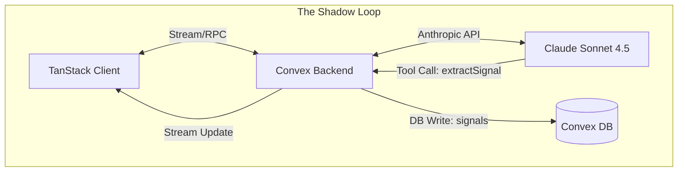

# TECHNICAL ARCHITECTURE: The Right Questions

> **Status**: DRAFT (Sprint 0)
> **Stack**: TanStack Start (Frontend/SSR), Convex (Backend/DB), Vercel AI SDK (Agent Runtime)
> **Paradigm**: Event-Driven State Machine with Optimistic UI

---

## 1. High-Level Topology



## 2. The Database Schema (Convex)

We need a rigorous schema to persist the "Soul".

```typescript
// convex/schema.ts

export default defineSchema({
  // 1. The User Session (State Machine Root)
  sessions: defineTable({
    userId: v.string(),
    phase: v.union(
      v.literal("SCENARIO"),
      v.literal("EXCAVATION"),
      v.literal("SYNTHESIS"),
      v.literal("STRATEGY"),
      v.literal("CONTRACT")
    ),
    // The "Internal Monologue" State
    honestyLevel: v.number(), // 0.9 to 1.0
    currentScenarioId: v.optional(v.id("scenarios")),
  }),

  // 2. The Extracted Psychometrics (The Profile)
  signals: defineTable({
    sessionId: v.id("sessions"),
    type: v.union(
        v.literal("VALUE"),
        v.literal("FEAR"),
        v.literal("CONSTRAINT"),
        v.literal("HABIT")
    ),
    content: v.string(), // "Fear of Poverty"
    source: v.string(), // "User quote"
    confidence: v.number(), // 0.0 - 1.0
    isConfirmed: v.boolean(), // Has user accepted this?
  }).index("by_session", ["sessionId"]),

  // 3. The Contract (Artifact)
  contracts: defineTable({
    sessionId: v.id("sessions"),
    status: v.literal("DRAFT", "SIGNED"),
    northStar: v.string(),
    spark: v.string(),
    // ... other fields
  })
});
```

## 3. The Runtime: Vercel AI SDK + Convex

We will NOT use standard API routes. We will use **Convex Actions** to host the Agent Runtime.

### 3.1 The "Shadow Loop" Implementation

To solve latency, we use **Multi-Step Tool Calls** (`maxSteps: 5`) but prioritize *Feedback*.

```typescript
// convex/agent.ts (Conceptual)

export const chat = action({
  args: { messages: v.any(), sessionId: v.id("sessions") },
  handler: async (ctx, args) => {
    // 1. Hydrate Context (The Amnesia Fix)
    const signals = await ctx.runQuery(internal.signals.getBySession, {
        sessionId: args.sessionId
    });

    // 2. Inject System Prompt (The Soul)
    const systemPrompt = generateSystemSoul({
        signals: formatSignals(signals),
        phase: session.phase
    });

    // 3. The Stream
    return streamText({
      model: anthropic("claude-3-5-sonnet-20241022"),
      messages: args.messages,
      system: systemPrompt,
      tools: {
        // The "Scan" Tool
        extractSignal: tool({
            parameters: SignalSchema,
            execute: async (signal) => {
                // WRITE to DB immediately
                await ctx.runMutation(internal.signals.add, signal);
                return "Signal Recorded.";
            }
        }),
        // The "Voice" tools
        transitionPhase: tool({ ... }),
      },
      maxSteps: 5, // Allow it to Extract -> Think -> Speak
    });
  }
});
```

### 3.2 Optimistic Client UI

How do we make it feel "God Tier"?
The Client does NOT wait for the text to show the extraction.

1.  **Subscription**: The Client subscribes to `ctx.db.query("signals")`.
2.  **Optimistic Update**: As soon as the LLM calls `extractSignal` (server-side), Convex pushes the new row to the Client.
3.  **Visual**: A small "Signal Chip" flies into the "Profile Drawer" *while* TARS is still typing the response.
    *   *Effect*: This proves to the user "I am listening" in real-time.

## 4. Middleware & Safety

### 4.1. The Formatting Guardrail
We cannot trust the LLM fully on "No Bullet Points".
We will implement a **Response Interceptor**.
*   If `phase === "EXCAVATION"`, we regex check for Markdown lists (`- ` or `1. `).
*   If found, we (optionally) re-prompt or strip them.
*   *Better*: We fine-tune the `system_soul` examples to be overwhelmingly prose-heavy.

### 4.2. Rate Limiting
*   Convex has built-in rate limiting.
*   We limit `extractSignal` to 10 calls per minute to prevent loops.

## 5. Critical Path for Sprint 0/1

1.  **Setup**: TanStack Start + Convex Init.
2.  **DB**: Define Schema (`sessions`, `signals`).
3.  **Agent**: Implement basic `streamText` loop with `extractSignal`.
4.  **UI**: Build the Chat Interface with "Optimistic Signal Drawer".

This moves us from "Prompting" to "Engineering".
