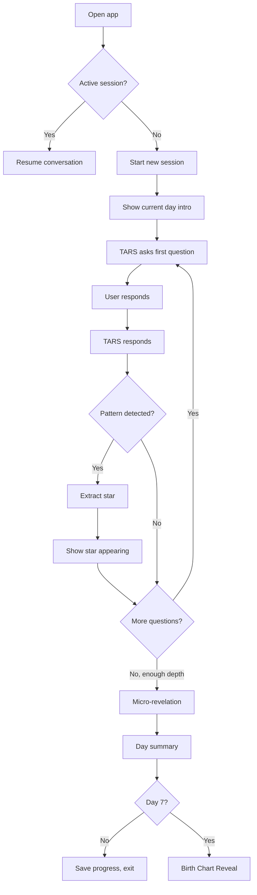
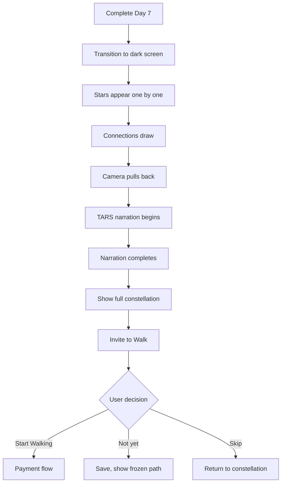
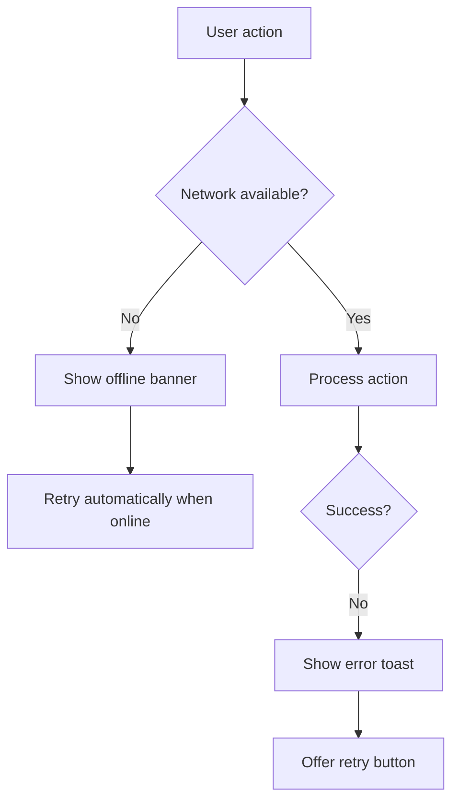
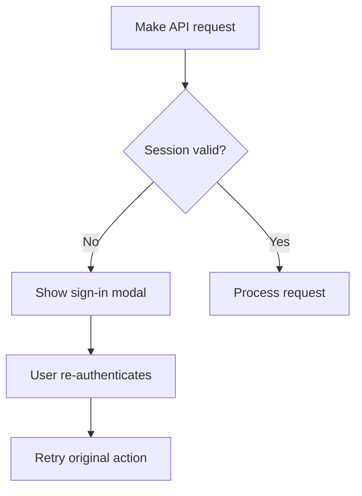

# User Flows

**Section:** 3-user-experience
**Status:** Draft
**Source:** Distilled from `concept/01-the-mirror.md`, `concept/07-onboarding-paths.md`

---

## Primary Flows

### Flow 1: New User Onboarding

```mermaid
flowchart TD
    A[Visit landing page] --> B{Has account?}
    B -->|No| C[Click "Begin"]
    B -->|Yes| D[Click "Sign In"]

    C --> E[Enter email]
    D --> E

    E --> F[Receive magic link]
    F --> G[Click link]

    G --> H{First time?}
    H -->|Yes| I[Welcome screen]
    H -->|No| J[Resume position]

    I --> K[Brief TARS intro]
    K --> L[Start Day 1 conversation]
```

**Decision Points:**

| Point | Condition | Action |
|-------|-----------|--------|
| Has account? | Email in system | Route to sign-in vs. sign-up |
| First time? | No user record | Show onboarding vs. resume |

**Exit Points:**
- User abandons at email entry
- User doesn't click magic link (expires in 15 min)

---

### Flow 2: Mirror Day Session (Days 1-7)



**Per-Day Structure:**

| Day | Opening | Questions | Micro-Revelation Focus |
|-----|---------|-----------|------------------------|
| 1 | "Let's begin" | Surface behaviors, complaints | First pattern identified |
| 2 | "Yesterday you mentioned..." | Energy, aliveness | First connection between stars |
| 3 | "Let's go deeper" | Fear, anti-vision | First dark star |
| 4 | "Today is about others" | Relationships, approval | Pattern you didn't mention directly |
| 5 | "What you avoid" | Triggers, giving up | Prediction about behavior |
| 6 | "The shadow" | Hidden self, forbidden wants | Shadow star named |
| 7 | "Integration" | Full reflection | Birth Chart narrative |

---

### Flow 3: Birth Chart Reveal



**Timing:**
| Phase | Duration |
|-------|----------|
| Dark transition | 2s |
| Stars appearing | 15-20s |
| Connections drawing | 10s |
| Camera pullback | 5s |
| Narration | 30-45s |
| **Total** | ~60-90s |

---

### Flow 4: Returning User

```mermaid
flowchart TD
    A[Open app] --> B{Session active?}
    B -->|Yes| C[Resume conversation]
    B -->|No| D{Current phase?}

    D -->|Mirror| E[Show constellation + "Continue Day X"]
    D -->|Birth Chart| F[Show constellation + replay reveal?]
    D -->|Walk| G[Show constellation + today's experiment]

    E --> H[User clicks Continue]
    H --> I[Start day session]
```

---

## Secondary Flows

### Settings

```
Profile
├── View email
├── View account creation date
├── View current phase
└── View subscription status

Data Management
├── Export data → Request email with download link
└── Delete account → Confirmation → 7-day grace → Permanent

Subscription (if pro)
├── View next billing date
└── Cancel subscription → Confirmation → Downgrade at period end
```

### Navigation

```
┌─────────────────────────────────┐
│  Primary Navigation             │
├─────────────────────────────────┤
│  🏠 Constellation (Star Map)    │
│  💬 Conversation (TARS)         │
│  ⚙️ Settings                    │
└─────────────────────────────────┘
```

---

## Error Flows

### Network Failure



### Authentication Expired



---

## Flow Dependencies

| Flow | Requires | Produces |
|------|----------|----------|
| Onboarding | — | User, first conversation |
| Mirror Day | User | Stars, connections, messages |
| Birth Chart | Day 7 complete | Phase change |
| Walk (V1) | Birth Chart complete, subscription | Journey, experiments |
