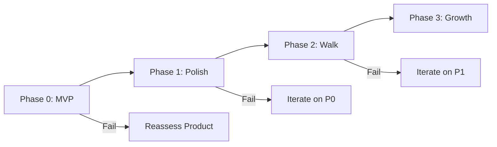

# Feature Phases

**Section:** 4-scope
**Status:** Draft

---

## Phase Overview

| Phase | Name | Timeline | Focus |
|-------|------|----------|-------|
| 0 | MVP | Weeks 1-8 | Validate the Mirror |
| 1 | Polish | Weeks 9-12 | Improve based on feedback |
| 2 | Walk | Weeks 13-20 | Add experiments & journeys |
| 3 | Growth | Weeks 21+ | Retention & viral features |

---

## Phase 0: MVP

**Timeline:** 8 weeks
**Goal:** Test the core hypothesis

### Week 1-2: Foundation
- [ ] Project setup (Next.js, Convex, Clerk)
- [ ] Authentication flow
- [ ] Basic conversation UI
- [ ] Claude integration

### Week 3-4: Mirror Core
- [ ] TARS prompting (7-day questions)
- [ ] Star extraction from conversation
- [ ] Basic star data model
- [ ] Conversation persistence

### Week 5-6: Constellation
- [ ] Canvas rendering (static stars)
- [ ] Star positioning (polar coordinates)
- [ ] Star type visual differentiation
- [ ] Star detail panel

### Week 7-8: Reveal & Polish
- [ ] Birth Chart reveal sequence
- [ ] TARS narration generation
- [ ] Micro-revelations per day
- [ ] Error handling, edge cases
- [ ] Mobile responsive

### Success Gate

| Metric | Required |
|--------|----------|
| 10+ pilot users | ✓ |
| Day 7 completion ≥15% | ✓ |
| "Felt seen" ≥3.0 | ✓ |

**If not met:** Iterate on MVP or reconsider product.

---

## Phase 1: Polish

**Timeline:** 4 weeks (if Phase 0 succeeds)
**Goal:** Improve based on pilot feedback

### Features

| Feature | Rationale |
|---------|-----------|
| Star pulse animations | Visual alive-ness |
| Connection line drawing | Show relationships |
| Improved TARS prompts | Based on what worked |
| Cliffhanger messages | End-of-day hooks |
| Share Birth Chart | Viral potential |
| Better mobile experience | Based on usage data |

### Success Gate

| Metric | Required |
|--------|----------|
| Day 7 completion ≥25% | ✓ |
| "Felt seen" ≥3.5 | ✓ |
| Would recommend ≥40% | ✓ |

---

## Phase 2: The Walk

**Timeline:** 8 weeks (if Phase 1 succeeds)
**Goal:** Add transformation layer

### Features

| Feature | Weeks | Dependency |
|---------|-------|------------|
| Discovery Interview | 1-2 | — |
| Journey data model | 2 | Discovery Interview |
| North Star + Milestones | 2-3 | Journey model |
| "Play the Tape" preview | 3-4 | Milestones |
| Experiment generation | 4-5 | Milestones |
| Evening check-in | 5-6 | Experiments |
| Velocity/momentum display | 6-7 | Check-ins |
| Milestone celebration | 7 | Velocity |
| Payment integration | 8 | All above |

### Success Gate

| Metric | Required |
|--------|----------|
| Discovery completion ≥50% | ✓ |
| Week 2 retention ≥30% | ✓ |
| Experiment completion ≥25% | ✓ |
| Paid conversion ≥5% | ✓ |

---

## Phase 3: Growth

**Timeline:** Ongoing
**Goal:** Scale acquisition and retention

### Features

| Feature | Purpose |
|---------|---------|
| Weekly Wrapped | Engagement + sharing |
| Push notifications | Experiment reminders |
| Email summaries | Return nudges |
| Referral system | Viral growth |
| "Month in Your Sky" | Monthly engagement |
| Context Graph predictions | Deeper personalization |

### Success Gate

| Metric | Required |
|--------|----------|
| Month 3 retention ≥20% | ✓ |
| LTV:CAC ≥2 | ✓ |
| Referral rate ≥10% | ✓ |

---

## Future Considerations (Not Planned)

| Feature | Rationale for Deferral |
|---------|------------------------|
| Native mobile apps | Web PWA works, native is expensive |
| Multi-user (couples, teams) | Requires different product design |
| Champions Marketplace | Platform play after PMF |
| Enterprise | Different market, different product |
| Device integrations | Manual tracking sufficient for now |

---

## Phase Dependencies

