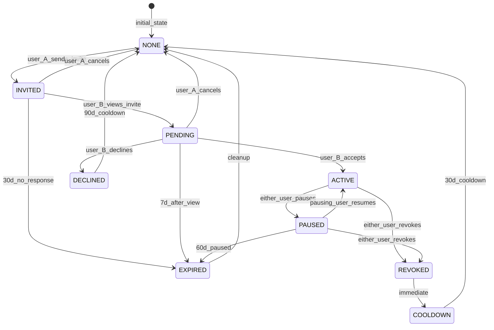
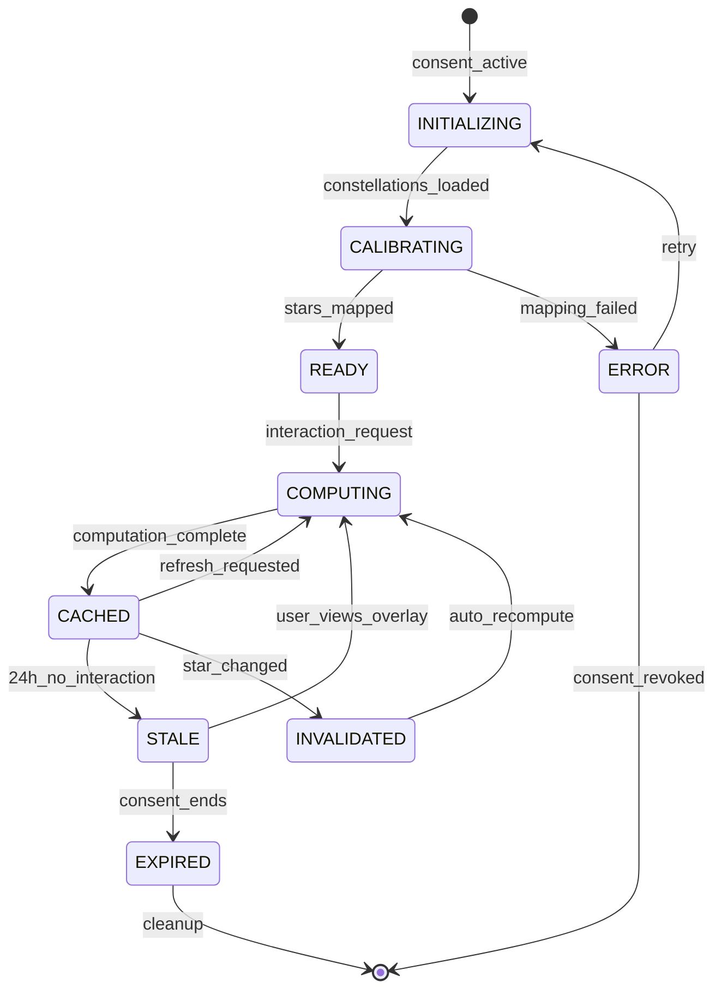

# Compatibility System - SKELETON

**Status:** SKELETON Draft
**Last Updated:** 2026-01-15
**Purpose:** Multi-user constellation overlay for relational understanding

---

## Summary

The Compatibility System overlays two (or more) constellations in shared space to detect interaction patterns between users' stars. It produces a multi-dimensional compatibility profile (not a single percentage) and requires mutual consent with granular privacy controls.

**Core Principle:** "Here's the shape of your dynamic" - never "You're incompatible"

---

## 1. Consent State Machine



### Consent States

| State | Description | Who Can Act | Duration Limit |
|-------|-------------|-------------|----------------|
| **NONE** | No relationship exists | Either can invite | - |
| **INVITED** | User A sent invite, B not seen | A: cancel | 30 days |
| **PENDING** | User B viewed but not responded | A: cancel, B: accept/decline | 7 days after view |
| **DECLINED** | User B explicitly declined | Neither (cooldown) | 90 days |
| **ACTIVE** | Both consented, overlay visible | Either: pause/revoke | - |
| **PAUSED** | Temporarily hidden | Pauser: resume, Either: revoke | 60 days |
| **REVOKED** | Permanently ended (this instance) | Neither | Enters cooldown |
| **COOLDOWN** | Post-revoke waiting period | Neither | 30 days |
| **EXPIRED** | Timed out (various triggers) | System cleanup | - |

### Consent Actions

| Action | From State | To State | Actor | Notes |
|--------|------------|----------|-------|-------|
| `send_invite` | NONE | INVITED | Any user | Creates ConsentRequest |
| `view_invite` | INVITED | PENDING | Invitee | Starts 7-day response window |
| `cancel_invite` | INVITED, PENDING | NONE | Inviter | Soft delete, no cooldown |
| `accept_invite` | PENDING | ACTIVE | Invitee | Creates Overlay |
| `decline_invite` | PENDING | DECLINED | Invitee | Triggers 90-day cooldown |
| `pause_overlay` | ACTIVE | PAUSED | Either | Reversible, 60-day limit |
| `resume_overlay` | PAUSED | ACTIVE | Pauser only | Only who paused can resume |
| `revoke_overlay` | ACTIVE, PAUSED | REVOKED | Either | Irreversible, archives data |
| `expire` | various | EXPIRED | System | Automatic cleanup |

---

## 2. Overlay Lifecycle



### Overlay States

| State | Description | Triggers Transition |
|-------|-------------|---------------------|
| **INITIALIZING** | Consent given, loading user data | `constellations_loaded` |
| **CALIBRATING** | Mapping stars to shared coordinate system | `stars_mapped` or `mapping_failed` |
| **READY** | Can compute interactions | User requests profile |
| **COMPUTING** | Actively calculating interactions | Computation complete |
| **CACHED** | Results available, not stale | Time, star changes, or refresh |
| **STALE** | Cached but outdated (time) | User views or consent ends |
| **INVALIDATED** | Cached but outdated (data change) | Auto-recompute |
| **ERROR** | Something failed | Retry or revoke |
| **EXPIRED** | Consent ended | Cleanup |

### Staleness Rules

| Trigger | Cache Action | Recompute Timing |
|---------|--------------|------------------|
| 24h elapsed | Mark STALE | On next view |
| Either user's star changes state | Mark INVALIDATED | Immediate (background) |
| Either user adds/removes star | Mark INVALIDATED | Immediate |
| Privacy settings change | Mark INVALIDATED | Immediate |
| Explicit refresh request | Force recompute | Immediate |

---

## 3. Entity Model

### Core Entities

```
CompatibilityRequest
├── id: UUID
├── inviter_id: UUID (user)
├── invitee_id: UUID (user)
├── state: ConsentState
├── created_at: timestamp
├── viewed_at: timestamp?
├── responded_at: timestamp?
├── expires_at: timestamp
└── metadata: { relationship_type?, message? }

Overlay
├── id: UUID
├── request_id: UUID (CompatibilityRequest)
├── user_a_id: UUID
├── user_b_id: UUID
├── state: OverlayState
├── created_at: timestamp
├── last_computed_at: timestamp?
├── cached_profile_id: UUID? (CompatibilityProfile)
└── version: int (for optimistic locking)

InteractionLine
├── id: UUID
├── overlay_id: UUID (Overlay)
├── star_a_id: UUID (star from user A)
├── star_b_id: UUID (star from user B)
├── type: InteractionType
├── strength: float [0.0, 1.0]
├── proximity: float (angular distance)
├── computed_at: timestamp
└── metadata: { domain, brightness_a, brightness_b }

CompatibilityProfile
├── id: UUID
├── overlay_id: UUID (Overlay)
├── computed_at: timestamp
├── dynamic_type: DynamicType
├── interaction_counts: { resonances, tensions, growth_edges, shadow_mirrors, complements }
├── dominant_domains: string[]
├── narrative_seed: string (for TARS)
└── version: int

PrivacySettings
├── id: UUID
├── overlay_id: UUID (Overlay)
├── user_id: UUID
├── hidden_stars: UUID[] (stars not visible to partner)
├── hidden_domains: string[] (entire domains hidden)
├── blur_brightness: boolean (show state but not exact value)
├── show_narrative: boolean
└── updated_at: timestamp
```

### Entity Relationships

```
User A ─────┐                   ┌───── User B
            │                   │
            ▼                   ▼
     Constellation A     Constellation B
            │                   │
            │   ┌───────────────┘
            │   │
            ▼   ▼
    CompatibilityRequest
            │
            ▼
         Overlay ◄─── PrivacySettings (per user)
            │
            ├──► InteractionLine (many)
            │         │
            │         ├── references Star A
            │         └── references Star B
            │
            └──► CompatibilityProfile (cached)
```

---

## 4. Interaction Types

### Type Definitions

| Type | Definition | Detection Criteria | Meaning |
|------|------------|-------------------|---------|
| **RESONANCE** | Both bright in same domain | `brightness_a >= 0.6 AND brightness_b >= 0.6 AND same_domain` | Mutual amplification |
| **TENSION** | One dark/dim, one bright in same domain | `abs(brightness_a - brightness_b) >= 0.4 AND same_domain` | Friction point |
| **GROWTH_EDGE** | One bright, one flickering/dim in same domain | `(bright >= 0.6 AND dim IN [0.3, 0.5]) AND same_domain` | Mentorship opportunity |
| **SHADOW_MIRROR** | Both dark/dim in same domain | `brightness_a <= 0.4 AND brightness_b <= 0.4 AND same_domain` | Shared wound |
| **COMPLEMENT** | Opposite strengths across domains | Measured at profile level, not per-pair | Interdependence |

### Detection Priority

When a star pair could match multiple types, use this priority:

1. **SHADOW_MIRROR** - Both struggling (most clinically significant)
2. **TENSION** - Active friction (high impact)
3. **GROWTH_EDGE** - Asymmetric but constructive
4. **RESONANCE** - Both strong (default positive)
5. **COMPLEMENT** - Computed at profile level from domain patterns

### Proximity Requirements

Two stars can interact if they share the same domain. Cross-domain interactions are not computed at the line level but may emerge at the profile level (complements).

| Same Domain | Proximity Score | Can Interact |
|-------------|-----------------|--------------|
| Yes (exact match) | 1.0 | Yes |
| Adjacent domains | 0.5 | No (future extension) |
| Different domains | 0.0 | No |

### State Considerations

| Star State | Can Participate | Notes |
|------------|-----------------|-------|
| BRIGHT | Yes | Full weight |
| STEADY | Yes | Full weight |
| FLICKERING | Yes | May indicate GROWTH_EDGE |
| DIM | Yes | May indicate TENSION or SHADOW_MIRROR |
| DARK | Yes | High significance for SHADOW_MIRROR |
| DORMANT | No | Excluded from overlay computation |
| NASCENT | No | Excluded (not established) |

---

## 5. Scoring Dimensions

### NOT a Single Percentage

```
WRONG: "You are 72% compatible"
RIGHT: "Your dynamic is GROWTH-type with tension undertones"
```

### Dynamic Types

| Type | Description | Criteria |
|------|-------------|----------|
| **AMPLIFYING** | Mostly resonances | resonances > 50% of interactions |
| **CHALLENGING** | Mostly tensions | tensions > 40% of interactions |
| **GROWTH** | Mostly growth edges | growth_edges > 40% of interactions |
| **MIRRORING** | Mostly shadow mirrors | shadow_mirrors > 30% of interactions |
| **BALANCING** | High complement score | complement_score > 0.6 |
| **COMPLEX** | Mixed pattern | No type exceeds threshold |

### Type Determination Priority

If multiple thresholds met:

1. MIRRORING (shared wounds most significant)
2. CHALLENGING (friction dominates experience)
3. GROWTH (asymmetric but constructive)
4. AMPLIFYING (mutual strength)
5. BALANCING (complementary patterns)
6. COMPLEX (fallback)

### Profile Structure

```typescript
interface CompatibilityProfile {
  // Interaction lists (filtered by strength threshold)
  resonances: InteractionLine[];      // strength >= 0.3
  tensions: InteractionLine[];        // strength >= 0.3
  growth_edges: InteractionLine[];    // strength >= 0.3
  shadow_mirrors: InteractionLine[];  // strength >= 0.2 (lower threshold - significant)

  // Complement is computed differently (domain-level, not star-level)
  complement_score: number;           // [0.0, 1.0]
  complement_domains: string[];       // Which domains complement

  // Summary
  dynamic_type: DynamicType;
  confidence: number;                 // How clearly one type dominates

  // Narrative support
  dominant_interactions: InteractionLine[];  // Top 3 by strength
  notable_domains: string[];                 // Where most interactions cluster
}
```

---

## 6. Privacy Model

### What Can Be Hidden

| Element | Can Hide | Effect When Hidden |
|---------|----------|-------------------|
| Specific stars | Yes | Excluded from overlay computation |
| Entire domains | Yes | All stars in domain excluded |
| Brightness values | Blur only | Partner sees state (BRIGHT/DIM/etc) but not number |
| Connection details | No | Would break overlay purpose |
| Overall profile | No | Would break overlay purpose |
| Narrative | Yes | Can disable TARS narrative generation |

### Consent Requirements

| Action | Required Consent | Notes |
|--------|------------------|-------|
| View partner's visible stars | Initial overlay consent | Core feature |
| See brightness values | Default yes, can blur | Per-user setting |
| See star history/trends | No (not shared) | Future extension |
| See internal connections | No (never shared) | Private to each user |
| Generate narrative | Default yes, can disable | Per-user setting |
| Share with third party | Explicit new consent | Creates new overlay |

### Revocation Behavior

| On Revoke | What Happens | Data Retention |
|-----------|--------------|----------------|
| Overlay access | Immediately terminated | - |
| Cached profile | Deleted | 0 days |
| Interaction lines | Deleted | 0 days |
| Consent request | Archived (anonymized) | 90 days |
| Usage analytics | Aggregated only | Indefinite |

### Asymmetric Privacy

Each user controls their own privacy independently:

```
User A: hides "Relationships" domain
User B: shows all domains

Result:
- User B sees User A's visible domains (not Relationships)
- User A sees all of User B's domains
- Interactions with A's Relationships stars: excluded
- Profile reflects only visible-visible pairs
```

---

## 7. Edge Cases

### No Overlapping Domains

**Scenario:** User A's stars are in {Purpose, Career}, User B's stars are in {Health, Soul}

**Handling:**
- Zero direct interactions (RESONANCE, TENSION, GROWTH_EDGE, SHADOW_MIRROR)
- May still compute COMPLEMENT score (different domains = potential balance)
- Dynamic type: BALANCING or COMPLEX
- Narrative: "Your constellations focus on different areas of life..."

### All-Dark Meets All-Bright

**Scenario:** User A has all dark/dim stars, User B has all bright stars

**Handling:**
- Interactions: All TENSION or GROWTH_EDGE (depending on exact values)
- Dynamic type: CHALLENGING or GROWTH
- Narrative emphasizes asymmetry, not judgment
- Privacy note: This reveals A's overall state - consider blur option

### Asymmetric Consent

**Scenario:** User A wants to share, User B pauses or has hidden domains

**Handling:**
- Overlay remains PAUSED until User B resumes
- Hidden domains: Profile computed only on mutually visible stars
- UI clearly shows: "Some interactions not shown due to privacy settings"
- Never reveal which specific elements are hidden

### Group Dynamics (N > 2)

**Handling Strategy:** Pairwise decomposition with group aggregation

```
For group of 3 (A, B, C):
1. Compute pairwise: (A,B), (A,C), (B,C)
2. Aggregate:
   - shared_bright: domains where ALL have bright stars
   - shared_dark: domains where ALL have dark/dim stars
   - role_map: who is strong/weak in each domain
3. Special patterns:
   - Triangular tension: A-B tension in domain X, B-C tension in X, A-C resonance
   - Collective blind spot: All dark in same domain
```

**Consent for Groups:**
- All N users must explicitly consent
- Any user can pause (pauses entire group overlay)
- Any user can revoke (ends their participation, group overlay recalculates for N-1 or dissolves if below minimum)
- Minimum group size: 3 (below that, it's dyadic)

### One User Deletes Account

**Handling:**
- Overlay immediately enters EXPIRED state
- All InteractionLines deleted
- Profile deleted
- Remaining user sees: "This overlay is no longer available"
- No notification of why (privacy of deleted user)

### Star State Changes During Computation

**Handling:**
- Optimistic locking on Overlay.version
- If star changes during computation, mark result INVALIDATED before caching
- Recompute with fresh data
- Never show stale data with mismatched states

### Very Small Constellations

**Scenario:** User A has 2 stars, User B has 10 stars

**Handling:**
- Compute interactions only for overlapping domains
- Profile may have sparse data
- Confidence score reflects data availability
- Narrative acknowledges: "With limited shared domains..."

### Privacy Setting Changes After Profile Cached

**Handling:**
- New privacy settings immediately invalidate cache
- Recompute excludes newly-hidden elements
- Previously-viewed profiles may have shown more data (acceptable - consent was valid at time)
- No retroactive redaction (user agreed to share at that moment)

---

## 8. Open Questions (For BLOOD)

1. **Strength formulas** - Exact calculations for each interaction type
2. **Complement detection** - How to measure cross-domain balance
3. **Confidence scoring** - How to quantify profile clarity
4. **Staleness timing** - 24h baseline, but should it vary by activity?
5. **Group dynamics** - Full formulas for N>2 aggregation

---

## 9. Quick Reference

```
CONSENT FLOW:    NONE → INVITED → PENDING → ACTIVE ⟷ PAUSED
                                         → REVOKED → COOLDOWN → NONE

OVERLAY FLOW:    INITIALIZING → CALIBRATING → READY → COMPUTING → CACHED
                                                    ↺ (on change/refresh)

INTERACTION TYPES:
  RESONANCE      Both bright, same domain      (mutual amplification)
  TENSION        One dark, one bright          (friction)
  GROWTH_EDGE    One bright, one flickering    (mentorship)
  SHADOW_MIRROR  Both dark/dim                 (shared wound)
  COMPLEMENT     Opposite domain strengths     (interdependence)

DYNAMIC TYPES:
  AMPLIFYING     Mostly resonances
  CHALLENGING    Mostly tensions
  GROWTH         Mostly growth edges
  MIRRORING      Mostly shadow mirrors
  BALANCING      High complement score
  COMPLEX        Mixed / no dominant pattern

PRIVACY:
  - Hide specific stars
  - Hide entire domains
  - Blur brightness (show state, not number)
  - Disable narrative
  - Revoke anytime (data deleted immediately)

EDGE CASES:
  - No overlap → BALANCING/COMPLEX, compute complements only
  - All dark/bright → CHALLENGING/GROWTH, emphasize asymmetry
  - Group (N>2) → Pairwise + aggregation, unanimous consent
```

---

*"Constellations reveal who we are. Overlays reveal who we become together."*
