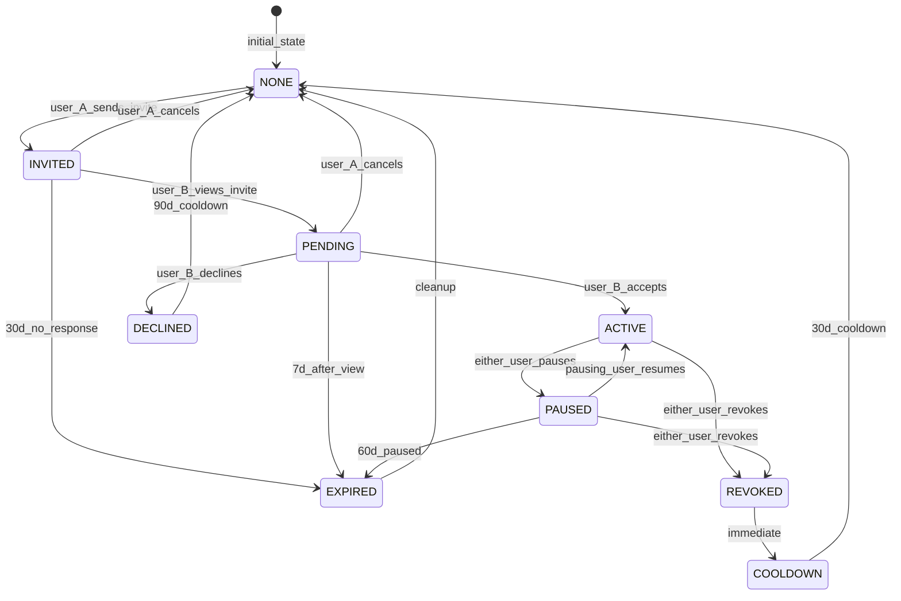

# Compatibility System - Canonical Reference

**Status:** Validated
**Last Updated:** 2026-01-15
**Lenses Completed:** SKELETON, BLOOD, NERVES, SKIN, MIRROR

---

## Summary

The Compatibility System overlays two (or more) constellations in shared space to detect interaction patterns between users' stars. It produces a **multi-dimensional compatibility profile** (not a single percentage) and requires **mutual consent** with granular privacy controls.

**Design Philosophy:** "Here's the shape of your dynamic" - never "You're 72% compatible."

---

## Consent State Machine



### Consent States

| State | Description | Who Can Act | Duration Limit |
|-------|-------------|-------------|----------------|
| **NONE** | No relationship exists | Either can invite | - |
| **INVITED** | User A sent invite, B not seen | A: cancel | 30 days |
| **PENDING** | User B viewed but not responded | A: cancel, B: accept/decline | 7 days after view |
| **DECLINED** | User B explicitly declined | Neither (cooldown) | 90 days |
| **ACTIVE** | Both consented, overlay visible | Either: pause/revoke | - |
| **PAUSED** | Temporarily hidden | Pauser: resume, Either: revoke | 60 days |
| **REVOKED** | Permanently ended | Neither | Enters cooldown |
| **COOLDOWN** | Post-revoke waiting period | Neither | 30 days |
| **EXPIRED** | Timed out | System cleanup | - |

### Consent Actions

| Action | From State | To State | Actor | Notes |
|--------|------------|----------|-------|-------|
| `send_invite` | NONE | INVITED | Any user | Creates ConsentRequest |
| `view_invite` | INVITED | PENDING | Invitee | Starts 7-day response window |
| `cancel_invite` | INVITED, PENDING | NONE | Inviter | Soft delete, no cooldown |
| `accept_invite` | PENDING | ACTIVE | Invitee | Creates Overlay |
| `decline_invite` | PENDING | DECLINED | Invitee | Triggers 90-day cooldown |
| `pause_overlay` | ACTIVE | PAUSED | Either | Reversible, 60-day limit |
| `resume_overlay` | PAUSED | ACTIVE | Pauser only | Only who paused can resume |
| `revoke_overlay` | ACTIVE, PAUSED | REVOKED | Either | Irreversible, archives data |
| `expire` | various | EXPIRED | System | Automatic cleanup |

---

## Interaction Types

### Detection Criteria

Stars can interact if they share the same domain. Each star pair produces at most one interaction type, determined by priority order.

| Type | Definition | Detection Criteria |
|------|------------|-------------------|
| **SHADOW_MIRROR** | Both struggling | `brightness_a <= 0.4 AND brightness_b <= 0.4 AND same_domain` |
| **TENSION** | Large gap | `abs(brightness_a - brightness_b) >= 0.4 AND same_domain AND NOT growth_edge` |
| **GROWTH_EDGE** | Mentor/mentee | `one >= 0.6 AND other in [0.3, 0.55] AND same_domain` |
| **RESONANCE** | Both strong | `brightness_a >= 0.6 AND brightness_b >= 0.6 AND same_domain` |
| **COMPLEMENT** | Cross-domain balance | Computed at profile level, not per-pair |

### Detection Priority

When a star pair could match multiple types:

```
1. SHADOW_MIRROR  (both struggling - most clinically significant)
2. TENSION        (friction - high experiential impact)
3. GROWTH_EDGE    (asymmetric but constructive)
4. RESONANCE      (both strong - default positive)
```

**Critical Finding (MIRROR):** The original priority had TENSION before GROWTH_EDGE, causing mentor/mentee pairs to be classified as CHALLENGING instead of GROWTH. The recommended fix is to check GROWTH_EDGE before TENSION, or add exclusion logic to TENSION detection.

### Strength Formulas

#### SHADOW_MIRROR Strength

```python
def calculate_shadow_mirror_strength(brightness_a, brightness_b):
    darkness_a = (SHADOW_THRESHOLD - brightness_a) / SHADOW_THRESHOLD
    darkness_b = (SHADOW_THRESHOLD - brightness_b) / SHADOW_THRESHOLD
    base_strength = sqrt(darkness_a * darkness_b)  # Geometric mean rewards symmetry
    return clamp(base_strength, MIN_INTERACTION_STRENGTH, 1.0)
```

#### TENSION Strength

```python
def calculate_tension_strength(brightness_a, brightness_b):
    gap = abs(brightness_a - brightness_b)
    excess_gap = gap - TENSION_GAP_THRESHOLD
    max_excess = (1.0 - MIN_BRIGHTNESS) - TENSION_GAP_THRESHOLD
    normalized_gap = excess_gap / max_excess
    strength = TENSION_BASE_STRENGTH + normalized_gap * TENSION_RANGE
    return clamp(strength, MIN_INTERACTION_STRENGTH, 1.0)
```

#### GROWTH_EDGE Strength

```python
def calculate_growth_edge_strength(brightness_a, brightness_b):
    if brightness_a >= brightness_b:
        mentor_b, mentee_b = brightness_a, brightness_b
    else:
        mentor_b, mentee_b = brightness_b, brightness_a

    mentor_factor = (mentor_b - GROWTH_MENTOR_THRESHOLD) / (1.0 - GROWTH_MENTOR_THRESHOLD)
    mentee_midpoint = (GROWTH_MENTEE_MIN + GROWTH_MENTEE_MAX) / 2  # 0.425
    mentee_range = GROWTH_MENTEE_MAX - GROWTH_MENTEE_MIN
    distance_from_optimal = abs(mentee_b - mentee_midpoint)
    mentee_factor = 1 - (distance_from_optimal / (mentee_range / 2))

    strength = GROWTH_BASE_STRENGTH + (mentor_factor * mentee_factor) * GROWTH_RANGE
    return clamp(strength, MIN_INTERACTION_STRENGTH, 1.0)
```

#### RESONANCE Strength

```python
def calculate_resonance_strength(brightness_a, brightness_b):
    excess_a = (brightness_a - RESONANCE_THRESHOLD) / (1.0 - RESONANCE_THRESHOLD)
    excess_b = (brightness_b - RESONANCE_THRESHOLD) / (1.0 - RESONANCE_THRESHOLD)
    base_strength = sqrt(excess_a * excess_b)  # Geometric mean rewards symmetry
    strength = RESONANCE_BASE_STRENGTH + base_strength * RESONANCE_RANGE
    return clamp(strength, MIN_INTERACTION_STRENGTH, 1.0)
```

#### Master Strength Formula

```python
def calculate_final_strength(star_a, star_b, interaction_type, privacy_a, privacy_b):
    base_strength = TYPE_STRENGTH_FUNCTIONS[interaction_type](brightness_a, brightness_b)
    brightness_factor = calculate_brightness_factor(brightness_a, brightness_b)
    certainty = calculate_certainty(star_a, star_b, privacy_a, privacy_b)

    final_strength = base_strength * brightness_factor * certainty
    return clamp(final_strength, 0.0, 1.0)

def calculate_brightness_factor(brightness_a, brightness_b):
    """Harmonic mean prevents one bright star from dominating."""
    safe_a = max(brightness_a, MIN_BRIGHTNESS_VALUE)
    safe_b = max(brightness_b, MIN_BRIGHTNESS_VALUE)
    harmonic_mean = 2 / (1/safe_a + 1/safe_b)
    return BRIGHTNESS_FACTOR_MIN + harmonic_mean * BRIGHTNESS_FACTOR_RANGE
```

---

## Profile Scoring

### NOT a Single Percentage

```
WRONG: "You are 72% compatible"
RIGHT: "Your dynamic is GROWTH-type with resonance undertones"
```

### Dynamic Types

| Type | Description | Criteria |
|------|-------------|----------|
| **MIRRORING** | Mostly shadow mirrors | shadow_mirrors >= 30% |
| **CHALLENGING** | Mostly tensions | tensions >= 40% |
| **GROWTH** | Mostly growth edges | growth_edges >= 40% |
| **AMPLIFYING** | Mostly resonances | resonances >= 50% |
| **BALANCING** | High complement score | complement_score >= 0.60 |
| **COMPLEX** | Mixed pattern | No type exceeds threshold |

### Type Determination Priority

If multiple thresholds met:

```
1. MIRRORING     (shared wounds most significant)
2. CHALLENGING   (friction dominates experience)
3. GROWTH        (asymmetric but constructive)
4. AMPLIFYING    (mutual strength)
5. BALANCING     (complementary patterns)
6. COMPLEX       (fallback)
```

### Complement Score (Cross-Domain)

```python
def calculate_complement_score(user_a, user_b, privacy_a, privacy_b):
    domains_a = get_domain_strengths(user_a, privacy_a)
    domains_b = get_domain_strengths(user_b, privacy_b)
    all_domains = set(domains_a.keys()) | set(domains_b.keys())

    complement_pairs = 0
    coverage_pairs = 0

    for domain in all_domains:
        strength_a = domains_a.get(domain, 0)
        strength_b = domains_b.get(domain, 0)

        if strength_a >= COMPLEMENT_STRONG_THRESHOLD:
            coverage_pairs += 1
            if strength_b < COMPLEMENT_WEAK_THRESHOLD:
                complement_pairs += 1
        elif strength_b >= COMPLEMENT_STRONG_THRESHOLD:
            coverage_pairs += 1
            if strength_a < COMPLEMENT_WEAK_THRESHOLD:
                complement_pairs += 1

    if coverage_pairs == 0:
        return 0.0

    raw_score = complement_pairs / len(all_domains)
    coverage_ratio = coverage_pairs / len(all_domains)
    coverage_bonus = 1 + COMPLEMENT_COVERAGE_BONUS * coverage_ratio

    return clamp(raw_score * coverage_bonus, 0.0, 1.0)
```

### Confidence Calculation

```python
def calculate_confidence(profile_scores, dynamic_type, complement_score):
    type_scores = {
        MIRRORING: profile_scores.shadow_mirrors,
        CHALLENGING: profile_scores.tensions,
        GROWTH: profile_scores.growth_edges,
        AMPLIFYING: profile_scores.resonances,
        BALANCING: complement_score,
        COMPLEX: 0
    }

    primary_score = type_scores[dynamic_type]
    other_scores = [s for t, s in type_scores.items() if t != dynamic_type and t != COMPLEX]
    runner_up = max(other_scores) if other_scores else 0

    gap = primary_score - runner_up
    confidence = CONFIDENCE_BASE + gap * CONFIDENCE_SCALE

    return clamp(confidence, 0.3, 1.0)
```

---

## Constants Table

### Interaction Detection

| Constant | Value | Description |
|----------|-------|-------------|
| MIN_INTERACTION_PROXIMITY | 0.5 | Must share domain |
| MIN_INTERACTION_STRENGTH | 0.2 | Below this, not recorded |
| MIN_BRIGHTNESS_VALUE | 0.05 | Floor for computations (prevents division by zero) |

### Shadow Mirror

| Constant | Value | Description |
|----------|-------|-------------|
| SHADOW_THRESHOLD | 0.4 | Both must be below this |

### Tension

| Constant | Value | Description |
|----------|-------|-------------|
| TENSION_GAP_THRESHOLD | 0.4 | Minimum brightness gap |
| TENSION_BASE_STRENGTH | 0.4 | Minimum strength when detected |
| TENSION_RANGE | 0.5 | Range above base (max = 0.9) |

### Growth Edge

| Constant | Value | Description |
|----------|-------|-------------|
| GROWTH_MENTOR_THRESHOLD | 0.6 | Must be this bright to mentor |
| GROWTH_MENTEE_MIN | 0.3 | Must be at least this (not struggling) |
| GROWTH_MENTEE_MAX | 0.55 | Must be below this (room to grow) |
| GROWTH_BASE_STRENGTH | 0.35 | Minimum strength when detected |
| GROWTH_RANGE | 0.45 | Range above base |

### Resonance

| Constant | Value | Description |
|----------|-------|-------------|
| RESONANCE_THRESHOLD | 0.6 | Both must be above this |
| RESONANCE_BASE_STRENGTH | 0.35 | Minimum strength when detected |
| RESONANCE_RANGE | 0.55 | Range above base (max = 0.9) |

### Strength Calculation

| Constant | Value | Description |
|----------|-------|-------------|
| BRIGHTNESS_FACTOR_MIN | 0.7 | Minimum multiplier (very dim stars) |
| BRIGHTNESS_FACTOR_RANGE | 0.3 | Range to 1.0 |

### Profile Scoring

| Constant | Value | Description |
|----------|-------|-------------|
| DYNAMIC_THRESHOLD_MIRRORING | 0.30 | Shadow mirror percentage |
| DYNAMIC_THRESHOLD_CHALLENGING | 0.40 | Tension percentage |
| DYNAMIC_THRESHOLD_GROWTH | 0.40 | Growth edge percentage |
| DYNAMIC_THRESHOLD_AMPLIFYING | 0.50 | Resonance percentage |
| DYNAMIC_THRESHOLD_BALANCING | 0.60 | Complement score |
| COMPLEMENT_STRONG_THRESHOLD | 0.65 | "Strong" in domain |
| COMPLEMENT_WEAK_THRESHOLD | 0.35 | "Weak" in domain |
| COMPLEMENT_COVERAGE_BONUS | 0.3 | Coverage multiplier |
| CONFIDENCE_BASE | 0.5 | Minimum confidence |
| CONFIDENCE_SCALE | 1.0 | Gap multiplier |

### Privacy

| Constant | Value | Description |
|----------|-------|-------------|
| BLUR_CERTAINTY | 0.75 | Certainty when one star blurred |
| MIN_CERTAINTY | 0.5 | Floor when both blurred |
| BLURRED_VALUE_BRIGHT | 0.85 | Midpoint for BRIGHT state |
| BLURRED_VALUE_STEADY | 0.60 | Midpoint for STEADY state |
| BLURRED_VALUE_FLICKERING | 0.40 | Midpoint for FLICKERING state |
| BLURRED_VALUE_DIM | 0.225 | Midpoint for DIM state |
| BLURRED_VALUE_DARK | 0.10 | Midpoint for DARK state |

### Group Dynamics

| Constant | Value | Description |
|----------|-------|-------------|
| COLLECTIVE_BLIND_SPOT_THRESHOLD | 0.8 | 80% of members dark in domain |
| SHARED_STRENGTH_THRESHOLD | 0.8 | 80% of members bright in domain |
| MAX_GROUP_SIZE | 10 | Hard limit for UX |
| MIN_GROUP_SIZE | 3 | Below this, use pairwise |

### Time Constants

| Constant | Value | Description |
|----------|-------|-------------|
| INVITE_EXPIRY | 30 days | Before viewing |
| PENDING_EXPIRY | 7 days | After viewing |
| PAUSE_EXPIRY | 60 days | Maximum pause duration |
| DECLINE_COOLDOWN | 90 days | Before re-invite after decline |
| REVOKE_COOLDOWN | 30 days | Before re-invite after revoke |

### Rate Limits

| Constant | Value | Description |
|----------|-------|-------------|
| INVITE_HOURLY_LIMIT | 10 | Invites per hour |
| INVITE_DAILY_LIMIT | 30 | Invites per day |
| MAX_PENDING_INVITES | 50 | Total pending per user |
| MAX_DECLINE_ATTEMPTS | 3 | Before permanent block |

### Size Confidence

| Constant | Value | Description |
|----------|-------|-------------|
| MIN_STARS_FOR_CONFIDENCE | 5 | Below this, low confidence |
| MIN_SIZE_CONFIDENCE | 0.4 | Floor for tiny constellations |
| SIZE_RATIO_PENALTY_THRESHOLD | 0.3 | Ratio below this penalized |
| CONFIDENCE_CEILING_SIZE | 20 | Beyond this, no additional confidence |
| MIN_DOMAINS_FOR_COMPLEMENT | 3 | Need breadth for complement |

### Clinical Flags

| Constant | Value | Description |
|----------|-------|-------------|
| CLINICAL_SHADOW_THRESHOLD | 0.70 | 70%+ shadow mirrors triggers flag |
| CLINICAL_LOW_BRIGHTNESS | 0.35 | Average below this triggers flag |

---

## Privacy Model

### What Can Be Hidden

| Element | Can Hide | Effect When Hidden |
|---------|----------|-------------------|
| Specific stars | Yes | Excluded from overlay computation |
| Entire domains | Yes | All stars in domain excluded |
| Brightness values | Blur only | Partner sees state (BRIGHT/DIM/etc) but not number |
| Connection details | No | Would break overlay purpose |
| Overall profile | No | Would break overlay purpose |
| Narrative | Yes | Can disable TARS narrative generation |

### Blurred Values

| State | True Range | Blurred Value | Uncertainty |
|-------|------------|---------------|-------------|
| BRIGHT | 0.7-1.0 | 0.85 | +/- 0.15 |
| STEADY | 0.5-0.7 | 0.60 | +/- 0.10 |
| FLICKERING | 0.3-0.5 | 0.40 | +/- 0.10 |
| DIM | 0.15-0.3 | 0.225 | +/- 0.075 |
| DARK | 0.05-0.15 | 0.10 | +/- 0.05 |

### Certainty with Privacy

| A Blurred | B Blurred | Certainty | Strength Multiplier |
|-----------|-----------|-----------|---------------------|
| No | No | 1.0 | 100% |
| Yes | No | 0.75 | 75% |
| No | Yes | 0.75 | 75% |
| Yes | Yes | 0.5625 | ~56% (floored to 50%) |

### Revocation Behavior

| On Revoke | What Happens | Data Retention |
|-----------|--------------|----------------|
| Overlay access | Immediately terminated | - |
| Cached profile | Deleted | 0 days |
| Interaction lines | Deleted | 0 days |
| Consent request | Archived (anonymized) | 90 days |
| Usage analytics | Aggregated only | Indefinite |

### Asymmetric Privacy

Each user controls their own privacy independently:

```
User A: hides "Relationships" domain
User B: shows all domains

Result:
- User B sees User A's visible domains (not Relationships)
- User A sees all of User B's domains
- Interactions with A's Relationships stars: excluded
- Profile reflects only visible-visible pairs
```

---

## Edge Cases

### Critical (Priority 0)

| Case | Behavior | Mitigation |
|------|----------|------------|
| Revoke mid-computation | Cache with atomic state check | Transaction + state recheck before save |
| Division by zero | Harmonic mean of 0 brightness | MIN_BRIGHTNESS_VALUE = 0.05 floor |
| Star deleted mid-compute | FK violation | Existence check before save |
| GDPR deletion | Cascade delete immediately | Hard delete interactions + profile |
| Stalking via invites | Repeated rejected invites | Detection + permanent block |

### High Priority

| Case | Behavior | Mitigation |
|------|----------|------------|
| Hide ALL stars | Zero interactions | Viability check + UX explanation |
| Both all-dark | 100% shadow mirrors | Clinical flags + support resources |
| Constellation unavailable | DB error | Fallback, retry, error states |
| Large groups (>10) | UX nightmare | Hard cap + suggest subgroups |
| Invite spam | Notification overload | Rate limits (10/hour, 30/day) |

### Medium Priority

| Case | Behavior | Mitigation |
|------|----------|------------|
| No overlapping domains | Zero direct interactions | Compute complement only |
| Asymmetric size (5 vs 20) | Mixed profile, low confidence | Size confidence penalty |
| All brightness 0.5 ("dead zone") | Zero interactions | UX explanation of stable middle |
| Fake accounts | Gaming compatibility | Sybil detection + gating |
| Stale pause (>30 days) | Outdated data | Change summary on resume |

### Low Priority

| Case | Behavior | Mitigation |
|------|----------|------------|
| Both blurred certainty floor | 0.56 certainty | Current floor acceptable |
| Brightness gaming | Artificial inflation | Warning flag, rolling average |
| Pairwise conflicts in group | Complex dynamics | Conflict detection, subgroups |
| History missing | Trend data unavailable | Graceful fallback to current |

---

## Validation Results (MIRROR)

### Scenario Test Summary

| Scenario | Expected | Actual | Status |
|----------|----------|--------|--------|
| Resonant Pair | AMPLIFYING | AMPLIFYING | OK |
| Challenging Pair | CHALLENGING | CHALLENGING | OK |
| Growth Pair | GROWTH | CHALLENGING | MISMATCH |
| Shadow Pair | MIRRORING | MIRRORING | OK |
| Complementary Pair | BALANCING | BALANCING | OK |
| Blurred Pair | AMPLIFYING | AMPLIFYING | OK |
| Asymmetric Pair | COMPLEX | GROWTH | MISMATCH |
| Dead Zone Pair | COMPLEX | COMPLEX | OK |
| Hidden Stars Pair | AMPLIFYING | AMPLIFYING | OK |

**Match Rate:** 7/9 scenarios (78%)

### Edge Case Tests

| Test | Status |
|------|--------|
| Division by Zero (brightness=0) | PASS |
| Maximum Brightness (1.0) | PASS |
| All Stars Hidden | PASS |
| Both Blurred Certainty | PASS |
| Dead Zone Detection | PASS |

### Tuning Recommendations from MIRROR

1. **CRITICAL:** Fix GROWTH_EDGE vs TENSION priority - check GROWTH_EDGE before TENSION
2. **MODERATE:** Boost GROWTH_EDGE base strength from 0.35 to 0.40
3. **MODERATE:** Add size confidence penalty for asymmetric constellations
4. **LOW:** Add minimum domain requirement for complement score

### Strength Ranges Observed

| Interaction Type | Base Range | Final Range |
|-----------------|------------|-------------|
| RESONANCE | 0.45 - 0.73 | 0.40 - 0.70 |
| TENSION | 0.44 - 0.69 | 0.37 - 0.55 |
| GROWTH_EDGE | 0.35 - 0.44 | 0.31 - 0.39 |
| SHADOW_MIRROR | 0.41 - 0.66 | 0.32 - 0.49 |

---

## Integration

### Depends On

| System | What We Use |
|--------|-------------|
| constellation-states | Star states determine interaction eligibility |
| brightness-decay | Brightness values for all formulas |
| connection-formation | Connection types for internal reference |

### Depended On By

| System | What They Use |
|--------|---------------|
| TARS narrative | Profile data for story generation |
| UI visualization | Interaction lines + strength for rendering |
| Group features | Multi-user overlay mechanics |

---

## Implementation Notes

### Recommended Approach

1. **Pre-filter stars by domain** before pairwise comparison
2. **Cache domain-level brightness averages** for complement scoring
3. **Invalidate on star state change**, not brightness change (reduces churn)
4. **For groups, compute pairwise in parallel**
5. **Check BLOCKS/visibility filters first** before any computation
6. **Use transactions for cache updates** to prevent race conditions

### Common Mistakes

| Mistake | Why It Fails | Fix |
|---------|--------------|-----|
| Not checking priority order | Double-counting interactions | Always check in priority order |
| Using arithmetic mean for brightness | Lets one star dominate | Use harmonic mean |
| Ignoring uncertainty from blur | Overconfident results | Apply certainty multiplier |
| Computing complement on hidden domains | Leaks privacy | Only use visible stars |
| TENSION before GROWTH_EDGE | Misclassifies mentorship | Check GROWTH_EDGE first |

### Performance Considerations

```
Time complexity:
- Pairwise detection: O(S_a * S_b) where S = visible stars
- Profile aggregation: O(I) where I = interactions
- Group of N: O(N^2 * S^2) worst case

Typical user:
- 10-20 stars per user
- 5-10 shared domain stars
- 10-40 interactions per pair
- Computation: <100ms for pair, <500ms for group of 5
```

---

## Research Foundation

### High Confidence (Multiple Sources)

| Decision | Sources | Application |
|----------|---------|-------------|
| Multi-dimensional profile | DA-1, DA-2, DA-3 (Dating app research) | No single percentage |
| Explicit consent | PC-1, PC-2, PC-3 (GDPR, ethics) | Overlay consent flow |
| Shadow mirror as opportunity | SW-1, SW-2, SW-3 (Jungian shadow work) | Not pathologized |
| Geometric mean for strength | GM-1, IC-1 (Statistics, interpersonal) | Rewards symmetry |
| Harmonic mean for brightness | GM-2 (Statistics) | Prevents dominance |
| Priority order | SW-1, IC-2 (Shadow, complementarity) | Shadow > tension > growth > resonance |
| Mentorship needs engagement | AT-1, MP-1 (Attachment, mentorship) | Mentor threshold 0.6 |

### Medium Confidence (Single Source or Extrapolation)

| Decision | Sources | Notes |
|----------|---------|-------|
| RESONANCE threshold 0.6 | RM-1, brightness-decay | Maps to STEADY state |
| TENSION gap threshold 0.4 | AT-2 | Reasonable but arbitrary |
| GROWTH_EDGE mentee range | ZPD-1, ZPD-2 (Vygotsky) | Zone of proximal development |
| SHADOW_THRESHOLD 0.4 | SW-1, brightness-decay | Maps to FLICKERING state |
| Blur certainty 0.75 | ST-1 (Signal detection) | Needs validation |
| Domain-based overlay | Design intuition | No direct research |

### Low Confidence (Needs Validation)

| Decision | Notes |
|----------|-------|
| COMPLEMENT thresholds (0.65/0.35) | Arbitrary cutoffs |
| Coverage bonus 0.3 | Arbitrary multiplier |
| Base strength values | Calibration numbers |
| Group pattern thresholds (0.8) | Arbitrary |
| MIN_INTERACTION_STRENGTH 0.2 | UI filtering threshold |

### Key Citations

| ID | Source | Key Finding |
|----|--------|-------------|
| IC-1 | Interpersonal Complementarity (PMC11233140) | Warmth similarity attracts; dominance opposites complement |
| SW-1 | Jungian Shadow Work (Humantold) | Shadow = neglected aspects, not inherently bad |
| ZPD-1 | Zone of Proximal Development (Vygotsky) | Learning occurs just beyond current capability |
| DA-2 | Dating App Design (DateID) | Multi-dimensional profiles outperform single score |
| RM-1 | Relationship Maintenance (Gottman) | 5:1 positive-to-negative ratio predicts satisfaction |
| GM-1 | Statistical Means | Geometric mean penalizes asymmetry |
| GD-1 | Group Dynamics (Tuckman) | Groups have emergent properties beyond pairs |

---

## Quick Reference

```
CONSENT FLOW:    NONE -> INVITED -> PENDING -> ACTIVE <-> PAUSED
                                             -> REVOKED -> COOLDOWN -> NONE

INTERACTION TYPES (priority order):
  1. SHADOW_MIRROR  Both <= 0.4              (shared wound)
  2. TENSION        Gap >= 0.4 (not growth)  (friction)
  3. GROWTH_EDGE    One >= 0.6, one [0.3,0.55] (mentorship)
  4. RESONANCE      Both >= 0.6              (mutual strength)
  5. COMPLEMENT     Cross-domain balance     (profile level)

STRENGTH FORMULA:
  final = base_strength * brightness_factor * certainty
  brightness_factor = harmonic mean of brightnesses
  certainty = 1.0 / 0.75 / 0.5625 (none / one / both blurred)

DYNAMIC TYPES:
  MIRRORING    shadow_mirrors >= 30%
  CHALLENGING  tensions >= 40%
  GROWTH       growth_edges >= 40%
  AMPLIFYING   resonances >= 50%
  BALANCING    complement >= 0.60
  COMPLEX      (fallback)

PRIVACY:
  - Hide specific stars
  - Hide entire domains
  - Blur brightness (show state, not number)
  - Disable narrative
  - Revoke anytime (data deleted immediately)

LIMITS:
  MAX_GROUP_SIZE = 10
  INVITE_HOURLY_LIMIT = 10
  PAUSE_EXPIRY = 60 days
  DECLINE_COOLDOWN = 90 days

EDGE CASES:
  - No overlap -> BALANCING/COMPLEX (compute complement only)
  - All dark/bright -> CHALLENGING/GROWTH (asymmetry)
  - Group (N>2) -> Pairwise + aggregation
  - Dead zone [0.4, 0.6] -> Zero interactions (explain in UX)

VALIDATION (MIRROR):
  - 7/9 scenarios matched (78%)
  - Fix needed: GROWTH_EDGE priority over TENSION
  - All edge case tests passed
```

---

## Open Questions

- [ ] Should GROWTH_EDGE priority fix use exclusion logic or priority swap?
- [ ] Is GROWTH_BASE_STRENGTH 0.35 too low? (MIRROR suggests 0.40)
- [ ] Should complement have minimum domain count requirement?
- [ ] How to handle sabbatical mode in compatibility context?
- [ ] Adjacent domain interactions - worth implementing in v2?

---

## Changelog

| Date | Change | Author |
|------|--------|--------|
| 2026-01-15 | Initial SKELETON | Claude |
| 2026-01-15 | Added BLOOD formulas | Claude |
| 2026-01-15 | Added NERVES citations | Claude |
| 2026-01-15 | Added SKIN edge cases | Claude |
| 2026-01-15 | MIRROR validation complete | Claude |
| 2026-01-15 | SCRIPTURE finalized | Claude |

---

*"Constellations reveal who we are. Overlays reveal who we become together."*
