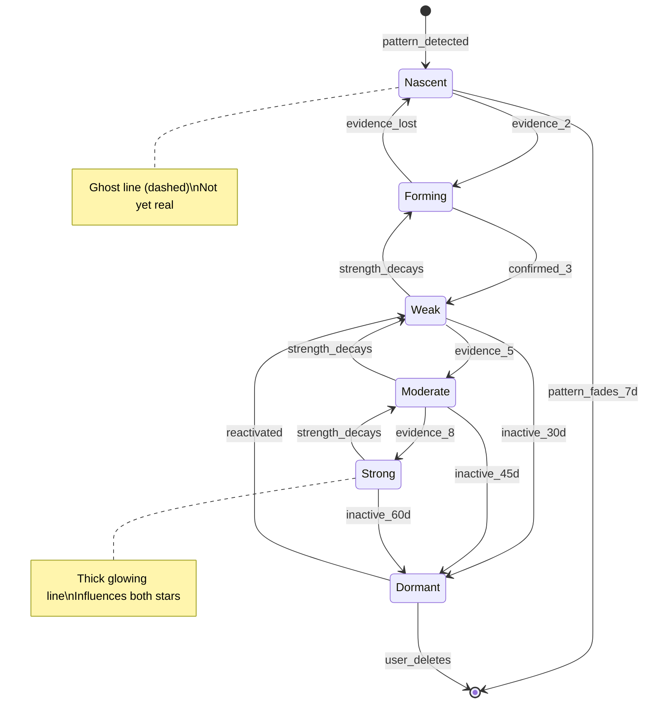

# Connection Formation - SKELETON

**System:** connection-formation
**Lens:** SKELETON (1/7)
**Created:** 2026-01-15
**Status:** Draft
**Depends on:** constellation-states

---

## Overview

**Connections** are the lines between stars in a constellation. They represent discovered relationships between aspects of a user's identity, behavior, or environment. Connections form, strengthen, weaken, and can become dormant - but rarely break entirely.

Unlike stars (which track single dimensions), connections reveal *structure* - how different parts of a person's life interact.

---

## State Machine



---

## Connection States (5)

### 1. NASCENT
**Visual:** Very faint dashed line
**Meaning:** TARS detected a possible relationship but needs more evidence
**Strength:** 0.0-0.2

**Entry conditions:**
- Pattern detected: 2+ co-mentions of stars in same context
- OR TARS hypothesis: "These might be related"
- OR user implies connection: "Whenever I feel X, Y happens"

**Exit conditions:**
- → FORMING: 2nd piece of evidence within 7 days
- → [deleted]: No reinforcement for 7 days

**Properties:**
- Invisible by default (only shown if user hovers star)
- TARS may surface: "I wonder if there's a connection here..."
- No effect on star behavior

---

### 2. FORMING
**Visual:** Thin dashed line, subtle pulse
**Meaning:** Connection hypothesis gaining evidence
**Strength:** 0.2-0.4

**Entry conditions:**
- From NASCENT: 2nd evidence (co-mention, correlation, user confirmation)

**Exit conditions:**
- → WEAK: 3rd evidence confirms connection
- → NASCENT: Strength decays below 0.2 (contradictory evidence or time)

**Properties:**
- Visible in constellation (but subtle)
- TARS may prompt: "You mentioned [A] and [B] together again. Related?"
- User can dismiss: "No, just coincidence" → strength -= 0.15

---

### 3. WEAK
**Visual:** Thin solid line
**Meaning:** Confirmed connection with limited evidence
**Strength:** 0.4-0.6

**Entry conditions:**
- From FORMING: 3rd evidence confirms pattern
- From MODERATE: Strength decayed below 0.6
- From DORMANT: Re-engagement

**Exit conditions:**
- → MODERATE: 5th evidence strengthens
- → FORMING: Strength decays below 0.4
- → DORMANT: No engagement for 30 days

**Properties:**
- Fully visible
- Has assigned connection type (see below)
- Minor influence on connected stars

---

### 4. MODERATE
**Visual:** Medium solid line
**Meaning:** Well-established connection with consistent evidence
**Strength:** 0.6-0.8

**Entry conditions:**
- From WEAK: 5th evidence
- From STRONG: Strength decayed below 0.8

**Exit conditions:**
- → STRONG: 8th evidence, high consistency
- → WEAK: Strength decays below 0.6
- → DORMANT: No engagement for 45 days

**Properties:**
- Clearly visible, may have subtle glow
- Influences star brightness (positive or negative depending on type)
- TARS references connection when discussing either star

---

### 5. STRONG
**Visual:** Thick glowing line
**Meaning:** Core structural relationship in constellation
**Strength:** 0.8-1.0

**Entry conditions:**
- From MODERATE: 8+ evidence AND high temporal consistency

**Exit conditions:**
- → MODERATE: Strength decays below 0.8
- → DORMANT: No engagement for 60 days (rare - strong connections resist dormancy)

**Properties:**
- Prominent in visualization
- Significant mutual influence between connected stars
- "Load-bearing" - breaking would require explicit user action
- TARS treats as fundamental to user's identity structure

---

### 6. DORMANT
**Visual:** Gray dashed line (barely visible)
**Meaning:** Once-confirmed connection that has gone inactive
**Strength:** Preserved from before dormancy

**Entry conditions:**
- From any active state: Extended inactivity
  - WEAK: 30 days
  - MODERATE: 45 days
  - STRONG: 60 days

**Exit conditions:**
- → WEAK: Any re-engagement (mention, experiment involving both stars)
- → [deleted]: User explicitly removes (rare, requires confirmation)

**Properties:**
- Preserves connection type and evidence history
- Can reactivate with single evidence
- TARS may surface: "This connection has been quiet. Still relevant?"

---

## Connection Types (6)

Each connection has a **type** that determines its behavior and visual style.

### RESONANCE
**Description:** Stars that rise and fall together - positive correlation
**Visual:** Warm golden line
**Direction:** Bidirectional (A ↔ B)
**Effect:** When A brightens, B gets slight boost; when A dims, B dims slightly

**Detection criteria:**
- Brightness changes in same direction within 48h
- 3+ observations
- Correlation coefficient > 0.5

**Example:** "When your Creativity star is bright, your Energy star tends to be bright too."

---

### TENSION
**Description:** Stars that compete for resources - one's gain is other's loss
**Visual:** Red-tinged line with subtle push/pull animation
**Direction:** Bidirectional (A ↔ B)
**Effect:** When A brightens significantly, B dims slightly; when A dims, B may brighten

**Detection criteria:**
- Brightness changes in opposite directions within 48h
- 3+ observations
- Correlation coefficient < -0.3

**Example:** "When you focus heavily on Work, your Relationships star tends to dim."

---

### CAUSATION
**Description:** One star's activity triggers changes in another
**Visual:** Line with arrow indicating direction
**Direction:** Unidirectional (A → B)
**Effect:** Events at A predict events at B (with lag)

**Detection criteria:**
- A-events precede B-events consistently
- Lag time < 72h
- 4+ observations
- Granger causality confidence > 0.6

**Example:** "Conflict in Relationships seems to trigger avoidance in Health (gym skipping)."

---

### GROWTH_EDGE
**Description:** One star enables/unlocks potential in another
**Visual:** Green-tinged line with upward arrow
**Direction:** Unidirectional (A → B)
**Effect:** Progress on A increases impact ceiling for B

**Detection criteria:**
- User explicitly identifies: "X helps me do Y"
- OR TARS detects: A-engagement correlates with B-breakthrough
- 3+ observations

**Example:** "Your Morning Routine star is a growth edge for your Productivity star."

---

### SHADOW_MIRROR
**Description:** Connection between a bright star and a dark star - the shadow of a strength
**Visual:** Half-golden, half-purple line
**Direction:** Bidirectional (A ↔ B)
**Effect:** Dark star influences the bright star's stability; confronting dark star can brighten the bright

**Detection criteria:**
- One star is DARK state
- Other star is DIM or BRIGHT
- TARS detects thematic relationship
- OR user identifies: "My fear of X is blocking my Y"

**Example:** "Your 'Fear of Failure' (dark) is connected to your 'Ambition' (bright)."

---

### BLOCKS
**Description:** One element actively prevents another from progressing
**Visual:** Red dashed line with stop symbol
**Direction:** Unidirectional (A -|→ B)
**Effect:** While active, B cannot reach BRIGHT state regardless of engagement

**Detection criteria:**
- B has high engagement but no brightness gain
- TARS detects blocking pattern
- User confirms: "X is stopping me from Y"
- 3+ observations

**Example:** "'Perfectionism' blocks 'Creative Expression' - you won't ship until it's perfect."

---

## Transition Summary

| From | To | Trigger | Evidence Required |
|------|-----|---------|-------------------|
| [none] | Nascent | Pattern detected | 2 co-mentions |
| Nascent | Forming | Evidence reinforced | 2nd within 7d |
| Nascent | [deleted] | Pattern fades | 7d no evidence |
| Forming | Weak | Pattern confirmed | 3rd evidence |
| Forming | Nascent | Evidence weakens | decay below 0.2 |
| Weak | Moderate | Pattern strengthens | 5th evidence |
| Weak | Forming | Decay | below 0.4 |
| Weak | Dormant | Inactivity | 30 days |
| Moderate | Strong | Core pattern | 8th evidence + consistency |
| Moderate | Weak | Decay | below 0.6 |
| Moderate | Dormant | Inactivity | 45 days |
| Strong | Moderate | Decay | below 0.8 |
| Strong | Dormant | Inactivity | 60 days |
| Dormant | Weak | Re-engagement | any evidence |
| Dormant | [deleted] | User removes | explicit action |

---

## Entity Relationships

```
┌─────────────────────────────────────────────────────────────────┐
│                         CONSTELLATION                            │
│                                                                   │
│    ┌──────┐                                         ┌──────┐    │
│    │ STAR │                                         │ STAR │    │
│    │  A   │─────────────┐         ┌─────────────────│  B   │    │
│    └──────┘             │         │                 └──────┘    │
│                         │         │                              │
│                    ┌────┴─────────┴────┐                        │
│                    │    CONNECTION     │                        │
│                    ├───────────────────┤                        │
│                    │ state: weak       │                        │
│                    │ type: resonance   │                        │
│                    │ strength: 0.45    │                        │
│                    │ evidence: [...]   │                        │
│                    │ direction: bi     │                        │
│                    └───────────────────┘                        │
│                                                                   │
└─────────────────────────────────────────────────────────────────┘

Connection
├── id: string
├── star_a: Star (reference)
├── star_b: Star (reference)
├── state: nascent | forming | weak | moderate | strong | dormant
├── type: resonance | tension | causation | growth_edge | shadow_mirror | blocks
├── strength: float [0, 1]
├── direction: bidirectional | a_to_b | b_to_a
├── evidence: Evidence[]
│   └── Evidence { description, observed_at, confidence }
├── created_at: datetime
├── last_engaged: datetime
└── metadata: {
      correlation_coefficient: float,  // for resonance/tension
      lag_time: duration,              // for causation
      blocked_since: datetime          // for blocks
    }
```

---

## Formation Triggers

### Automatic Detection (TARS)

| Trigger | Creates | Confidence |
|---------|---------|------------|
| 2+ co-mentions in same response | NASCENT | Low (0.3) |
| Brightness correlation > 0.5 | NASCENT → type:resonance | Medium (0.5) |
| Brightness anti-correlation < -0.3 | NASCENT → type:tension | Medium (0.5) |
| A-event precedes B-event 3x | NASCENT → type:causation | Medium (0.6) |
| User says "X blocks Y" | NASCENT → type:blocks | High (0.8) |
| Dark star + thematically related star | NASCENT → type:shadow_mirror | Medium (0.5) |

### User-Initiated

| Action | Effect |
|--------|--------|
| "These are connected" | Creates FORMING at 0.35 strength |
| "This helps me with that" | Creates FORMING, type:growth_edge |
| "This blocks that" | Creates FORMING, type:blocks |
| "No, not connected" | Dissolves NASCENT/FORMING immediately |
| "I don't see this anymore" | Moves to DORMANT |

### TARS-Prompted

TARS may ask users to confirm/deny nascent connections:
- "You mentioned Health and Relationships together again. Do you see a connection?"
- "When Work dims, Purpose brightens. Is that a trade-off you're making intentionally?"

---

## Edge Cases

| Case | Question | Resolution |
|------|----------|------------|
| Same star connected twice | Can A→B have multiple connection types? | No - strongest type wins, others become metadata |
| Connection between DORMANT stars | Can dormant stars have active connections? | No - connection goes dormant when either star does |
| Circular causation (A→B→A) | Is this valid? | Yes - becomes feedback loop, visualized as cycle |
| Self-connection | Can star connect to itself? | No - use star variance instead |
| 50+ connections | Cluttered? | Only show strong/moderate by default, filter by strength |
| Conflicting types | Resonance AND tension detected | Impossible by definition - use correlation sign |
| Connection during excavation (Day 1-7) | Different rules? | Yes - lower thresholds, TARS more active |
| Dark star to dark star | Shadow mirror between two dark stars? | Yes - shows competing anti-patterns |

---

## Visual Reference

```
CONNECTION STRENGTH VISUALIZATION

NASCENT (0.1):     · · · · · · ·        (barely visible dots)
FORMING (0.3):     - - - - - - -        (dashed line)
WEAK (0.5):        ─────────────        (thin solid)
MODERATE (0.7):    ══════════════       (medium solid)
STRONG (0.9):      ████████████         (thick glowing)
DORMANT:           ┄┄┄┄┄┄┄┄┄┄┄┄         (gray dashed)


CONNECTION TYPE VISUALIZATION

RESONANCE:         ═══════════════      (golden)
TENSION:           ≈≈≈≈≈≈≈≈≈≈≈≈≈        (red, wavy)
CAUSATION:         ─────────────→       (with arrow)
GROWTH_EDGE:       ═════════════↑       (green, up arrow)
SHADOW_MIRROR:     ░░░░░░░░░░░░░        (half gold/half purple)
BLOCKS:            ─ ─ ─ ─|─ ─ ─        (red dashed with stop)
```

---

## Open Questions for BLOOD

- [ ] What is the exact strength formula for evidence accumulation?
- [ ] How does connection strength decay over time? (Same half-lives as stars? Different?)
- [ ] What is the influence formula for resonance/tension effects on star brightness?
- [ ] How does BLOCKS type quantitatively cap the blocked star?
- [ ] What's the threshold for Granger causality detection?
- [ ] How do multiple connections combine their effects on a single star?

---

## Open Questions for NERVES

- [ ] What research supports the connection types? (Attachment theory? Systems dynamics?)
- [ ] Is 7-day pattern fade justified? (Habit formation research?)
- [ ] What's the psychology of surfacing unconscious connections?

---

*SKELETON complete. Proceed to BLOOD for formulas.*
