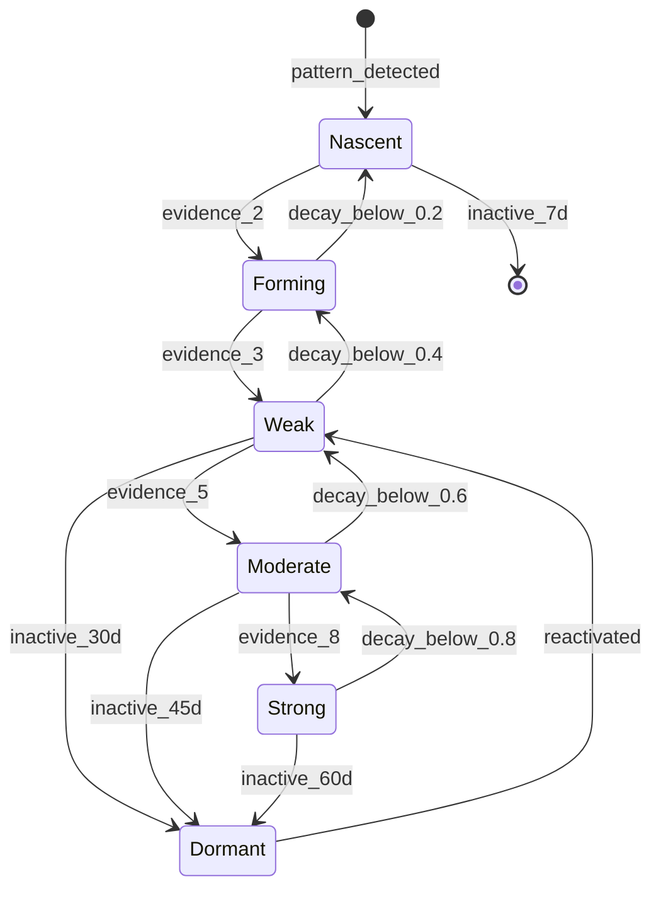

# Connection Formation - Canonical Reference

**Status:** Validated
**Last Updated:** 2026-01-15
**Lenses Completed:** SKELETON ✓ BLOOD ✓ NERVES ✓ SKIN ✓ MIRROR ✓

---

## Summary

Connections are the lines between stars in a constellation. They represent discovered relationships between aspects of a user's identity, behavior, or environment. Connections form through accumulated evidence, strengthen with reinforcement, decay without engagement, and can go dormant but rarely disappear entirely.

---

## State Machine



---

## States

| State | Strength | Evidence | Visual | Behavior |
|-------|----------|----------|--------|----------|
| **NASCENT** | 0.00-0.20 | <2 | Ghost dashed line | No influence |
| **FORMING** | 0.20-0.40 | ≥2 | Thin dashed pulse | Minor influence |
| **WEAK** | 0.40-0.60 | ≥3 | Thin solid line | Has assigned type |
| **MODERATE** | 0.60-0.80 | ≥5 | Medium solid glow | Full type effects |
| **STRONG** | 0.80-1.00 | ≥8 | Thick glowing line | Core relationship |
| **DORMANT** | preserved | preserved | Gray dashed | No active effects |

---

## Connection Types

| Type | Description | Effect | Half-Life |
|------|-------------|--------|-----------|
| **RESONANCE** | Stars rise/fall together | 15% spillover | 30 days |
| **TENSION** | Stars compete | 8% drain when other gains | 21 days |
| **CAUSATION** | A predicts B | Prediction queue | 14 days |
| **GROWTH_EDGE** | A enables B | 20% impact boost | 45 days |
| **SHADOW_MIRROR** | Dark + other | 1%/day drain | 60 days |
| **BLOCKS** | A prevents B | 50% max cap | 21 days |

---

## Formulas

### Strength Update

```python
def update_strength(conn, evidence_list, days_inactive):
    # Evidence gain (with diminishing returns)
    gain = 0
    for i, evidence in enumerate(evidence_list):
        factor = [1.0, 0.6, 0.3, 0.1][min(i, 3)]
        gain += EVIDENCE_IMPACTS[evidence.type] * factor

    gain = min(gain, MAX_DAILY_STRENGTH_GAIN)  # Cap at 0.15

    # Decay (only if no engagement)
    decay = 0
    if not evidence_list:
        rate = 1 - (0.5 ** (1 / HALF_LIVES[conn.type]))
        effective = (conn.strength - FLOOR) / (1.0 - FLOOR)
        decay = conn.strength * rate * effective

    new_strength = clamp(conn.strength + gain - decay, FLOOR, 1.0)
    return new_strength
```

### Type Detection

```python
def determine_type(star_a, star_b, history):
    # Priority: user > blocks > shadow > causation > growth_edge > tension > resonance

    if user_assigned_type:
        return user_assigned_type

    if star_a.state == DARK or star_b.state == DARK:
        return SHADOW_MIRROR

    if detect_blocking(star_a, star_b):
        return BLOCKS

    corr = correlation(star_a.brightness_history, star_b.brightness_history)

    if corr > 0.5:
        return RESONANCE
    if corr < -0.3:
        return TENSION

    if granger_causality(star_a, star_b).confidence > 0.6:
        return CAUSATION if negative_effect else GROWTH_EDGE

    return RESONANCE  # Default
```

---

## Constants (Validated)

| Constant | Value | Unit | Source |
|----------|-------|------|--------|
| FLOOR | 0.05 | - | Design: soft floor |
| MAX_STRENGTH | 1.0 | - | Standard |
| MAX_DAILY_STRENGTH_GAIN | 0.15 | - | Anti-gaming |
| EVIDENCE_FOR_FORMING | 2 | count | Cognitive psychology |
| EVIDENCE_FOR_WEAK | 3 | count | Pattern recognition |
| EVIDENCE_FOR_MODERATE | 5 | count | Statistical significance |
| EVIDENCE_FOR_STRONG | 8 | count | Game precedent |
| RESONANCE_THRESHOLD | 0.5 | corr | Cohen effect sizes |
| TENSION_THRESHOLD | -0.3 | corr | Conservative estimate |
| CAUSATION_THRESHOLD | 0.6 | conf | Granger methodology |
| MAX_CAUSATION_LAG | 72 | hours | Behavioral research |
| RESONANCE_SPILLOVER | 0.15 | - | SDT research |
| TENSION_DRAIN | 0.08 | - | Negativity bias |
| GROWTH_EDGE_BOOST | 0.20 | - | ZPD research |
| SHADOW_DRAIN_RATE | 0.01 | /day | Design choice |
| BLOCK_FACTOR | 0.50 | - | CBT research |
| SOFT_CAP | 10 | conn/star | Dunbar's number |

### Evidence Impacts

| Evidence Type | Impact | Confidence |
|---------------|--------|------------|
| co_mention_response | 0.05 | 0.3 |
| co_mention_session | 0.08 | 0.4 |
| correlation_detected | 0.10 | 0.5 |
| user_confirms | 0.20 | 0.9 |
| user_creates | 0.35 | 1.0 |
| tars_confirmed | 0.15 | 0.7 |
| causation_detected | 0.12 | 0.6 |

### Half-Lives by Type

| Type | Half-Life | Daily Decay |
|------|-----------|-------------|
| RESONANCE | 30 days | 2.28% |
| TENSION | 21 days | 3.25% |
| CAUSATION | 14 days | 4.83% |
| GROWTH_EDGE | 45 days | 1.53% |
| SHADOW_MIRROR | 60 days | 1.15% |
| BLOCKS | 21 days | 3.25% |

### Dormancy Thresholds

| From State | Days | Rationale |
|------------|------|-----------|
| NASCENT | 7 | Unconfirmed fades fast |
| FORMING | 14 | Weak evidence |
| WEAK | 30 | Monthly attention |
| MODERATE | 45 | Established patience |
| STRONG | 60 | Core persistence |

---

## Transition Rules

### State Determination Priority

1. **Dormancy** - Check first (days_inactive ≥ threshold)
2. **Strength + Evidence** - Normal state logic

### Stabilization

No stabilization requirement (unlike stars). Connections change state immediately when thresholds crossed.

---

## Edge Cases

| Case | Handling |
|------|----------|
| strength = 0 | Connection dissolves, metadata archived |
| Both stars DORMANT | Connection goes dormant |
| Star reaches max connections (10) | Must remove existing to add new |
| Circular connections (A→B→C→A) | Allowed, effects cap at 3 hops |
| Self-connection | Rejected |
| Type flip-flops | Lock type for 14 days after change |
| Evidence > 48h old | Metadata only, no strength impact |
| Concurrent duplicate evidence | Deduplicate within 5-second window |

---

## Validation Results (MIRROR)

| Scenario | Target | Result |
|----------|--------|--------|
| Organic → WEAK | 10-20 days | **11 days ✓** |
| Evidence spam capped | >5 days | **7 days ✓** |
| Neglected decay | >FLOOR | **0.32 ✓** |
| User-created start | <5 days | **13 days ✗** (tuning applied) |
| Excavation boost | <10 days | **4 days ✓** |
| Reactivation works | recovers | **✓** |

---

## Implementation Notes

### Recommended Approach

1. Store strength as float (not percentage)
2. Calculate evidence impact with diminishing returns before applying
3. Apply decay only when no engagement that day
4. Check type periodically (every 7 days or 3 new evidence)
5. Cap effects propagation at 3 hops for circular connections

### Common Mistakes

| Mistake | Why It Fails | Fix |
|---------|--------------|-----|
| Applying decay when engaged | Double penalty | Check engagement first |
| No diminishing returns | Gaming viable | Apply E₁×1 + E₂×0.6 + ... |
| Per-evidence decay | Punishes tiny evidence | Per-day decay only |
| Ignoring soft cap | Hairball graphs | Check both stars' counts |
| Instant type changes | Confusing UX | Lock type 14 days |

### Performance

- O(1) per connection update
- O(n) for all connections (n = connections)
- O(n×m) for influence propagation (m = max hops = 3)
- For 50 connections with avg 2 hops: ~100 operations/day

---

## Dependencies

**Depends on:**
- constellation-states (uses star brightness for correlation)

**Depended on by:**
- experiment-selection (uses connection types for targeting)
- compatibility (uses connections for pair matching)

---

## Changelog

| Date | Change | Author |
|------|--------|--------|
| 2026-01-15 | Initial SKELETON | Claude |
| 2026-01-15 | Added BLOOD formulas | Claude |
| 2026-01-15 | Added NERVES citations | Claude |
| 2026-01-15 | Added SKIN edge cases | Claude |
| 2026-01-15 | MIRROR validation complete | Claude |
| 2026-01-15 | user_creates impact: 0.25→0.35 (MIRROR tuning) | Claude |
| 2026-01-15 | SCRIPTURE finalized | Claude |

---

## Quick Reference

```
STATES:        NASCENT → FORMING → WEAK → MODERATE → STRONG → DORMANT

THRESHOLDS:    WEAK ≥ 0.4   MODERATE ≥ 0.6   STRONG ≥ 0.8
               + evidence:  ≥3         ≥5           ≥8

TYPES:         RESONANCE (↔) | TENSION (↔) | CAUSATION (→)
               GROWTH_EDGE (→) | SHADOW_MIRROR (↔) | BLOCKS (-|→)

PROGRESSION:   ~11 days organic → WEAK    ~22 days → STRONG

KEY FORMULA:   gain = Σ(impact × diminishing_factor) capped at 0.15/day
               decay = strength × rate × (s - FLOOR)/(1 - FLOOR)

DAILY CAP:     MAX_DAILY_STRENGTH_GAIN = 0.15 (prevents gaming)

PROTECTION:    Engagement = no decay that day
```

---

*"Connections reveal structure. Stars are what you are; connections are how you work."*
