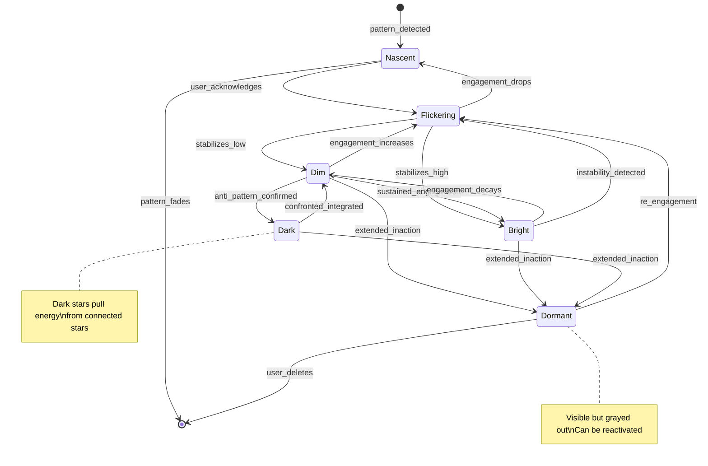

# Constellation States - SKELETON

**System:** constellation-states
**Lens:** SKELETON (1/7)
**Created:** 2026-01-15
**Status:** Draft

---

## Overview

A star's **state** describes its lifecycle stage - how bright, stable, and influential it is in the constellation. States are independent of domain (a Health star and Purpose star can both be BRIGHT).

---

## State Machine



---

## States (6)

### 1. NASCENT
**Symbol:** · (faint dot)
**Meaning:** A star is forming but not yet "real" in the constellation
**Visibility:** Barely visible, ghost-like
**Behavior:** No connections yet, doesn't affect other stars

**Entry conditions:**
- Pattern detected: 3+ mentions of same topic
- OR explicit user articulation: "I care about X"
- OR TARS recognition: "I notice a pattern..."

**Exit conditions:**
- → FLICKERING: User acknowledges ("Yes, that's important to me")
- → [deleted]: Pattern fades (no further mentions for 14 days)

---

### 2. FLICKERING
**Symbol:** ✦
**Meaning:** Emerging potential, becoming but not yet stable
**Visibility:** Medium brightness, irregular pulse
**Behavior:** Can form weak connections, brightness oscillates

**Entry conditions:**
- From NASCENT: User acknowledgment
- From DIM: Increased engagement (3+ actions in 7 days)
- From DORMANT: Re-engagement after absence

**Exit conditions:**
- → BRIGHT: Brightness ≥ 0.7 sustained for 7 days (stabilizes high)
- → DIM: Brightness stabilizes at < 0.5 for 7 days (stabilizes low)
- → NASCENT: No engagement for 14 days (fading back)

**Special properties:**
- Brightness variance > 0.15 (unstable)
- Visual flicker animation
- TARS may prompt: "This star is flickering. What would help it stabilize?"

---

### 3. DIM
**Symbol:** ✧
**Meaning:** Shadow aspect OR stable but under-engaged area
**Visibility:** Low but steady brightness
**Behavior:** Forms connections, stable baseline

**Entry conditions:**
- From FLICKERING: Stabilizes low (brightness < 0.5, variance < 0.1)
- From BRIGHT: Decay from inaction

**Exit conditions:**
- → FLICKERING: Engagement increases (variance rises)
- → BRIGHT: Sustained engagement (brightness ≥ 0.7 for 7 days)
- → DARK: Anti-pattern confirmed (say-do contradiction 3+ times)
- → DORMANT: No engagement for 30 days

**Special properties:**
- Not negative - just waiting
- TARS treats with curiosity, not concern
- "This star is dim. Not wrong - just dim. What's true about that?"

---

### 4. BRIGHT
**Symbol:** ☆
**Meaning:** Verified strength, proven through consistent action
**Visibility:** High brightness, warm glow, gentle pulse
**Behavior:** Strong connections, positive influence on nearby stars

**Entry conditions:**
- From FLICKERING: Stabilizes high (brightness ≥ 0.7, variance < 0.1, 7 days)
- From DIM: Sustained engagement breakthrough

**Exit conditions:**
- → DIM: Brightness decays below 0.5 (gradual)
- → FLICKERING: Instability detected (variance spikes)
- → DORMANT: No engagement for 60 days (longer runway for bright stars)

**Special properties:**
- Can "spill over" to connected stars when capped
- TARS celebrates but doesn't make it a big deal
- Slower decay rate than other states

---

### 5. DARK
**Symbol:** ●
**Meaning:** Gravity well - a pattern pulling away from user's vision
**Visibility:** Deep purple-black, subtle dark aura, slow rotation
**Behavior:** PULLS energy from connected stars (negative influence)

**Entry conditions:**
- From DIM: Anti-pattern confirmed
  - Say-do contradiction detected 3+ times
  - OR user identifies as "what I'm afraid of becoming"
  - OR TARS surfaces: "This pattern is pulling against your vision"

**Exit conditions:**
- → DIM: Confronted and integrated
  - User engages directly with dark star
  - Completes "shadow work" experiments
  - Names and acknowledges the pattern
- → DORMANT: No engagement for 30 days (dark stars don't go dormant easily)

**Special properties:**
- **Energy drain:** Connected bright/dim stars decay faster
- **Pull animation:** Visual effect of nearby stars being tugged
- TARS treats with respect, not fear: "Let's look at this together"
- Cannot be deleted - must be integrated or go dormant

---

### 6. DORMANT
**Symbol:** ◌ (hollow circle)
**Meaning:** Abandoned star - no longer active but still remembered
**Visibility:** Grayed out, no glow, static
**Behavior:** No connections active, no influence

**Entry conditions:**
- From any state: Extended period of zero engagement
  - FLICKERING/DIM: 30 days
  - BRIGHT: 60 days
  - DARK: 30 days (but harder to ignore)

**Exit conditions:**
- → FLICKERING: Any re-engagement (mention, experiment, reflection)
- → [deleted]: User explicitly removes (rare, requires confirmation)

**Special properties:**
- Still visible in constellation (grayed)
- Serves as memory: "You had a star here once"
- Can be reactivated anytime
- TARS may occasionally surface: "This star has been dormant for 3 months. Still relevant?"

---

## Transitions Summary

| From | To | Trigger | Days Required |
|------|-----|---------|---------------|
| [none] | Nascent | Pattern detected (3+ mentions) | - |
| Nascent | Flickering | User acknowledges | - |
| Nascent | [deleted] | Pattern fades | 14 |
| Flickering | Bright | brightness ≥ 0.7, variance < 0.1 | 7 |
| Flickering | Dim | brightness < 0.5, variance < 0.1 | 7 |
| Flickering | Nascent | No engagement | 14 |
| Dim | Flickering | Engagement spike | - |
| Dim | Bright | brightness ≥ 0.7, variance < 0.1 | 7 |
| Dim | Dark | Anti-pattern confirmed (3x contradiction) | - |
| Dim | Dormant | No engagement | 30 |
| Bright | Dim | brightness < 0.5 | - |
| Bright | Flickering | variance > 0.15 | - |
| Bright | Dormant | No engagement | 60 |
| Dark | Dim | Confronted/integrated | - |
| Dark | Dormant | No engagement | 30 |
| Dormant | Flickering | Re-engagement | - |
| Dormant | [deleted] | User explicit delete | - |

---

## Entity Relationships

```
┌─────────────────────────────────────────────────────────────────┐
│                         CONSTELLATION                            │
│                                                                   │
│    ┌──────┐         ┌──────────┐         ┌──────┐               │
│    │ STAR │─────────│CONNECTION│─────────│ STAR │               │
│    └──────┘         └──────────┘         └──────┘               │
│        │                  │                   │                  │
│        │                  │                   │                  │
│    ┌───┴───┐         ┌────┴────┐         ┌───┴───┐              │
│    │ STATE │         │STRENGTH │         │ STATE │              │
│    │       │         │         │         │       │              │
│    │ - id  │         │ - value │         │ - id  │              │
│    │ - bri │         │ - decay │         │ - bri │              │
│    │ - var │         │         │         │ - var │              │
│    └───────┘         └─────────┘         └───────┘              │
│                                                                   │
└─────────────────────────────────────────────────────────────────┘

Star
├── id: string
├── domain: health | relationships | purpose | wealth | soul
├── name: string (user-given or TARS-suggested)
├── state: nascent | flickering | dim | bright | dark | dormant
├── brightness: float [0, 1]
├── variance: float [0, 1] (rolling 7-day)
├── created_at: datetime
├── last_engaged: datetime
└── connections: Connection[]

Connection
├── id: string
├── star_a: Star
├── star_b: Star
├── strength: float [0, 1]
├── type: resonance | tension | growth_edge | shadow_mirror
└── created_at: datetime
```

---

## Edge Cases

| Case | Question | Resolution |
|------|----------|------------|
| User has 0 stars | What do they see? | Empty sky with nebula, TARS prompts first question |
| User has 50+ stars | Does it get cluttered? | Zoom levels + clustering by domain |
| Two stars in same exact position | Visual collision? | Slight offset, never overlap |
| Dark star connected to bright star | How does energy drain work? | Defined in BLOOD phase |
| Star at exactly 0.5 brightness | Is it dim or potentially bright? | Treated as dim until proven bright |
| Dormant star re-engages | Which state does it return to? | Always Flickering (needs stabilization) |
| User explicitly disagrees with TARS-suggested star | Can they reject nascent stars? | Yes - nascent stars are suggestions, not facts |
| All stars are dark | Emergency state? | TARS suggests "low gravity mode" or professional help |

---

## Domain vs State Clarification

**Domains** (5) - WHAT the star represents:
- Health (body, energy, habits)
- Relationships (people, connection)
- Purpose (meaning, mission)
- Wealth (career, money, security)
- Soul (creativity, spirituality, inner life)

**States** (6) - HOW the star is doing:
- Nascent, Flickering, Dim, Bright, Dark, Dormant

Every star has both:
- "My Health star is BRIGHT" (domain=health, state=bright)
- "My Purpose star is FLICKERING" (domain=purpose, state=flickering)

---

## Open Questions for BLOOD

- [ ] What is the exact brightness threshold for each state?
- [ ] How is variance calculated? (rolling window? exponential?)
- [ ] How does dark star energy drain quantitatively work?
- [ ] What's the spillover formula when bright stars are capped?
- [ ] How do domain-specific decay rates affect state transitions?

---

## Visual Reference

```
STATE PROGRESSION (typical positive path)

    ·  →  ✦  →  ✧  →  ☆
 Nascent  Flicker  Dim  Bright
  (0.1)   (0.3)   (0.4)  (0.8)

ALTERNATIVE PATHS

    ✧  →  ●  →  ✧        (dark star confronted)
   Dim   Dark   Dim

    ☆  →  ✧  →  ◌  →  ✦  (bright decays, goes dormant, reactivates)
  Bright  Dim  Dormant Flicker
```

---

*SKELETON complete. Proceed to BLOOD for formulas.*
