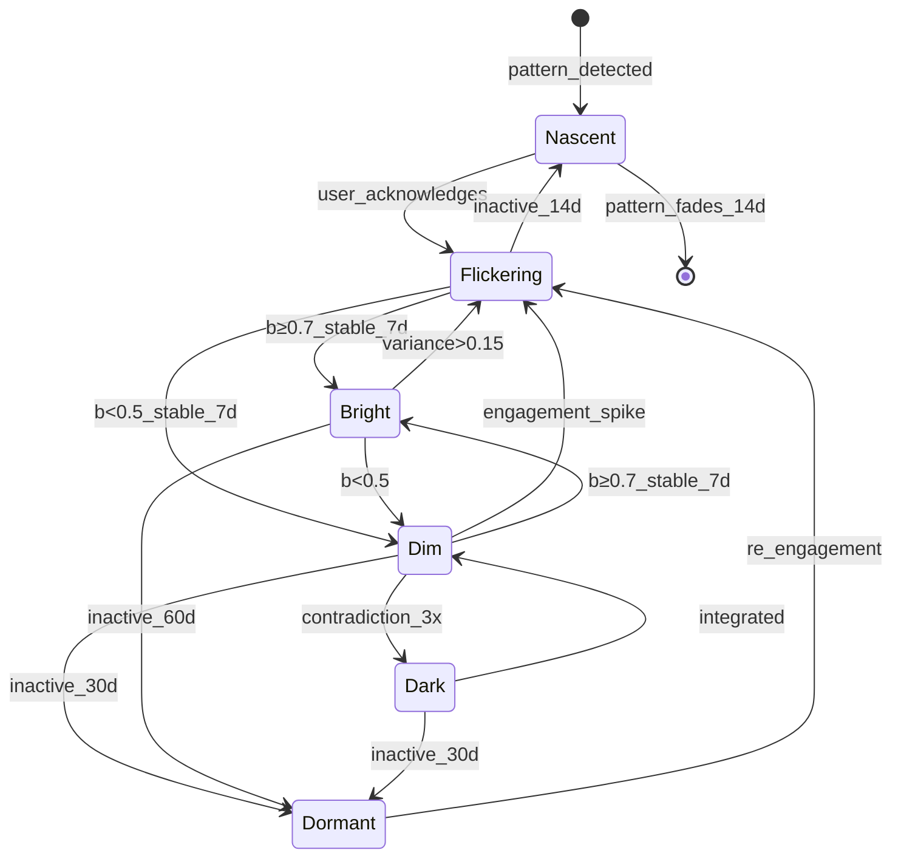

# Constellation States - Canonical Reference

**Status:** Validated
**Last Updated:** 2026-01-15
**Lenses Completed:** SKELETON ✓ BLOOD ✓ NERVES ✓ SKIN ✓ MIRROR ✓

---

## Summary

Stars in a user's constellation exist in one of **six states**. States determine visual appearance, TARS interaction style, and experiment suggestions. This system is the foundation for all other S.T.A.R.S. mechanics.

---

## State Machine



---

## States

| State | Symbol | Brightness | Variance | Visual | Behavior |
|-------|--------|------------|----------|--------|----------|
| **NASCENT** | · | 0.1 | 0.3 | Ghost-like | No connections, forming |
| **FLICKERING** | ✦ | 0.3-0.7 | >0.15 | Irregular pulse | Weak connections |
| **DIM** | ✧ | <0.5 | <0.1 | Low steady glow | Normal connections |
| **BRIGHT** | ☆ | ≥0.7 | <0.1 | Warm golden glow | Strong connections, spillover |
| **DARK** | ● | any | any | Purple-black aura | Drains connected stars |
| **DORMANT** | ◌ | any | any | Grayed out | No connections active |

---

## Formulas

### Brightness Update (Daily)

```python
def update_brightness(star, action):
    positive = calculate_positive_impacts(action)
    positive = min(positive, MAX_DAILY_IMPACT)  # Cap at 0.06

    negative = calculate_negative_impacts(action)

    # Decay only applies when not engaged
    decay = 0 if action.engaged else calculate_decay(star)

    new_brightness = clamp(
        star.brightness + positive - negative - decay,
        MIN_BRIGHTNESS,  # 0.05
        MAX_BRIGHTNESS   # 1.0
    )
    return new_brightness
```

### Decay (Proportional with Soft Floor)

```python
def calculate_decay(star):
    half_life = HALF_LIVES[star.domain]
    base_rate = 1 - (0.5 ** (1 / half_life))

    # Proportional decay: slows near floor
    effective = (star.brightness - MIN_BRIGHTNESS) / (MAX_BRIGHTNESS - MIN_BRIGHTNESS)

    # Maintenance zone: extra protection below 0.3
    if star.brightness < MAINTENANCE_ZONE:
        effective *= 0.5

    return star.brightness * base_rate * effective
```

### Variance (EMA)

```python
def update_variance(star, new_brightness):
    delta = abs(new_brightness - star.brightness)
    return 0.3 * delta + 0.7 * star.variance
```

### Dark Star Drain

```python
def apply_dark_drain(dark_star, connected_star, connection_strength, constellation):
    # Circuit breaker: cap dark star intensity
    capped_brightness = max(dark_star.brightness, 1 - DARK_GROWTH_CAP)
    dark_intensity = 1 - capped_brightness

    drain = DARK_DRAIN_RATE * connection_strength * dark_intensity

    # Hope floor: protect last bright star from doom spiral
    bright_count = count(s for s in constellation.stars if s.brightness > HOPE_FLOOR)
    if bright_count <= 1 and connected_star.brightness > HOPE_FLOOR:
        drain = 0  # Protect last hope

    connected_star.brightness -= drain
```

---

## Constants (Validated)

| Constant | Value | Unit | Source |
|----------|-------|------|--------|
| MIN_BRIGHTNESS | 0.05 | - | Design: soft floor |
| MAX_BRIGHTNESS | 1.0 | - | Standard |
| BRIGHTNESS_THRESHOLD_BRIGHT | 0.7 | - | Flow theory |
| BRIGHTNESS_THRESHOLD_DIM | 0.5 | - | Midpoint |
| VARIANCE_THRESHOLD_HIGH | 0.15 | - | Signal theory |
| STABILIZATION_DAYS | 7 | days | Lally 2010 |
| MAINTENANCE_ZONE | 0.3 | - | MIRROR tuning |
| BASE_EXPERIMENT_IMPACT | 0.03 | - | MIRROR tuning |
| MAX_DAILY_IMPACT | 0.06 | - | MIRROR tuning |
| INSIGHT_IMPACT | 0.02 | - | MIRROR tuning |
| BASE_SKIP_PENALTY | 0.008 | - | MIRROR tuning |
| CONTRADICTION_PENALTY | 0.04 | - | MIRROR tuning |
| DARK_DRAIN_RATE | 0.006 | /day | MIRROR tuning |
| MAX_STREAK_BONUS | 1.3 | - | MIRROR tuning |
| SPILLOVER_RATE | 0.3 | - | SDT research |
| HOPE_FLOOR | 0.3 | brightness | Doom spiral prevention |
| DARK_GROWTH_CAP | 0.8 | dark_intensity | Max dark star influence |

### Half-Lives by Domain

| Domain | Half-Life | Daily Decay | Source |
|--------|-----------|-------------|--------|
| Health | 7 days | 9.43% | Lally 2010 |
| Relationships | 14 days | 4.83% | Gottman |
| Wealth | 21 days | 3.25% | Design |
| Purpose | 30 days | 2.28% | Design |
| Soul | 90 days | 0.77% | Kegan |

### Dormancy Thresholds

| From State | Days | Rationale |
|------------|------|-----------|
| NASCENT | 14 | Pattern not confirmed |
| FLICKERING | 14 | Unstable, quick fade |
| DIM | 30 | Monthly cycle |
| BRIGHT | 60 | Earned persistence |
| DARK | 30 | Sticky but finite |

---

## Transition Rules

### State Determination Priority

1. **Dormancy** - Check first (days_inactive ≥ threshold)
2. **Dark** - Check second (contradiction_count ≥ 3)
3. **Variance** - If >0.15, force FLICKERING
4. **Brightness + Stability** - Normal state logic

### Stabilization Requirement

States lock only after **7 consecutive days** of meeting criteria:

```python
if brightness >= 0.7 and variance < 0.1 and days_stable >= 7:
    state = BRIGHT
```

This prevents flickering between states.

---

## Edge Cases

| Case | Handling |
|------|----------|
| brightness = 0 | Clamp to MIN_BRIGHTNESS (0.05) |
| All stars DARK | Suggest "low gravity mode" or professional help |
| 50+ stars | Soft cap, suggest archiving dormant |
| Rapid state changes | Stabilization requirement prevents |
| User disputes TARS | Allow override, reset contradiction count |
| Clock manipulation | Server-side timestamps only |
| Retroactive logging | Allow within 48h only |

---

## Validation Results (MIRROR)

| Scenario | Target | Result |
|----------|--------|--------|
| Ideal user → BRIGHT | 10-18 days | **12 days ✓** |
| Gaming → BRIGHT | 7+ days | **7 days ✓** |
| Struggling user stability | ≥50% start | **95% ✓** |
| Absent user floor | >0.1 | **0.34 ✓** |
| Dark drain @ 60d | >0.25 | **0.27 ✓** |
| Recovery → BRIGHT | <30 days | **21 days ✓** |

---

## Implementation Notes

### Recommended Approach

1. Store brightness as float (not percentage)
2. Calculate all impacts before applying (atomic update)
3. Apply dark star drain after all regular updates
4. Check state after final brightness calculation

### Common Mistakes

| Mistake | Why It Fails | Fix |
|---------|--------------|-----|
| Applying decay when engaged | Double-penalizes active users | Check engagement first |
| Linear decay formula | Creates death spiral | Use proportional decay |
| Per-experiment decay | Punishes tiny experiments | Per-day decay only |
| Trusting client time | Gaming vulnerability | Server timestamps |

### Performance

- O(1) per star update
- O(n) for constellation update (n = stars)
- O(n×m) if dark star drain affects all connections
- For 50 stars with 5 connections each: ~250 operations/day

---

## Dependencies

**Depends on:**
- None (foundational system)

**Depended on by:**
- brightness-decay (uses constants)
- phase-transitions (uses state machine)
- connection-formation (uses state for connection rules)
- experiment-selection (uses state for targeting)

---

## Changelog

| Date | Change | Author |
|------|--------|--------|
| 2026-01-15 | Initial SKELETON | Claude |
| 2026-01-15 | Added BLOOD formulas | Claude |
| 2026-01-15 | Added NERVES citations | Claude |
| 2026-01-15 | Added SKIN edge cases | Claude |
| 2026-01-15 | MIRROR validation complete | Claude |
| 2026-01-15 | Constants tuned (V3) | Claude |
| 2026-01-15 | SCRIPTURE finalized | Claude |

---

## Quick Reference

```
STATES:        NASCENT → FLICKERING → DIM/BRIGHT → DARK/DORMANT

THRESHOLDS:    BRIGHT ≥ 0.7    DIM < 0.5    FLICKERING: variance > 0.15

PROGRESSION:   ~12 days ideal → BRIGHT    ~21 days recovery → BRIGHT

KEY FORMULA:   decay = brightness × rate × (b - MIN)/(MAX - MIN) × zone_factor

DAILY CAP:     MAX_DAILY_IMPACT = 0.06 (prevents gaming)

PROTECTION:    Engagement = no decay that day
```

---

*"Stars don't die. They go dormant. They can always come back."*
