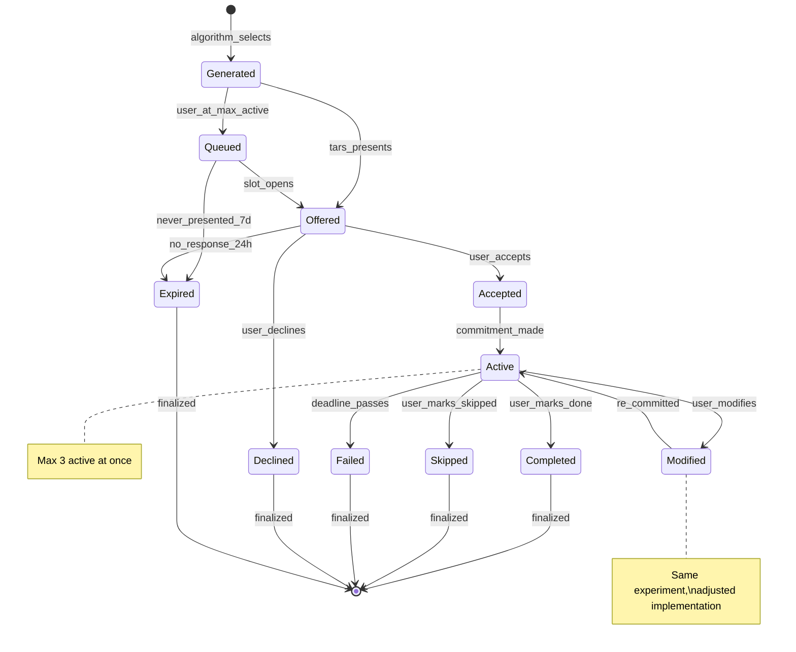

# Experiment Selection - SKELETON

**System:** experiment-selection
**Lens:** SKELETON (1/7)
**Created:** 2026-01-15
**Status:** Draft

---

## Overview

Experiment selection determines which small real-world actions to recommend to users. An experiment is a concrete behavior with an implementation intention format (WHEN/WILL/AT) that targets a specific star. The selection algorithm balances star urgency, user capacity, and success probability to surface the right experiment at the right time.

This system is the engine of "The Walk" - the action framework that turns constellation insight into behavior change.

---

## State Machine - Experiment Lifecycle



---

## States (10)

### 1. GENERATED
**Meaning:** Algorithm has created this experiment candidate
**Duration:** Momentary (transitions immediately)
**Behavior:** Exists in pool, not yet shown to user

**Entry conditions:**
- Selection algorithm runs (daily or on-demand)
- Star + difficulty + template match found

**Exit conditions:**
- OFFERED: User has < 3 active experiments
- QUEUED: User already at max active (3)

---

### 2. QUEUED
**Meaning:** Waiting for an active slot to open
**Duration:** Up to 7 days
**Behavior:** Preserved in pool, priority may change with context

**Entry conditions:**
- From GENERATED: User has 3 active experiments

**Exit conditions:**
- OFFERED: An active experiment completes/fails/skips
- EXPIRED: 7 days without being offered (stale)

**Special properties:**
- Queue is priority-ordered (re-sorted daily)
- Max queue depth: 5 experiments
- Oldest experiments expire first if queue exceeds 5

---

### 3. OFFERED
**Meaning:** TARS has presented this experiment to the user
**Duration:** Up to 24 hours
**Behavior:** Awaiting user response

**Entry conditions:**
- From GENERATED: User has capacity
- From QUEUED: Slot opened

**Exit conditions:**
- ACCEPTED: User says yes / commits
- DECLINED: User explicitly says no
- EXPIRED: 24 hours without response

**Special properties:**
- TARS guides implementation intention crafting
- User can request alternatives ("not this one")
- Declining is judgment-free

---

### 4. ACCEPTED
**Meaning:** User has agreed to try this experiment
**Duration:** Momentary (transitions to ACTIVE)
**Behavior:** Commitment is being finalized

**Entry conditions:**
- From OFFERED: User acceptance

**Exit conditions:**
- ACTIVE: Implementation intention locked (WHEN/WILL/AT)

**Special properties:**
- Must have complete implementation intention
- Deadline set (typically 24-48h)

---

### 5. ACTIVE
**Meaning:** User has committed; experiment is in progress
**Duration:** Until deadline (usually 24-48h)
**Behavior:** Counts against max active (3), awaiting outcome

**Entry conditions:**
- From ACCEPTED: Commitment finalized
- From MODIFIED: Re-commitment after adjustment

**Exit conditions:**
- COMPLETED: User reports success
- SKIPPED: User reports didn't do it (intentional)
- FAILED: Deadline passes without report
- MODIFIED: User adjusts implementation

**Special properties:**
- Reminder notifications at trigger time
- Evening check-in prompts for outcome
- Each active experiment is tied to exactly one star

---

### 6. MODIFIED
**Meaning:** User is adjusting the implementation intention
**Duration:** Momentary
**Behavior:** Same experiment, different approach

**Entry conditions:**
- From ACTIVE: User requests change ("I need to adjust this")

**Exit conditions:**
- ACTIVE: New implementation intention locked

**Special properties:**
- Preserves experiment identity and star target
- Changes trigger, behavior, or location
- Does not reset attempt count
- Max 2 modifications per experiment (then must accept or skip)

---

### 7. COMPLETED
**Meaning:** User successfully performed the experiment
**Duration:** Terminal
**Behavior:** Updates star brightness, logs outcome

**Effects on system:**
- Star brightness increases (amount depends on difficulty)
- Success rate for similar experiments improves
- User capacity estimate increases slightly
- Connection to star may strengthen

---

### 8. SKIPPED
**Meaning:** User intentionally did not do the experiment
**Duration:** Terminal
**Behavior:** Minimal negative impact, logged for patterns

**Effects on system:**
- Minimal star brightness impact (first skip: negligible)
- Pattern detection: 3+ skips in a row triggers pivot
- No shame - TARS gets curious
- Constraint learning: why didn't it fit?

---

### 9. FAILED
**Meaning:** Deadline passed without user reporting outcome
**Duration:** Terminal
**Behavior:** Treated as implicit skip, triggers follow-up

**Effects on system:**
- Slightly more impact than explicit skip (ambiguity penalty)
- TARS follows up: "What happened?"
- Success rate for similar experiments decreases
- May indicate constraint or capacity issue

---

### 10. EXPIRED
**Meaning:** Experiment was never engaged with
**Duration:** Terminal
**Behavior:** Removed from pool, no star impact

**Effects on system:**
- No brightness change (never attempted)
- May indicate offer timing issues
- If many expire: TARS adjusts notification strategy

---

### 11. DECLINED
**Meaning:** User explicitly said no to offered experiment
**Duration:** Terminal
**Behavior:** Removed, TARS seeks alternative

**Effects on system:**
- No brightness change
- TARS asks why (optional)
- May indicate wrong difficulty, wrong star, or timing
- Alternative experiment offered immediately

---

## Entity Model

### Primary Entities

```
EXPERIMENT
├── id: string (uuid)
├── user_id: string
├── star_id: string (target star)
├── template_id: string (base template used)
├── state: generated | queued | offered | accepted | active | modified | completed | skipped | failed | expired | declined
├── difficulty: tiny | small | medium | stretch
├── priority_score: float [0, 1]
├── implementation_intention: ImplementationIntention
├── constraints_satisfied: string[]
├── created_at: datetime
├── offered_at: datetime?
├── activated_at: datetime?
├── deadline: datetime?
├── resolved_at: datetime?
├── outcome_note: string?
├── modification_count: int [0, 2]
└── attempt_number: int (for same star+template combo)


IMPLEMENTATION_INTENTION
├── id: string
├── experiment_id: string
├── trigger: string ("When I finish making coffee")
├── behavior: string ("I will stand up")
├── location: string ("in my kitchen")
├── anchor: string? (existing habit this attaches to)
└── created_at: datetime


EXPERIMENT_TEMPLATE
├── id: string
├── star_domain: health | relationships | purpose | wealth | soul
├── difficulty: tiny | small | medium | stretch
├── description: string
├── default_trigger: string?
├── default_behavior: string
├── suggested_duration: minutes
├── required_constraints: Constraint[] (must be met)
├── blocked_by_constraints: Constraint[] (cannot have these)
└── tags: string[]


CONSTRAINT
├── type: time | energy | social | physical | values | location
├── key: string (e.g., "morning_available", "has_partner", "can_run")
├── value: any
└── source: user_stated | observed | inferred


USER_CAPACITY
├── user_id: string
├── recent_completion_rate: float [0, 1] (7-day rolling)
├── current_stress_level: low | medium | high | crisis
├── optimal_time_windows: TimeWindow[]
├── day_of_week_patterns: map<day, float> (success rate by day)
├── active_experiment_count: int [0, 3]
└── queue_depth: int [0, 5]


SELECTION_CONTEXT
├── user_id: string
├── timestamp: datetime
├── star_urgencies: map<star_id, float>
├── user_capacity: UserCapacity
├── connection_effects: ConnectionEffect[]
├── available_templates: ExperimentTemplate[]
├── constraints: Constraint[]
└── recent_outcomes: Outcome[] (last 10)


CONNECTION_EFFECT
├── connection_id: string
├── connection_type: resonance | tension | causation | growth_edge | shadow_mirror | blocks
├── source_star_id: string
├── target_star_id: string
├── effect: enables | boosts | competes | prevents | drains
└── magnitude: float
```

---

## Entity Relationships

```
┌─────────────────────────────────────────────────────────────────────────────┐
│                           EXPERIMENT SELECTION SYSTEM                        │
│                                                                              │
│  ┌──────────────────┐         ┌─────────────┐         ┌──────────────────┐  │
│  │ USER_CAPACITY    │────────→│  SELECTION  │←────────│  STAR_URGENCIES  │  │
│  │                  │         │   CONTEXT   │         │                  │  │
│  │ - completion_rate│         │             │         │ - star states    │  │
│  │ - stress_level   │         │             │         │ - brightness     │  │
│  │ - time_windows   │         │             │         │ - connections    │  │
│  └──────────────────┘         └──────┬──────┘         └──────────────────┘  │
│                                      │                                       │
│                                      ▼                                       │
│                            ┌─────────────────┐                               │
│                            │    ALGORITHM    │                               │
│                            │                 │                               │
│                            │ PRIORITY =      │                               │
│                            │ urgency × 0.4 + │                               │
│                            │ capacity × 0.3 +│                               │
│                            │ success × 0.3   │                               │
│                            └────────┬────────┘                               │
│                                     │                                        │
│           ┌─────────────────────────┼─────────────────────────┐              │
│           ▼                         ▼                         ▼              │
│  ┌─────────────────┐       ┌─────────────────┐       ┌─────────────────┐    │
│  │   EXPERIMENT    │       │   EXPERIMENT    │       │   EXPERIMENT    │    │
│  │   (Active 1)    │       │   (Active 2)    │       │   (Active 3)    │    │
│  │                 │       │                 │       │                 │    │
│  │ ┌─────────────┐ │       │ ┌─────────────┐ │       │ ┌─────────────┐ │    │
│  │ │ IMPL.       │ │       │ │ IMPL.       │ │       │ │ IMPL.       │ │    │
│  │ │ INTENTION   │ │       │ │ INTENTION   │ │       │ │ INTENTION   │ │    │
│  │ └─────────────┘ │       │ └─────────────┘ │       │ └─────────────┘ │    │
│  │        │        │       │        │        │       │        │        │    │
│  │        ▼        │       │        ▼        │       │        ▼        │    │
│  │ ┌─────────────┐ │       │ ┌─────────────┐ │       │ ┌─────────────┐ │    │
│  │ │    STAR     │ │       │ │    STAR     │ │       │ │    STAR     │ │    │
│  │ └─────────────┘ │       │ └─────────────┘ │       │ └─────────────┘ │    │
│  └─────────────────┘       └─────────────────┘       └─────────────────┘    │
│                                                                              │
│                            ┌─────────────────┐                               │
│                            │     QUEUED      │                               │
│                            │  EXPERIMENTS    │                               │
│                            │   (max 5)       │                               │
│                            └─────────────────┘                               │
│                                                                              │
└─────────────────────────────────────────────────────────────────────────────┘
```

### Key Relationships

| From | To | Relationship | Cardinality |
|------|-----|--------------|-------------|
| Experiment | Star | targets | N:1 (many experiments can target same star) |
| Experiment | ImplementationIntention | has | 1:1 |
| Experiment | Template | derived_from | N:1 |
| User | Experiment | owns | 1:N |
| User | UserCapacity | has | 1:1 |
| Star | Connection | participates_in | N:N |
| Connection | Experiment | influences_selection | N:N |

---

## Connection Type Effects on Selection

From the connection-formation system, connection types affect experiment targeting:

| Connection Type | Effect on Selection | Mechanism |
|-----------------|---------------------|-----------|
| **GROWTH_EDGE** | **Enables** | If A is bright and A GROWTH_EDGE B, experiments for B get +20% priority boost |
| **RESONANCE** | **Spillover** | Success on A brightens B slightly; consider experiments that hit both |
| **TENSION** | **Competes** | If A and B in tension, don't offer experiments for both simultaneously |
| **CAUSATION** | **Sequencing** | If A causes B, prioritize A experiments first |
| **SHADOW_MIRROR** | **Awareness** | Dark star drains; may prioritize dark star experiments for integration |
| **BLOCKS** | **Prevents** | If A blocks B (and A is active), B cannot be targeted until A addressed |

### Connection-Aware Selection Rules

1. **BLOCKS check first:** Never offer experiments for a star that is blocked by another active star
2. **TENSION awareness:** Don't have two active experiments on stars in TENSION
3. **GROWTH_EDGE leverage:** Boost priority when prerequisite star is bright
4. **SHADOW_MIRROR surfacing:** Periodically offer dark star experiments (can't ignore forever)

---

## Star Urgency States

Star state directly informs urgency (from 02a-walk-mechanics.md):

| Star State | Urgency Score | Selection Behavior |
|------------|---------------|-------------------|
| **FLICKERING** (5+ days) | 0.9 | Highest priority - at risk of dimming, needs stabilization |
| **DARK** (growing) | 0.8 | Active threat - offer confrontation/awareness experiments |
| **BRIGHT** (declining) | 0.7 | Protect gains - maintenance experiments |
| **DIM** (steady) | 0.5 | Ready for growth - growth experiments |
| **BRIGHT** (stable) | 0.2 | Maintenance only - stretch experiments if user wants challenge |
| **DORMANT** | 0.1 | Low priority unless user re-engages |

---

## Difficulty Levels

| Level | Time Required | Effort | When Used | Example |
|-------|---------------|--------|-----------|---------|
| **TINY** | < 30 seconds | Trivial | Flickering stars, low capacity, momentum building | "Notice you're breathing" |
| **SMALL** | 2-5 minutes | Easy | Dim-steady stars, moderate capacity | "5 squats after brushing teeth" |
| **MEDIUM** | 15-30 minutes | Some effort | Bright stars (expansion), high capacity | "30-minute walk" |
| **STRETCH** | Variable | Pushes comfort zone | User-requested challenge, strong constellation | "Share a creative idea publicly" |

### Difficulty Selection Logic

1. **Default to TINY/SMALL** - Higher success rate
2. **Match to star state:**
   - FLICKERING stars get TINY (stabilization)
   - DIM stars get SMALL (growth)
   - BRIGHT stars get MEDIUM (expansion)
   - DARK stars get context-dependent (often TINY awareness tasks)
3. **Adjust for user capacity:**
   - Low recent success rate LOW difficulty
   - High stress LOW difficulty
   - Crisis mode TINY only or pause
4. **Honor user preferences:**
   - "I want something harder" Offer STRETCH with honest success rate disclosure

---

## Constraint Types

| Constraint Type | Examples | How It Filters Templates |
|-----------------|----------|-------------------------|
| **TIME** | "mornings only", "weekends free" | Filter by time window match |
| **ENERGY** | "drained after work" | No evening willpower-demanding experiments |
| **SOCIAL** | "live alone", "work from home" | Filter experiments requiring others |
| **PHYSICAL** | "can't run", "back pain" | Filter movement experiments appropriately |
| **VALUES** | "won't track phone", "no social media" | Filter experiments violating values |
| **LOCATION** | "no gym access", "rural" | Filter location-dependent experiments |

### Constraint Learning

Constraints are learned from:
- **Explicit statements:** "I only have mornings free"
- **Observed failures:** Evening experiments consistently fail NOT offered evening
- **Inferred patterns:** User completes 90% of solo experiments, 20% of social ones solo-preferred

---

## Transitions Summary

| From | To | Trigger | Notes |
|------|-----|---------|-------|
| [algorithm] | Generated | selection_runs | Priority calculated |
| Generated | Offered | user_capacity_available | < 3 active |
| Generated | Queued | user_at_max | Max active reached |
| Queued | Offered | slot_opens | Active experiment resolves |
| Queued | Expired | 7_days_pass | Stale, never offered |
| Offered | Accepted | user_says_yes | Begins commitment flow |
| Offered | Declined | user_says_no | No penalty, alternative offered |
| Offered | Expired | 24h_no_response | Removed from consideration |
| Accepted | Active | intention_locked | WHEN/WILL/AT complete |
| Active | Completed | user_reports_done | Star brightens |
| Active | Skipped | user_reports_skip | Minimal impact, curiosity |
| Active | Failed | deadline_passes | Implicit skip + follow-up |
| Active | Modified | user_adjusts | Same experiment, new intention |
| Modified | Active | re_committed | Back to active tracking |
| * | [terminal] | finalized | State preserved for history |

---

## Algorithm Pseudocode

```
function selectExperiments(context: SelectionContext): Experiment[] {
    candidates = []

    // 1. Get all stars eligible for experiments
    eligibleStars = getEligibleStars(context)

    // 2. For each star, generate candidate experiments
    for star in eligibleStars:
        // Check connection constraints
        if isBlocked(star, context.connectionEffects):
            continue

        // Get templates matching star domain and constraints
        templates = filterTemplates(
            domain = star.domain,
            difficulty = selectDifficulty(star, context.userCapacity),
            constraints = context.constraints
        )

        for template in templates:
            experiment = generateExperiment(star, template)
            experiment.priority_score = calculatePriority(
                star_urgency = context.starUrgencies[star.id],
                user_capacity = context.userCapacity,
                success_probability = predictSuccess(template, context.recentOutcomes),
                connection_bonus = getConnectionBonus(star, context.connectionEffects)
            )
            candidates.append(experiment)

    // 3. Sort by priority
    candidates.sort(by: priority_score, descending)

    // 4. Apply tension check (no two experiments on stars in TENSION)
    filtered = applyTensionFilter(candidates, context.connectionEffects)

    // 5. Return top N based on available slots
    availableSlots = 3 - context.userCapacity.activeExperimentCount
    return filtered.take(availableSlots)
}

function calculatePriority(urgency, capacity, success, bonus): float {
    base = (urgency * 0.4) + (capacity.score * 0.3) + (success * 0.3)
    return clamp(base + bonus, 0.0, 1.0)
}
```

---

## Edge Cases

| Case | Question | Resolution |
|------|----------|------------|
| User has 0 stars | What experiments to offer? | Cannot run selection - redirect to Mirror for star creation |
| All stars are BRIGHT and stable | Low urgency everywhere | Offer STRETCH experiments or maintenance; don't force |
| All stars are DARK | System overload | Activate Sabbatical Mode; single TINY experiment or pause |
| User at max active + max queued | What happens to generated experiments? | Discard; re-run selection when slots open |
| Same experiment offered 3x and declined | User clearly doesn't want it | Blacklist this template for this star for 30 days |
| User completes experiment but star doesn't brighten | Brightness formula issue? | Investigate template-star mismatch; log for review |
| User modifies experiment 2x then wants to modify again | Prevent infinite modification | Force decision: accept current or skip |
| Two stars need attention equally | How to break ties? | Connection bonus (GROWTH_EDGE), then recency (least recent), then random |
| Experiment depends on another person who cancels | Social experiment failure | Treat as SKIPPED, not FAILED; no user fault |
| User reports completion but didn't do it | Honesty issue | Trust user; system will self-correct via non-brightening |
| Deadline is 11:59 PM and user is asleep | Harsh deadline | Grace period: check-in next morning instead of auto-fail |
| User's constraints change mid-experiment | Active experiment now invalid | Offer modification; don't auto-fail |
| Connection type changes while experiment active | GROWTH_EDGE becomes BLOCKS | Complete current; don't retroactively fail |

---

## Failure Handling Patterns (from 02a-walk-mechanics.md)

### Skip Pattern Detection

| Skip Count | TARS Response | System Action |
|------------|---------------|---------------|
| 1 skip | "That's data. What got in the way?" | Log, offer same or similar |
| 2 skips | "Two days now. No judgment - what's true?" | Log, suggest modification |
| 3+ skips | "Let's pause this experiment. Not the right one right now." | Pivot: new approach for same star |

### Pivot Strategy

When a category consistently fails:
1. **Identify pattern:** e.g., "All evening experiments skipped"
2. **Pivot approach:** Same star, different time/method/difficulty
3. **Reduce difficulty:** Go even smaller
4. **Question the star:** "Is this actually important right now?"

### Sabbatical Mode

**Trigger:** User hasn't engaged for 7+ days OR explicitly requests break

**Modes available:**
- **Low Gravity:** No experiments, constellation visible but passive, weekly check-in
- **One Anchor:** Single ultra-tiny daily practice, no progress pressure

---

## Capacity Signals

| Signal | How Detected | Effect on Selection |
|--------|--------------|---------------------|
| Recent completion rate | 7-day rolling average | Low rate LOW difficulty |
| Stress level | Check-in sentiment, explicit statements | High stress TINY only |
| Day of week patterns | Historical success by day | Avoid low-success days |
| Time of day | Optimal windows from data | Schedule within windows |
| Current active count | Direct count | At 3 = no new offers |

---

## Time Windows

Experiments are offered within user's optimal windows:

```
TimeWindow
├── day_of_week: monday | tuesday | ... | sunday | weekday | weekend
├── start_time: time (HH:MM)
├── end_time: time (HH:MM)
├── success_rate: float (historical for this window)
└── source: user_stated | observed
```

**Default windows if none specified:**
- Morning: 6 AM - 9 AM
- Midday: 12 PM - 2 PM
- Evening: 6 PM - 9 PM

---

## Open Questions for BLOOD

- [ ] Exact priority formula weights - are 0.4/0.3/0.3 optimal?
- [ ] How does connection bonus quantitatively modify priority?
- [ ] What is the success probability formula based on past outcomes?
- [ ] Difficulty-to-brightness-gain mapping: how much does each level brighten?
- [ ] Decay rate for queued experiments (do they lose priority over time)?
- [ ] How is user capacity score calculated from multiple signals?
- [ ] What triggers a constraint to be learned from observation vs stated?
- [ ] Grace period length for deadline misses?
- [ ] Blacklist duration after repeated declines?
- [ ] How many experiments per day maximum (offer rate)?

---

## Dependencies

**Depends on:**
- constellation-states (star state determines urgency)
- brightness-decay (experiment completion affects brightness)
- connection-formation (connection types affect selection)

**Depended on by:**
- The Walk (experiment selection is the core engine)
- User engagement loop (daily check-ins, experiments)
- Decision support (experiment patterns inform major decisions)

---

## Visual Reference

```
EXPERIMENT LIFECYCLE

  [Algorithm] ─────→ GENERATED ──┬──→ OFFERED ─┬──→ ACCEPTED → ACTIVE ─┬─→ COMPLETED
                                 │             │                       ├─→ SKIPPED
                                 │             ├──→ DECLINED           ├─→ FAILED
                                 │             └──→ EXPIRED            └─→ MODIFIED → ACTIVE
                                 │
                                 └──→ QUEUED ──┬──→ OFFERED
                                               └──→ EXPIRED


PRIORITY CALCULATION

  ┌─────────────────┐
  │  STAR URGENCY   │ × 0.4 ─┐
  │  (0.2 - 0.9)    │        │
  └─────────────────┘        │
                             │    ┌─────────────────┐
  ┌─────────────────┐        ├───→│    PRIORITY     │
  │  USER CAPACITY  │ × 0.3 ─┤    │    SCORE        │
  │  (0.0 - 1.0)    │        │    │  (0.0 - 1.0)    │
  └─────────────────┘        │    └─────────────────┘
                             │
  ┌─────────────────┐        │
  │ SUCCESS PROB.   │ × 0.3 ─┘
  │  (0.0 - 1.0)    │
  └─────────────────┘


DIFFICULTY MAPPING

  User Capacity    │  Star State   │  Difficulty
  ─────────────────┼───────────────┼──────────────
  Crisis/Low       │  Any          │  TINY
  Low              │  Flickering   │  TINY
  Medium           │  Dim          │  SMALL
  High             │  Bright       │  MEDIUM
  High + Request   │  Any          │  STRETCH


MAX ACTIVE EXPERIMENTS: 3
MAX QUEUED EXPERIMENTS: 5
OFFER EXPIRY: 24 hours
QUEUE EXPIRY: 7 days
```

---

*SKELETON complete. Proceed to BLOOD for formulas and exact calculations.*
