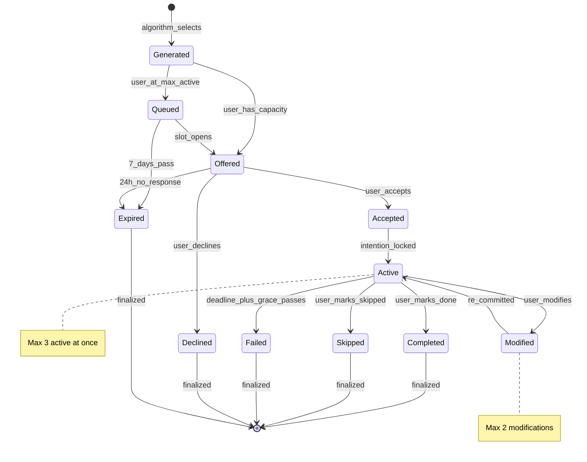

# Experiment Selection - Canonical Reference

**Status:** Validated
**Last Updated:** 2026-01-15
**Lenses Completed:** SKELETON, BLOOD, NERVES, SKIN, MIRROR

---

## Summary

Experiment selection determines which small real-world actions to recommend to users. The system balances star urgency, user capacity, and success probability to surface the right experiment at the right time. It acts as the engine of "The Walk" - transforming constellation insight into behavior change through implementation intentions (WHEN/WILL/AT).

**Design Philosophy:** Selection should feel like a wise friend who knows you, not an algorithm optimizing metrics.

---

## State Machine



---

## States

| State | Duration | Behavior |
|-------|----------|----------|
| **GENERATED** | Momentary | Created by algorithm, awaiting offer or queue |
| **QUEUED** | Up to 7 days | Waiting for active slot; expires if never offered |
| **OFFERED** | Up to 24 hours | Presented to user; awaiting response |
| **ACCEPTED** | Momentary | User agreed; finalizing implementation intention |
| **ACTIVE** | Until deadline | Committed; counts against MAX_ACTIVE (3) |
| **MODIFIED** | Momentary | User adjusting implementation; same experiment |
| **COMPLETED** | Terminal | User succeeded; star brightness increases |
| **SKIPPED** | Terminal | User intentionally didn't do it; minimal penalty |
| **FAILED** | Terminal | Deadline passed without report; treated as implicit skip |
| **DECLINED** | Terminal | User explicitly said no; alternative offered |
| **EXPIRED** | Terminal | No engagement; removed from consideration |

---

## Core Formulas

### Priority Score

The master formula for ranking experiment candidates:

```
PRIORITY = (U * W_URGENCY) + (C * W_CAPACITY) + (S * W_SUCCESS) + CONNECTION_BONUS

where:
  U = star_urgency        [0.0, 1.0]
  C = capacity_fit        [0.0, 1.0]
  S = success_probability [0.0, 1.0]
  W_URGENCY = 0.40
  W_CAPACITY = 0.35
  W_SUCCESS = 0.25

PRIORITY_FINAL = clamp(PRIORITY, 0.0, 1.0)
```

**Weight Rationale:**
- **Urgency (0.40):** Stars at risk matter most - leverages loss aversion
- **Capacity (0.35):** Experiments that fit the user's state succeed - higher than historical success because capacity mismatch is the #1 cause of failure
- **Success (0.25):** Historical success matters but shouldn't dominate - need exploration, not just exploitation

---

### Star Urgency

Determines how much a star "needs" an experiment right now:

```
URGENCY = base_urgency * trajectory_modifier * connection_modifier * time_modifier

Clamped to [0.0, 1.0]
```

**Base Urgency by Star State:**

| Star State | Base Urgency | Rationale |
|------------|--------------|-----------|
| NASCENT | 0.60 | New stars need nurturing (cold start fix) |
| FLICKERING (5+ days) | 0.90 | At risk of dimming |
| DARK (growing) | 0.85 | Active threat escalating |
| DARK (stable) | 0.75 | Persistent threat |
| DIM (declining) | 0.70 | Slipping toward dark |
| BRIGHT (declining) | 0.65 | Protect gains |
| DIM (stable) | 0.50 | Growth ready, no crisis |
| BRIGHT (stable) | 0.20 | Maintenance only |
| DORMANT | 0.10 | User disengaged |

**Trajectory Modifier (3-day brightness trend):**

| Trend | Modifier |
|-------|----------|
| Declining significantly (<-0.05) | 1.2 |
| Declining slightly (<-0.02) | 1.1 |
| Stable | 1.0 |
| Rising slightly (>0.02) | 0.9 |
| Rising significantly (>0.05) | 0.8 |

**Time Modifier (days since last experiment):**

| Days Since | Modifier |
|------------|----------|
| 0-3 | 1.0 |
| 4-7 | 1.0 + 0.05 * (days - 3) |
| 8-14 | 1.2 + 0.02 * (days - 7) |
| 15+ | 1.5 (capped) |

---

### User Capacity

Represents the user's current ability to complete experiments:

```
CAPACITY = (E * 0.30) + (T * 0.25) + (H * 0.20) + (L * 0.25) - stress_penalty

where:
  E = energy_level         [0.0, 1.0]
  T = time_availability    [0.0, 1.0]
  H = historical_success   [0.0, 1.0]
  L = load_headroom        [0.0, 1.0]

Clamped to [0.0, 1.0]
```

**Energy by Stress State:**

| Stress State | Base Energy |
|--------------|-------------|
| LOW | 1.0 |
| MEDIUM | 0.7 |
| HIGH | 0.4 |
| CRISIS | 0.15 |

**Load Headroom:**

| Active Experiments | Headroom |
|-------------------|----------|
| 0 | 1.0 |
| 1 | 0.75 |
| 2 | 0.45 |
| 3 | 0.0 |

**Stress Penalty (subtractive, per ego depletion research):**

| Stress State | Penalty |
|--------------|---------|
| LOW | 0.00 |
| MEDIUM | 0.05 |
| HIGH | 0.15 |
| CRISIS | 0.35 |

---

### Success Probability

Predicts likelihood of experiment completion:

```
SUCCESS_PROB = base_prob * difficulty_mod * template_mod * star_mod * recency_mod

Clamped to [0.05, 0.95]  // Never hopeless, never certain
```

**Difficulty Modifier:**

| Difficulty | Modifier | Rationale |
|------------|----------|-----------|
| TINY | 1.10 | Almost trivial |
| SMALL | 1.00 | Baseline |
| MEDIUM | 0.85 | Requires effort |
| STRETCH | 0.60 | Significant challenge |

**Star State Modifier:**

| Star State | Modifier | Rationale |
|------------|----------|-----------|
| FLICKERING | 0.85 | Unstable |
| DARK | 0.70 | Avoidance patterns |
| DIM | 1.00 | Neutral |
| BRIGHT | 1.10 | Momentum |

**Recency Modifier:**

| Days Since Similar | Modifier |
|-------------------|----------|
| 0-1 | 1.2 (momentum) |
| 2-3 | 1.1 |
| 4-7 | 1.0 |
| 8+ | 0.9 (stale) |
| Never | 0.95 |

---

### Connection Bonus

How connection types affect experiment selection:

| Connection Type | Effect | Magnitude |
|-----------------|--------|-----------|
| **GROWTH_EDGE** | Enables | +0.15 to +0.25 when prerequisite bright |
| **RESONANCE** | Spillover | +0.05 (bright partner) + 0.10 (active experiment) |
| **TENSION** | Competes | -0.20 if in tension with active experiment |
| **CAUSATION** | Sequences | +0.10 if effect star needs help |
| **SHADOW_MIRROR** | Surfaces | +0.10 base + 0.02/day overdue (max +0.38) |
| **BLOCKS** | **Hard Filter** | Blocked stars excluded entirely |

**GROWTH_EDGE Bonus Calculation:**
```
bonus = 0.15 + 0.10 * (source_brightness - 0.65) / (1.0 - 0.65)
// Only applies when source brightness >= 0.65
```

---

## Constants Reference

### Priority Weights

| Constant | Value | Source |
|----------|-------|--------|
| W_URGENCY | 0.40 | Design (Temporal Motivation Theory) |
| W_CAPACITY | 0.35 | Design (Fogg Behavior Model) |
| W_SUCCESS | 0.25 | Design (exploration-exploitation balance) |

### Urgency Constants

| Constant | Value | Unit | Source |
|----------|-------|------|--------|
| BASE_URGENCY_FLICKERING | 0.90 | - | Design |
| BASE_URGENCY_DARK_GROWING | 0.85 | - | Design |
| BASE_URGENCY_DARK_STABLE | 0.75 | - | Design |
| BASE_URGENCY_DIM_DECLINING | 0.70 | - | Design |
| BASE_URGENCY_BRIGHT_DECLINING | 0.65 | - | Design |
| BASE_URGENCY_DIM_STABLE | 0.50 | - | Design |
| BASE_URGENCY_BRIGHT_STABLE | 0.20 | - | Design |
| BASE_URGENCY_DORMANT | 0.10 | - | Design |
| BASE_URGENCY_NASCENT | 0.60 | - | Design (cold start fix) |
| TRAJECTORY_MODIFIER_MIN | 0.8 | - | Design |
| TRAJECTORY_MODIFIER_MAX | 1.2 | - | Design |
| TIME_MODIFIER_MAX | 1.5 | - | Design |

### Capacity Constants

| Constant | Value | Unit | Source |
|----------|-------|------|--------|
| STRESS_ENERGY_LOW | 1.0 | - | Design |
| STRESS_ENERGY_MEDIUM | 0.7 | - | Design |
| STRESS_ENERGY_HIGH | 0.4 | - | Design |
| STRESS_ENERGY_CRISIS | 0.15 | - | Design |
| STRESS_PENALTY_MEDIUM | 0.05 | - | Ego depletion research |
| STRESS_PENALTY_HIGH | 0.15 | - | Ego depletion research |
| STRESS_PENALTY_CRISIS | 0.35 | - | Ego depletion research |
| DEFAULT_SUCCESS_RATE | 0.5 | - | Design |

### Success Constants

| Constant | Value | Unit | Source |
|----------|-------|------|--------|
| DIFFICULTY_MOD_TINY | 1.10 | - | Yerkes-Dodson |
| DIFFICULTY_MOD_SMALL | 1.00 | - | Baseline |
| DIFFICULTY_MOD_MEDIUM | 0.85 | - | Yerkes-Dodson |
| DIFFICULTY_MOD_STRETCH | 0.60 | - | Yerkes-Dodson |
| SUCCESS_PROB_FLOOR | 0.05 | - | Design (consider 0.10) |
| SUCCESS_PROB_CEILING | 0.95 | - | Design |

### Connection Constants

| Constant | Value | Unit | Source |
|----------|-------|------|--------|
| GROWTH_EDGE_THRESHOLD | 0.65 | brightness | Design |
| GROWTH_EDGE_BONUS_MIN | 0.15 | - | Game design |
| GROWTH_EDGE_BONUS_MAX | 0.25 | - | Game design |
| RESONANCE_BONUS_PER_BRIGHT | 0.05 | - | Transfer of learning |
| RESONANCE_BONUS_ACTIVE | 0.10 | - | Synergy |
| RESONANCE_BONUS_CAP | 0.15 | - | Cap |
| TENSION_PENALTY | 0.20 | - | RPG hybrid builds |
| CAUSATION_BOOST | 0.10 | - | 5 Whys technique |
| SHADOW_SURFACE_INTERVAL | 7 | days | Habit research |
| SHADOW_SURFACE_BONUS_BASE | 0.10 | - | Shadow work |
| SHADOW_SURFACE_BONUS_RATE | 0.02 | /day | Design |
| BLOCKER_THRESHOLD | 0.25 | brightness | Design |

### System Limits

| Constant | Value | Unit | Source |
|----------|-------|------|--------|
| MAX_ACTIVE | 3 | experiments | Cowan's 3-4 working memory |
| MAX_QUEUED | 5 | experiments | Design |
| MAX_TEMPLATES_PER_STAR | 3 | templates | Design |
| MAX_PER_STAR | 2 | experiments | Diversity filter |
| MAX_PER_DOMAIN | 3 | experiments | Diversity filter |
| TIE_TOLERANCE | 0.01 | priority | Design |

### Time Constants

| Constant | Value | Unit | Source |
|----------|-------|------|--------|
| OFFER_EXPIRY | 24 | hours | Hyperbolic discounting |
| QUEUE_EXPIRY | 7 | days | Habit formation (Lally 2010) |
| BLACKLIST_DURATION | 30 | days | Spacing effect |
| GRACE_PERIOD | 12 | hours | Duolingo streak freeze |

### Difficulty Time Estimates

| Difficulty | Minutes | Source |
|------------|---------|--------|
| TINY | 0.5 | BJ Fogg Tiny Habits |
| SMALL | 5 | Fogg Starter Step |
| MEDIUM | 20 | Half Pomodoro |
| STRETCH | 45 | Full Pomodoro |

---

## Algorithm

### Main Selection Function

```pseudocode
function select_experiments(context):
    // 0. Pre-checks
    if user.stars.count == 0:
        return redirect_to_mirror()

    if dark_ratio(user.stars) > 0.8:
        return enter_sabbatical_mode()

    available_slots = MAX_ACTIVE - user.active_experiment_count
    if available_slots <= 0:
        return []

    // 1. Generate candidates
    candidates = []
    for star in get_eligible_stars(user):
        if is_blocked(star, connections):
            continue
        if star.has_active_experiment:
            continue

        difficulty = select_difficulty(star, user_capacity)
        templates = filter_templates(star.domain, difficulty, constraints)

        for template in templates[:MAX_TEMPLATES_PER_STAR]:
            experiment = generate_experiment(star, template)

            urgency = calculate_urgency(star, connections, history)
            capacity = calculate_capacity(user, experiment)
            success = calculate_success_probability(user, experiment)
            bonus = calculate_connection_bonus(experiment, context)

            if bonus is None:  // Blocked
                continue

            experiment.priority = (urgency * 0.40) + (capacity * 0.35) +
                                  (success * 0.25) + bonus
            experiment.priority = clamp(experiment.priority, 0.0, 1.0)

            candidates.append(experiment)

    // 2. Sort and filter
    candidates.sort(by: priority, descending)
    candidates = apply_diversity_filter(candidates)
    candidates = apply_tension_filter(candidates, connections)

    // 3. Return top N
    return candidates[:available_slots]
```

### Difficulty Selection

```pseudocode
function select_difficulty(star, user_capacity):
    if user_capacity.stress_state == CRISIS:
        return TINY

    if user_capacity.score < 0.3:
        return TINY

    state_mapping = {
        FLICKERING: TINY,
        DARK: TINY,
        DIM: SMALL,
        BRIGHT: MEDIUM,
        DORMANT: TINY
    }

    base = state_mapping[star.state]

    if user_capacity.score < 0.5 and base > SMALL:
        return SMALL

    return base
```

### Tie-Breaking

When priorities are equal (within TIE_TOLERANCE = 0.01):
1. Higher connection bonus wins
2. More neglected star wins (days since last experiment)
3. Seeded random (user_id + date for determinism)

---

## Edge Cases

| Case | Behavior |
|------|----------|
| 0 stars | Redirect to Mirror (star creation) |
| All stars BRIGHT stable | Offer MEDIUM/STRETCH; don't force engagement |
| All stars DARK | Sabbatical mode (dark_ratio > 0.8) |
| Max active + max queued | Discard new; wait for slots |
| Same experiment declined 3x | Blacklist template for 30 days |
| Completion but no brightness gain | Minimum gain floor (0.005) |
| Modification count > 2 | Force accept or skip (no more modifications) |
| Tied priority | Connection bonus > recency > seeded random |
| Social experiment external failure | Treat as SKIPPED, not FAILED |
| Dishonest completion reports | Trust user; system self-corrects |
| Deadline at midnight, user asleep | 12-hour grace period |
| Constraints change mid-experiment | Offer modification path |
| Connection type changes mid-experiment | Complete current; affects future only |
| 0% completion rate | Floor at 0.05; pivot intervention |
| 100% completion rate | Cap at 0.95; offer STRETCH |

---

## Validation Results (MIRROR)

### Scenario Tests

| Scenario | Stars | Stress | Result |
|----------|-------|--------|--------|
| New User Journey | 5 DIM | LOW | 3 SMALL experiments, priority 0.634 |
| All-Dark Constellation | 5 DARK | HIGH | 3 TINY experiments, priority 0.907 |
| Perfect User | 5 BRIGHT | LOW | 3 MEDIUM, GROWTH_EDGE bonus applied |
| Failing User | 5 mixed | HIGH | 2 TINY/SMALL, SUCCESS_FLOOR prevents hopelessness |
| Crisis Mode | 3 mixed | CRISIS | 3 TINY, capacity severely reduced (0.287) |
| Blocking Connection | 3 mixed | LOW | Blocked star filtered; 2 experiments offered |
| Growth Edge | 3 mixed | LOW | Health prioritized via +0.19 GROWTH_EDGE bonus |
| Tension | 3 mixed | LOW | 2 experiments (tension star excluded) |
| Equal Priority | 3 identical | LOW | All 3 selected (tie handled) |

### Multi-Day Simulation (7 days, 70% completion)

| Day | Experiments Offered | Completed | Final State |
|-----|---------------------|-----------|-------------|
| 1 | Health, Wealth, Purpose | 1/3 | All DIM |
| 7 | Relationships, Health, Wealth | 2/3 | All DIM (0.32-0.39) |

**Observations:**
- Priority drift works (neglected stars rise)
- Brightness gains modest (~0.06-0.09 over 7 days)
- Matches brightness-decay SCRIPTURE (~12 days to BRIGHT)

### Weight Sensitivity Analysis

| Configuration | New User Priority | All-Dark Priority |
|---------------|-------------------|-------------------|
| Default (0.40/0.35/0.25) | 0.634 | 0.907 |
| Urgency-heavy (0.60/0.25/0.15) | 0.596 | Higher |
| Capacity-heavy (0.25/0.50/0.25) | 0.694 | Lower |
| Success-heavy (0.25/0.25/0.50) | 0.587 | Lower |

**Conclusion:** Default weights (0.40/0.35/0.25) provide balanced behavior. Validated.

---

## Integration

### Depends On

| System | What We Use |
|--------|-------------|
| constellation-states | Star state determines base urgency |
| brightness-decay | Experiment completion affects brightness |
| connection-formation | Connection types affect selection priority |

### Depended On By

| System | What They Use |
|--------|---------------|
| The Walk | Experiment selection is the core engine |
| User engagement loop | Daily check-ins, experiment offers |
| Decision support | Experiment patterns inform major decisions |

### Brightness Impact Integration

From brightness-decay SCRIPTURE:

```
gain = BASE_EXPERIMENT_IMPACT * difficulty * alignment * novelty

BASE_EXPERIMENT_IMPACT = 0.03
difficulty = {TINY: 0.5, SMALL: 0.75, MEDIUM: 1.0, STRETCH: 1.5}
alignment = 0.5 (tangential) to 1.0 (direct)
novelty = 1.2 for first-time type, else 1.0
```

**Expected Brightness Gains:**

| Difficulty | Base Gain | With Streak | Daily Cap |
|------------|-----------|-------------|-----------|
| TINY | 0.015 | 0.020 | 0.06 |
| SMALL | 0.023 | 0.030 | 0.06 |
| MEDIUM | 0.030 | 0.039 | 0.06 |
| STRETCH | 0.045 | 0.059 | 0.06 |

**Skip Penalty:**
- First 2 skips: FREE (life happens)
- 3rd skip: 0.008
- 4th+ skip: escalating (0.012, 0.016)

---

## Implementation Notes

### Recommended Approach

1. **Selection is idempotent** - Same context should produce same ranking
2. **Calculate all components before combining** - Enables debugging
3. **Apply BLOCKS filter first** - Hard constraint, not soft preference
4. **Check for active experiments on stars** - Don't re-offer
5. **Add sabbatical pre-check** - Before normal selection flow
6. **Use seeded random for tie-breaking** - Deterministic for debugging
7. **Implement grace period as deadline extension** - Not separate timer

### Common Mistakes

| Mistake | Why It Fails | Fix |
|---------|--------------|-----|
| Offering experiments on blocked stars | BLOCKS is hard filter | Check `is_blocked()` first |
| Re-offering to stars with active experiments | Duplicate work | Filter `star.has_active_experiment` |
| Missing sabbatical check | Overwhelms all-dark users | Pre-check before selection |
| Non-deterministic tie-breaking | Can't reproduce bugs | Use seeded random |
| Applying TENSION as hard filter | Too restrictive | Use penalty (-0.20) |
| Forgetting SUCCESS_PROB_FLOOR | 0% users get 0% predictions | Clamp to [0.05, 0.95] |
| Multiplicative stress penalty | Doesn't create hard floor | Use subtractive |

### Performance Considerations

- **O(s * t)** for selection where s = stars, t = templates per star
- With s = 20 (max considered) and t = 3: ~60 candidate evaluations
- Connection checks: O(c) where c = connections involving star
- Typical runtime: <100ms for largest constellations
- Consider caching urgency calculations (stable within 1 hour)

### Testing Strategy

1. **Unit tests:** Each formula component independently
2. **Integration tests:** Full selection with known context
3. **Edge case tests:** All cases from SKIN table
4. **Regression tests:** MIRROR scenarios with expected outputs
5. **A/B tests:** Weight configurations with completion rate metrics

---

## Research Foundation

| Principle | Source | Application |
|-----------|--------|-------------|
| Flow Theory | Csikszentmihalyi (1975) | Difficulty selection |
| Fogg Behavior Model | BJ Fogg (2009) | B=MAP underlies capacity |
| Self-Determination Theory | Ryan & Deci (2000) | Weight rationale |
| Temporal Motivation Theory | Steel & Konig (2006) | Urgency modifiers |
| Ego Depletion | Baumeister et al. (1998) | Stress penalty is subtractive |
| Prospect Theory | Kahneman & Tversky (1979) | Urgency > success weight |
| Implementation Intentions | Gollwitzer (1999) | WHEN/WILL/AT format |
| Yerkes-Dodson Law | Yerkes & Dodson (1908) | Difficulty modifiers |
| Hyperbolic Discounting | Laibson (1997) | Time constants (24h, 7d) |
| Goal Gradient Effect | Hull (1932) | Connection bonuses |
| Duolingo Streak Research | Duolingo (2023) | Grace period, streak freeze |
| Cowan's Working Memory | Cowan (2001) | MAX_ACTIVE = 3 |

---

## Open Questions

- [ ] Should SUCCESS_PROB_FLOOR be raised from 0.05 to 0.10 for failing users?
- [ ] Is the SHADOW_MIRROR bonus (up to +0.38) too aggressive?
- [ ] Should time modifier ramp up faster in first 7 days for new users?
- [ ] What's the right GROWTH_EDGE_THRESHOLD (0.65)?
- [ ] Should TENSION be visible to users for understanding?
- [ ] How should we handle sabbatical mode exit criteria?

---

## Changelog

| Date | Change | Author |
|------|--------|--------|
| 2026-01-15 | Initial SKELETON | Claude |
| 2026-01-15 | Added BLOOD formulas | Claude |
| 2026-01-15 | Added NERVES citations | Claude |
| 2026-01-15 | Added SKIN edge cases | Claude |
| 2026-01-15 | MIRROR validation complete | Claude |
| 2026-01-15 | SCRIPTURE finalized | Claude |

---

## Quick Reference

```
STATES:        GENERATED -> OFFERED -> ACCEPTED -> ACTIVE -> COMPLETED
               GENERATED -> QUEUED -> OFFERED -> ...
               ACTIVE -> MODIFIED -> ACTIVE (max 2x)
               Terminal: COMPLETED, SKIPPED, FAILED, DECLINED, EXPIRED

PRIORITY:      (U * 0.40) + (C * 0.35) + (S * 0.25) + CONNECTION_BONUS
               Clamped to [0.0, 1.0]

URGENCY:       base * trajectory * connection * time
               Base: FLICKERING=0.9, DARK=0.75-0.85, DIM=0.5-0.7, BRIGHT=0.2-0.65

CAPACITY:      (E*0.30) + (T*0.25) + (H*0.20) + (L*0.25) - stress_penalty
               Stress penalty: CRISIS=0.35 (subtractive, creates floor)

SUCCESS:       base * difficulty_mod * template_mod * star_mod * recency_mod
               Clamped to [0.05, 0.95]

CONNECTION:    BLOCKS = hard filter (excluded)
               GROWTH_EDGE = +0.15 to +0.25 bonus
               TENSION = -0.20 penalty
               Others = smaller bonuses

LIMITS:        MAX_ACTIVE = 3    MAX_QUEUED = 5
               OFFER_EXPIRY = 24h    QUEUE_EXPIRY = 7d
               MODIFICATIONS = 2 max

DIFFICULTY:    CRISIS/Low capacity -> TINY always
               FLICKERING/DARK -> TINY
               DIM -> SMALL
               BRIGHT -> MEDIUM
               User request -> STRETCH (with warning)
```

---

*"The system chooses what matters most while respecting what you can handle. That's wisdom, not optimization."*
