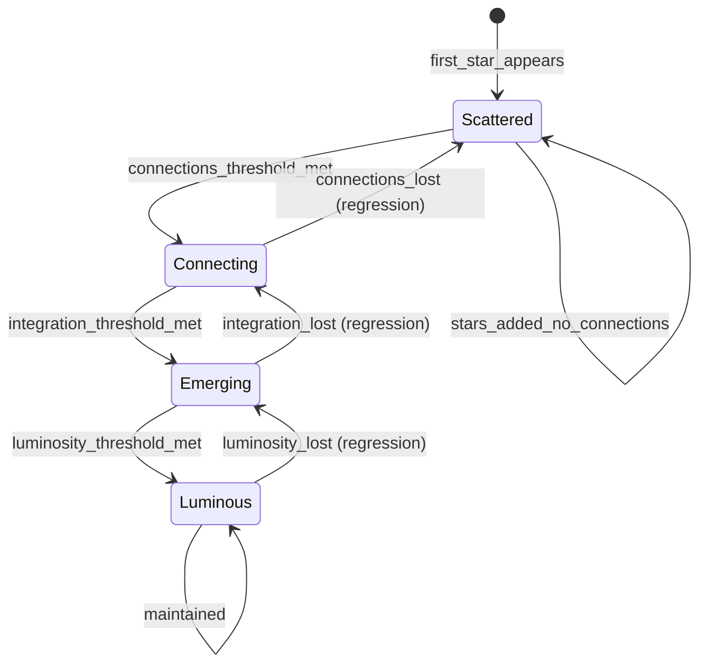

# Phase Transitions - SKELETON

**Status:** Draft
**Last Updated:** 2026-01-15
**Depends on:** constellation-states, brightness-decay

---

## Purpose

This system defines how a user's **overall constellation** evolves through four macro-phases. While constellation-states governs individual stars and brightness-decay governs their continuous values, phase-transitions governs the **gestalt** — what the whole constellation looks like and means.

Phases represent the user's journey of self-discovery, not just mechanical progress.

---

## The Four Phases

```
┌─────────────────────────────────────────────────────────────────────────┐
│                        CONSTELLATION PHASES                              │
├─────────────────────────────────────────────────────────────────────────┤
│                                                                          │
│   SCATTERED          CONNECTING         EMERGING          LUMINOUS       │
│   ✦ · · ✧ · ☆        ✦──☆ · ✧──●       ✦──☆──✧ ●──✦      ☆══✦══☆══✧     │
│                                                                          │
│   "Discovering"      "Relating"         "Understanding"   "Becoming"     │
│                                                                          │
│   Stars appear,      Lines form,        Shape emerges,    Constellation  │
│   no pattern yet     relationships      you see yourself  blazes bright  │
│                      visible                                             │
│                                                                          │
└─────────────────────────────────────────────────────────────────────────┘
```

---

## State Machine



---

## Phase Definitions

### SCATTERED — "Discovering"

The initial phase. Stars appear but don't relate to each other yet.

**Entry Condition:**
- First star appears in constellation

**Characteristics:**
- Stars exist but no connections between them
- User is naming things, not relating them
- Birth Chart hasn't been "revealed" yet (or just was)

**Visual:**
```
✦ · · ✧ · ☆ · ·
```
Isolated points of light. No lines.

**TARS Behavior:**
- Asks discovery questions
- Names patterns as they emerge
- Doesn't push for connections yet

**Exit Condition:**
- Connection threshold met (moves to CONNECTING)

---

### CONNECTING — "Relating"

Stars begin to relate to each other. The user sees how parts of themselves connect.

**Entry Condition:**
- Minimum connection count reached
- OR minimum connection density reached

**Characteristics:**
- Lines form between stars
- User starts seeing relationships between life areas
- "Oh, my health affects my purpose..."

**Visual:**
```
✦──☆ · ✧──● ·
```
Some lines connecting stars. Still gaps.

**TARS Behavior:**
- Points out connections forming
- Asks about relationships between stars
- "I notice your Health and Purpose stars are connected now..."

**Exit Condition:**
- Integration threshold met (moves to EMERGING)
- OR connection loss (regresses to SCATTERED)

---

### EMERGING — "Understanding"

A coherent shape is forming. The user sees themselves as a whole.

**Entry Condition:**
- Integration score threshold met
- Minimum bright star ratio
- Most stars connected

**Characteristics:**
- Constellation has recognizable shape
- User can articulate their "constellation story"
- Dark stars are identified and named

**Visual:**
```
✦──☆──✧ ●──✦
```
Mostly connected. A shape is visible.

**TARS Behavior:**
- Reflects the whole picture
- "Look at your constellation now..."
- Helps integrate dark stars

**Exit Condition:**
- Luminosity threshold met (moves to LUMINOUS)
- OR integration loss (regresses to CONNECTING)

---

### LUMINOUS — "Becoming"

The constellation blazes. The user is becoming who they want to be.

**Entry Condition:**
- High luminosity score
- High connection density
- Minimal dark star influence
- Sustained over time (not just a peak)

**Characteristics:**
- Most stars are BRIGHT
- All areas connected
- Dark stars integrated or minimal
- User is living their vision

**Visual:**
```
☆══✦══☆══✧
```
Strong connections. Bright glow. Double lines = strong bonds.

**TARS Behavior:**
- Celebrates without performing
- "Look at your sky now. Remember where you started?"
- Helps maintain, not just achieve

**Exit Condition:**
- Luminosity loss (regresses to EMERGING)
- Luminous is not permanent — must be maintained

---

## Aggregate Metrics

Phase is determined by aggregate metrics across the constellation:

### 1. Star Count
```
star_count = total stars in constellation
```

### 2. Connection Count
```
connection_count = total connections between stars
connection_density = connection_count / max_possible_connections
max_possible_connections = star_count × (star_count - 1) / 2
```

### 3. Average Brightness
```
avg_brightness = mean(star.brightness for all stars)
```

### 4. Bright Star Ratio
```
bright_ratio = count(stars where brightness >= 0.7) / star_count
```

### 5. Dark Star Influence
```
dark_influence = sum(dark_star.drain_impact for all dark stars)
```

### 6. Integration Score
```
integration = f(connection_density, avg_brightness, dark_star_confrontation)
```

### 7. Luminosity Score
```
luminosity = f(bright_ratio, connection_density, stability, dark_influence)
```

---

## Transition Triggers

### SCATTERED → CONNECTING

```
IF connection_count >= CONNECTION_THRESHOLD
   OR connection_density >= DENSITY_THRESHOLD_LOW
THEN phase = CONNECTING
```

### CONNECTING → EMERGING

```
IF integration_score >= INTEGRATION_THRESHOLD
   AND bright_ratio >= BRIGHT_RATIO_THRESHOLD_LOW
   AND connection_density >= DENSITY_THRESHOLD_MED
THEN phase = EMERGING
```

### EMERGING → LUMINOUS

```
IF luminosity_score >= LUMINOSITY_THRESHOLD
   AND bright_ratio >= BRIGHT_RATIO_THRESHOLD_HIGH
   AND dark_influence <= DARK_INFLUENCE_MAX
   AND days_in_emerging >= STABILIZATION_DAYS
THEN phase = LUMINOUS
```

---

## Regression Rules

Phases can regress if conditions are no longer met.

### Regression Protection

To prevent flickering between phases:
- **Hysteresis**: Regression thresholds are LOWER than advancement thresholds
- **Grace period**: Must be below threshold for X days before regressing
- **Warning**: TARS warns before regression happens

### CONNECTING → SCATTERED (Regression)

```
IF connection_count < CONNECTION_THRESHOLD × HYSTERESIS_FACTOR
   AND days_below_threshold >= REGRESSION_GRACE_DAYS
THEN phase = SCATTERED
```

### EMERGING → CONNECTING (Regression)

```
IF integration_score < INTEGRATION_THRESHOLD × HYSTERESIS_FACTOR
   AND days_below_threshold >= REGRESSION_GRACE_DAYS
THEN phase = CONNECTING
```

### LUMINOUS → EMERGING (Regression)

```
IF luminosity_score < LUMINOSITY_THRESHOLD × HYSTERESIS_FACTOR
   AND days_below_threshold >= REGRESSION_GRACE_DAYS
THEN phase = EMERGING
```

---

## Entity Relationships

```
┌─────────────────────┐
│    Constellation    │
│    (the whole)      │
└──────────┬──────────┘
           │
           │ has
           ▼
┌─────────────────────┐         ┌─────────────────────┐
│       Phase         │◀───────▶│   Aggregate Metrics │
│  (SCATTERED/        │ derived │  - star_count       │
│   CONNECTING/       │   from  │  - connection_count │
│   EMERGING/         │         │  - avg_brightness   │
│   LUMINOUS)         │         │  - integration      │
└─────────────────────┘         │  - luminosity       │
                                └─────────────────────┘
                                         ▲
                                         │ computed from
                                         │
                        ┌────────────────┴────────────────┐
                        │                                 │
               ┌────────┴────────┐               ┌───────┴───────┐
               │      Stars      │               │  Connections  │
               │ (from const-    │               │  (between     │
               │  ellation-      │               │   stars)      │
               │  states)        │               │               │
               └─────────────────┘               └───────────────┘
```

---

## Experience Design

### Phase Announcements

Phase transitions are **moments**. TARS makes them meaningful.

**SCATTERED → CONNECTING:**
> "Something is happening in your constellation. Lines are forming — your Health star just connected to your Purpose star. You're starting to see how the pieces relate. Welcome to CONNECTING."

**CONNECTING → EMERGING:**
> "Look at your sky. It has a shape now. This isn't random anymore — it's you, taking form. You're entering EMERGING."

**EMERGING → LUMINOUS:**
> "Do you see it? Your constellation is blazing. Not just points of light — a pattern. A presence. You've reached LUMINOUS. This isn't the end — it's who you are now."

**Regression warning:**
> "I'm noticing your constellation dimming. You're still in EMERGING, but some connections have weakened. Not a crisis — just something to notice. What's happening?"

### Visual Progression

| Phase | Visual Metaphor | Background | Star Glow |
|-------|-----------------|------------|-----------|
| SCATTERED | Night sky, stars distant | Deep black | Faint, isolated |
| CONNECTING | Lines appearing | Dark blue hints | Moderate, some linked |
| EMERGING | Shape visible | Purple undertones | Warm, interconnected |
| LUMINOUS | Constellation blazes | Subtle aurora | Golden, radiating |

---

## Edge Cases (Questions for SKIN)

| Case | Question |
|------|----------|
| User has 1 star | Can you be SCATTERED with 1 star? |
| All stars DARK | What phase is "all dark"? |
| Rapid star deletion | Does archiving stars affect phase? |
| 100 stars | Does phase scale with star count? |
| No connections possible | What if stars can't connect? |
| Phase gaming | Can user game to LUMINOUS? |
| Long-term LUMINOUS | Is LUMINOUS sustainable? |

---

## Open Questions for BLOOD

- [ ] What are the specific thresholds for each transition?
- [ ] How is integration_score calculated?
- [ ] How is luminosity_score calculated?
- [ ] What is the hysteresis factor?
- [ ] How many days for regression grace period?
- [ ] How does dark star influence factor in?

---

## Relationship to Other Systems

**Depends on:**
- constellation-states (star states, brightness values)
- brightness-decay (brightness dynamics)
- connection-formation (connection data) — NOT YET BUILT

**Depended on by:**
- TARS interaction layer (phase-specific prompts)
- Visual system (phase-specific rendering)
- Compatibility layer (phase matching)

**Note:** This system partially depends on connection-formation, which isn't built yet. We can define the structure here and fill in connection details when that system is complete.

---

## Summary

Phase-transitions answers: **"Where is the user in their journey?"**

- **SCATTERED**: Just beginning, discovering
- **CONNECTING**: Seeing relationships
- **EMERGING**: Understanding themselves
- **LUMINOUS**: Becoming who they want to be

The phases are not achievements to unlock — they're descriptions of where the user is. Regression is possible and not shameful. The goal is awareness, not gamification.

*"Your constellation is always your constellation. The phase just describes how much of it you can see."*
