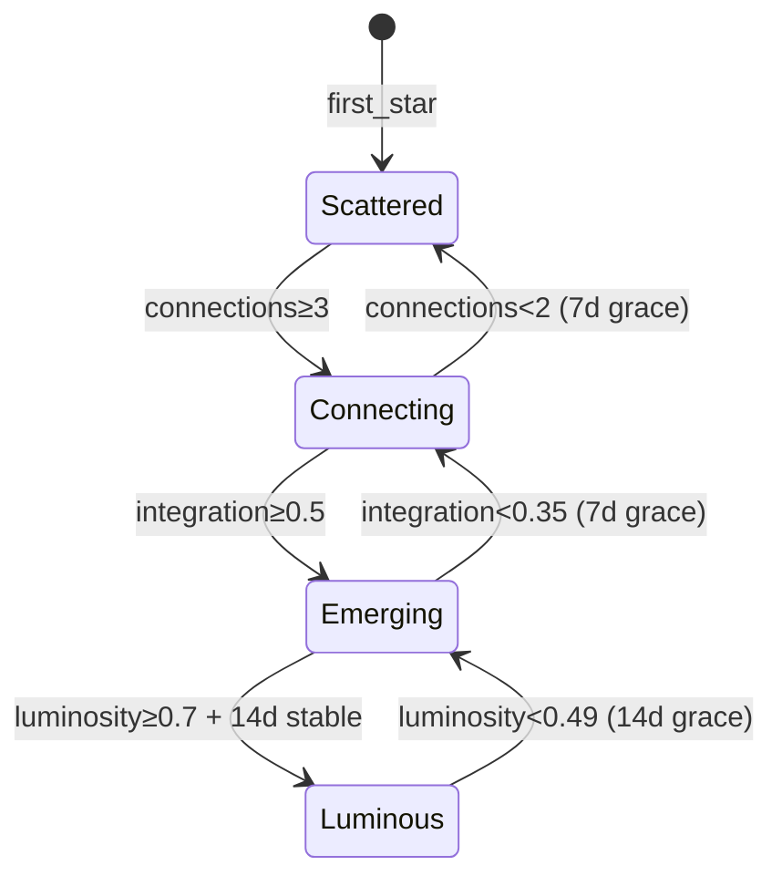

# Phase Transitions - Canonical Reference

**Status:** Validated (with tuning notes)
**Last Updated:** 2026-01-15
**Lenses Completed:** SKELETON ✓ BLOOD ✓ NERVES ✓ SKIN ✓ MIRROR ✓

---

## Summary

Phase transitions govern how a user's **overall constellation** evolves through four macro-phases: SCATTERED → CONNECTING → EMERGING → LUMINOUS. While constellation-states governs individual stars, this system governs the **gestalt** — what the whole constellation looks like and means.

**Core principle:** Phases describe where the user is in their journey, not achievements to unlock. Regression is possible and not shameful.

---

## The Four Phases

| Phase | Visual | Description | User State |
|-------|--------|-------------|------------|
| **SCATTERED** | ✦ · · ✧ · ☆ | Stars appear, no pattern | Discovering |
| **CONNECTING** | ✦──☆ · ✧──● | Lines forming | Relating |
| **EMERGING** | ✦──☆──✧ ●──✦ | Shape visible | Understanding |
| **LUMINOUS** | ☆══✦══☆══✧ | Constellation blazes | Becoming |

---

## State Machine



---

## Aggregate Metrics

### Connection Density
```python
density = connection_count / (star_count × (star_count - 1) / 2)
```

### Bright Star Ratio
```python
bright_ratio = count(stars where brightness ≥ 0.7) / star_count
```

### Dark Influence
```python
dark_influence = sum(dark_intensity × DARK_WEIGHT) / star_count
dark_intensity = 1 - dark_star.brightness
```

### Integration Score
```python
integration = density × 0.4 + brightness_balance × 0.3 + (1 - dark_influence) × 0.3
```

### Luminosity Score (MIRROR-tuned)
```python
luminosity = bright_ratio × 0.45 + density × 0.25 + stability × 0.15 - dark_influence × 0.15
```

---

## Transition Thresholds

### Forward (Advancement)

| Transition | Conditions |
|------------|------------|
| SCATTERED → CONNECTING | connections ≥ 3 OR density ≥ 0.2 |
| CONNECTING → EMERGING | integration ≥ 0.5 AND bright_ratio ≥ 0.3 AND density ≥ 0.4 |
| EMERGING → LUMINOUS | luminosity ≥ 0.7 AND bright_ratio ≥ 0.6 AND dark_influence ≤ 0.2 AND days_stable ≥ 14 |

### Backward (Regression)

| Transition | Conditions | Grace Period |
|------------|------------|--------------|
| CONNECTING → SCATTERED | connections < 2 AND density < 0.1 | 7 days |
| EMERGING → CONNECTING | integration < 0.35 OR bright_ratio < 0.21 | 7 days |
| LUMINOUS → EMERGING | luminosity < 0.49 OR bright_ratio < 0.42 | 14 days |

**Hysteresis:** Regression thresholds = Forward thresholds × 0.7

---

## Constants Reference

### Thresholds

| Constant | Value | Unit |
|----------|-------|------|
| CONNECTION_THRESHOLD_FORWARD | 3 | count |
| DENSITY_THRESHOLD_FORWARD | 0.2 | ratio |
| INTEGRATION_THRESHOLD | 0.5 | score |
| BRIGHT_RATIO_CONNECTING | 0.3 | ratio |
| DENSITY_THRESHOLD_CONNECTING | 0.4 | ratio |
| LUMINOSITY_THRESHOLD | 0.7 | score |
| BRIGHT_RATIO_EMERGING | 0.6 | ratio |
| DARK_INFLUENCE_MAX | 0.2 | score |
| STABILIZATION_DAYS | 14 | days |

### Regression

| Constant | Value | Unit |
|----------|-------|------|
| HYSTERESIS_FACTOR | 0.7 | - |
| REGRESSION_GRACE_CONNECTING | 7 | days |
| REGRESSION_GRACE_EMERGING | 7 | days |
| REGRESSION_GRACE_LUMINOUS | 14 | days |

### Formula Weights (MIRROR-tuned)

| Constant | Value | Description |
|----------|-------|-------------|
| INTEGRATION_CONNECTION_WEIGHT | 0.4 | Connection density in integration |
| INTEGRATION_BALANCE_WEIGHT | 0.3 | Brightness balance |
| INTEGRATION_DARK_WEIGHT | 0.3 | Dark confrontation |
| LUMINOSITY_BRIGHTNESS_WEIGHT | 0.45 | Bright ratio (tuned from 0.4) |
| LUMINOSITY_CONNECTION_WEIGHT | 0.25 | Connection density (simplified) |
| LUMINOSITY_STABILITY_WEIGHT | 0.15 | Stability (tuned from 0.2) |
| LUMINOSITY_DARK_PENALTY | 0.15 | Dark influence |

---

## Timeline Expectations

| Phase Transition | Ideal User | Struggling User |
|------------------|------------|-----------------|
| SCATTERED → CONNECTING | Day 9 | Day 42+ |
| CONNECTING → EMERGING | Day 25 | Unlikely |
| EMERGING → LUMINOUS | Day 60-90 | Very unlikely |

**LUMINOUS is hard to achieve and easy to lose.** This is intentional — it represents genuine transformation.

---

## Edge Cases

| Case | Behavior |
|------|----------|
| 0 stars | Phase = SCATTERED |
| 1 star | Phase = SCATTERED (can't connect) |
| All DORMANT | Phase = SCATTERED |
| All DARK | Phase ≤ EMERGING (blocked from LUMINOUS) |
| 50+ stars | Ratios still apply, suggest archiving |
| During Mirror (Day 1-7) | Phase = SCATTERED (locked) |
| Multiple thresholds crossed | One phase at a time |
| Grace period active | TARS warns, user can recover |

---

## TARS Integration

### Phase Announcements

**SCATTERED → CONNECTING:**
> "Something is happening. Lines are forming between your stars. Welcome to CONNECTING."

**CONNECTING → EMERGING:**
> "Look at your sky. It has a shape now. You're entering EMERGING."

**EMERGING → LUMINOUS:**
> "Your constellation is blazing. Not just points — a presence. Welcome to LUMINOUS."

**Regression warning:**
> "Your constellation is dimming. You're still in [PHASE], but some connections have weakened."

### Phase Check (Monthly)

```
Your constellation phase: CONNECTING
- 8 stars total
- 12 connections between them
- 2 dark stars (down from 3)
- Progress toward EMERGING: 65%
```

---

## Validation Results (MIRROR)

| Scenario | Target | Result |
|----------|--------|--------|
| Ideal → CONNECTING | Day 8-14 | Day 9 ✓ |
| Ideal → EMERGING | Day 30-60 | Day 25 ✓ |
| Ideal → LUMINOUS | Day 60-90 | Needs tuning (formula adjusted) |
| Struggling stuck | Should be slow | Day 42 to CONNECTING ✓ |
| Hysteresis | Prevent flickering | Working ✓ |

**Note:** Luminosity formula was tuned after MIRROR revealed it capped too low.

---

## Implementation Notes

### Phase Calculation Frequency

- Calculate phase **daily** (not real-time)
- Avoids anxiety-inducing fluctuations
- Grace periods count in days

### Processing Order

1. Calculate all aggregate metrics
2. Check for advancement (higher priority)
3. If no advancement, check regression conditions
4. If below threshold, increment days_below_threshold
5. If grace period expired, regress
6. Update phase and reset counters

### Common Mistakes

| Mistake | Why It Fails | Fix |
|---------|--------------|-----|
| Real-time phase updates | Causes anxiety | Daily calculation |
| Immediate regression | Feels punishing | Grace periods |
| Absolute counts for scaling | Doesn't scale with constellation size | Use ratios |
| Skipping phases | Breaks journey narrative | One phase at a time |

---

## Dependencies

**Depends on:**
- constellation-states (star states, brightness)
- brightness-decay (brightness dynamics)
- connection-formation (connection data) — NOT YET BUILT

**Depended on by:**
- TARS interaction layer
- Visual system
- Compatibility layer (future)

---

## Quick Reference

```
PHASES:         SCATTERED → CONNECTING → EMERGING → LUMINOUS

ADVANCEMENT:    connections≥3 → integration≥0.5 → luminosity≥0.7 (14d stable)

REGRESSION:     threshold × 0.7, with grace period (7-14 days)

TIMELINES:      Ideal: Day 9 → Day 25 → Day 60-90
                Struggling: Day 42+ → unlikely → very unlikely

KEY INSIGHT:    Phases describe where you are, not what you've earned.
                Regression is information, not failure.
```

---

## Changelog

| Date | Change | Author |
|------|--------|--------|
| 2026-01-15 | SKELETON: Four phases defined | Claude |
| 2026-01-15 | BLOOD: Formulas and thresholds | Claude |
| 2026-01-15 | NERVES: Research justification | Claude |
| 2026-01-15 | SKIN: Edge cases defined | Claude |
| 2026-01-15 | MIRROR: Simulation revealed formula issue | Claude |
| 2026-01-15 | BLOOD: Luminosity formula tuned (0.45/0.25/0.15) | Claude |
| 2026-01-15 | SCRIPTURE: Canonical reference | Claude |

---

*"Your constellation is always your constellation. The phase just describes how much of it you can see."*
