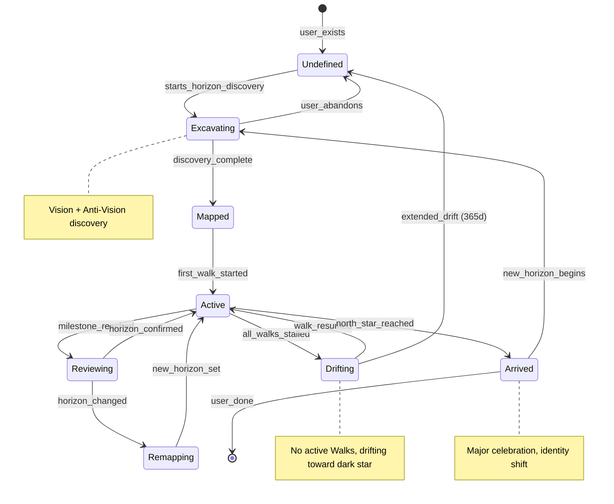

# The Horizon - SKELETON

**System:** the-horizon
**Lens:** SKELETON (1/7)
**Created:** 2026-01-15
**Status:** Draft
**Depends on:** the-walk, constellation-states

---

## Overview

The Horizon is the **strategic layer** above The Walk — multi-Walk planning for 1-5-10 year trajectories. It introduces vision/anti-vision mapping, trajectory alignment across Walks, and slingshot mechanics.

**Core insight:** The Walk gets you to the next star. The Horizon tells you which stars to walk toward.

---

## State Machine



---

## States (7)

### 1. UNDEFINED
**Meaning:** User has a Star Map but no Horizon set
**Visibility:** Constellation visible, no trajectory, no destination stars
**Duration:** Until first Horizon excavation

**Entry conditions:**
- New user after completing Mirror
- OR extended drift (365d no Walks)

**Exit conditions:**
- → EXCAVATING: User initiates Horizon discovery

---

### 2. EXCAVATING
**Meaning:** Trajectory presentation and vision refinement
**Visibility:** TARS presents inferred trajectory, user reacts
**Duration:** 10-30 minutes

**Entry conditions:**
- User completes 7-day Mirror
- OR user completes existing Horizon and starts new one

**Exit conditions:**
- → MAPPED: User confirms trajectory direction
- → UNDEFINED: User abandons

**Special properties:**
- **Anti-vision is INFERRED from Mirror data**, not explicitly excavated
- TARS says: "Based on your constellation, here's where your current path leads..."
- User reacts: what they like, what they fear, what they want to change
- Vision emerges from user's reaction, not direct questioning
- Less confrontational than explicit anti-vision prompts

---

### 3. MAPPED
**Meaning:** Horizon defined but no Walk started yet
**Visibility:** Trajectory visible on star map, destination stars placed
**Duration:** Brief (user typically starts Walk immediately)

**Entry conditions:**
- Horizon discovery completes

**Exit conditions:**
- → ACTIVE: User starts first Walk toward any Horizon milestone

---

### 4. ACTIVE
**Meaning:** User has defined Horizon and at least one Walk in progress
**Visibility:** Full trajectory visible, active Walk highlighted, momentum visible
**Duration:** Months to years

**Entry conditions:**
- First Walk started
- OR Walk resumed after Reviewing
- OR Walk resumed after Drifting

**Exit conditions:**
- → REVIEWING: Any milestone reached (triggers Horizon check)
- → DRIFTING: All Walks stalled (velocity < 0.05 for 30+ days)
- → ARRIVED: North Star reached

---

### 5. REVIEWING
**Meaning:** Milestone reached, checking if Horizon still valid
**Visibility:** Celebration moment + Horizon review prompt
**Duration:** One session

**Entry conditions:**
- Walk milestone reached

**Exit conditions:**
- → ACTIVE: User confirms Horizon still valid
- → REMAPPING: User indicates Horizon has changed

**Special properties:**
- Slingshot bonus calculated and applied
- Prompts: "Is this still where you're heading? Has anything changed?"

---

### 6. REMAPPING
**Meaning:** Horizon being revised (not full excavation, but adjustment)
**Visibility:** Abbreviated discovery flow
**Duration:** 5-15 minutes

**Entry conditions:**
- User indicates during Review that goals have shifted

**Exit conditions:**
- → ACTIVE: New Horizon set, Walks continue/adjusted

**Special properties:**
- Lighter than full excavation
- Preserves momentum and history
- May shift North Star or rearrange milestones

---

### 7. DRIFTING
**Meaning:** All Walks stalled, user drifting toward anti-vision
**Visibility:** Dark star grows brighter, path fading, warning state
**Duration:** Up to 365 days

**Entry conditions:**
- All active Walks have velocity < 0.05 for 30+ days

**Exit conditions:**
- → ACTIVE: Any Walk resumes
- → UNDEFINED: 365 days of drift (Horizon expires)

**Special properties:**
- Dark star pull increases
- TARS gentle intervention
- Not punitive — just visible

---

### 8. ARRIVED
**Meaning:** North Star reached, major life transformation complete
**Visibility:** Major celebration, constellation transformation
**Duration:** Transitional

**Entry conditions:**
- 10-year North Star success criteria met

**Exit conditions:**
- → EXCAVATING: User starts new Horizon
- → [archived]: User chooses not to continue

---

## Entity Relationships

```
┌─────────────────────────────────────────────────────────────────┐
│                           USER                                   │
│                                                                  │
│    ┌────────────────────────────────────────────────────────┐   │
│    │                   CONSTELLATION                         │   │
│    │              (Star Map - FREE)                          │   │
│    │                                                         │   │
│    │   ┌──────┐ ┌──────┐ ┌──────┐ ┌──────┐                  │   │
│    │   │STAR  │ │STAR  │ │DARK  │ │STAR  │  ← Profile stars │   │
│    │   │      │ │      │ │STAR  │ │      │                   │   │
│    │   └──────┘ └──────┘ └──────┘ └──────┘                   │   │
│    │       ↑                ↑                                 │   │
│    │       │                │   ← Anti-vision projection      │   │
│    └───────┼────────────────┼────────────────────────────────┘   │
│            │                │                                     │
│    ┌───────┴────────────────┴────────────────────────────────┐   │
│    │                     HORIZON                              │   │
│    │              (Strategic Layer - PREMIUM)                 │   │
│    │                                                          │   │
│    │   ┌───────────────────────────────────────────────────┐ │   │
│    │   │                                                   │ │   │
│    │   │   Dark Star (anti-vision)                         │ │   │
│    │   │        ●                                          │ │   │
│    │   │         ↖                                         │ │   │
│    │   │           ↖ (drift pull)                          │ │   │
│    │   │             ↖                                     │ │   │
│    │   │              USER                                 │ │   │
│    │   │               ↗                                   │ │   │
│    │   │             ↗  (Walk trajectory)                  │ │   │
│    │   │           ★ Milestone (1yr)                       │ │   │
│    │   │          ↗                                        │ │   │
│    │   │        ★ Milestone (3yr)                          │ │   │
│    │   │       ↗                                           │ │   │
│    │   │     ☆ North Star (5-10yr)                         │ │   │
│    │   │                                                   │ │   │
│    │   └───────────────────────────────────────────────────┘ │   │
│    │                                                          │   │
│    │   Walks                                                  │   │
│    │   ├── Walk 1 (Career) → toward 1yr milestone             │   │
│    │   ├── Walk 2 (Health) → toward 1yr milestone             │   │
│    │   └── Walk 3 (empty)                                     │   │
│    │                                                          │   │
│    └──────────────────────────────────────────────────────────┘   │
│                                                                   │
└───────────────────────────────────────────────────────────────────┘

Horizon
├── id: string
├── user_id: string
├── state: HorizonState
├── vision: VisionDocument
├── anti_vision: AntiVisionDocument
├── north_star: DestinationStar (10-year)
├── milestones: DestinationStar[] (1yr, 3yr, 5yr)
├── dark_star: ConstellationStar (anti-vision projection)
├── walks: Walk[] (active journeys)
├── slingshot_velocity: float (accumulated from completed Walks)
├── created_at: datetime
├── last_reviewed: datetime
└── total_milestones_reached: int

DestinationStar
├── id: string
├── horizon_id: string
├── description: string
├── timeframe: '1_year' | '3_year' | '5_year' | '10_year'
├── success_criteria: string[]
├── connected_profile_stars: ConstellationStar[] (affinity)
├── status: 'distant' | 'approaching' | 'reached'
└── slingshot_power: float (gravity based on timeframe)

VisionDocument
├── summary: string (one sentence)
├── detailed: string (paragraphs)
├── identity_shift: string ("Who do I become?")
├── created_at: datetime
└── revised_at: datetime

AntiVisionDocument
├── summary: string
├── fears: string[]
├── typical_tuesday: string (vivid description)
├── what_dies: string
├── dark_star_id: string (projection to constellation)
└── created_at: datetime
```

---

## Slingshot Mechanics

When a Walk reaches a milestone, the user receives a **slingshot boost**:

```
                Before milestone:
                USER ────velocity───→ ★ (destination)

                At milestone:
                USER ────→ ★ ════accelerated═══→→→ (NEXT star)
                           ↑
                    Star's gravity + approach velocity = slingshot
```

**Slingshot formula (defined in BLOOD):**
```
exit_velocity = approach_velocity + (star.slingshot_power × approach_velocity × alignment)
```

**Implications:**
- Completing Walks in sequence compounds velocity
- Misaligned next-Walks get reduced slingshot bonus
- Accumulated slingshot_velocity persists across Horizon

---

## Dark Star Drift

When all Walks stall, user drifts toward anti-vision:

```
pull_toward_dark = DARK_GRAVITY / distance_to_dark²

# Only applies when velocity is low
effective_pull = pull_toward_dark × (1 - velocity / DRIFT_THRESHOLD)
```

**Visibility:** Dark star brightens, path to vision fades

---

## Transitions Summary

| From | To | Trigger |
|------|-----|---------|
| [none] | Undefined | User completes Mirror |
| Undefined | Excavating | Starts Horizon discovery |
| Excavating | Mapped | Discovery completes |
| Excavating | Undefined | User abandons |
| Mapped | Active | First Walk starts |
| Active | Reviewing | Milestone reached |
| Active | Drifting | All Walks stalled 30d |
| Active | Arrived | North Star reached |
| Reviewing | Active | Horizon confirmed |
| Reviewing | Remapping | User changes Horizon |
| Remapping | Active | New Horizon set |
| Drifting | Active | Walk resumes |
| Drifting | Undefined | 365d drift |
| Arrived | Excavating | New Horizon begins |

---

## Edge Cases

| Case | Question | Resolution |
|------|----------|------------|
| User has no vision (nihilism) | Can't complete excavation? | TARS handles gently; may suggest smaller horizon |
| Anti-vision too dark (trauma) | Safety concern? | Safety protocol; skip anti-vision if flagged |
| North Star becomes impossible | Life circumstances change? | Remapping triggered; no shame |
| Multiple Arrive moments (multi-star) | What if 5yr before 10yr? | Each star has own Arrived moment; North Star = ultimate |
| User never reviews | Just keeps walking? | Natural checkpoints at milestones enforce review |
| Horizon 10+ years old | Still valid? | TARS prompts periodic reflection |

---

## Integration Points

### Depends On

| System | What We Use |
|--------|-------------|
| the-walk | Walk mechanics, velocity, momentum |
| constellation-states | Profile stars, dark stars |
| experiment-selection | Daily experiments toward Horizon milestones |

### Provides To

| System | What We Provide |
|--------|-----------------|
| the-walk | Slingshot velocity, trajectory alignment |
| constellation-states | Anti-vision dark star projection |
| experiment-selection | Horizon context for prioritization |

---

## Open Questions for BLOOD

- [ ] What's the exact slingshot formula?
- [ ] How does dark star gravity decay with distance?
- [ ] What alignment threshold triggers reduced slingshot?
- [ ] How is slingshot_power determined by timeframe?
- [ ] What's the drift velocity toward dark star?

---

*SKELETON complete. Proceed to BLOOD for formulas.*
