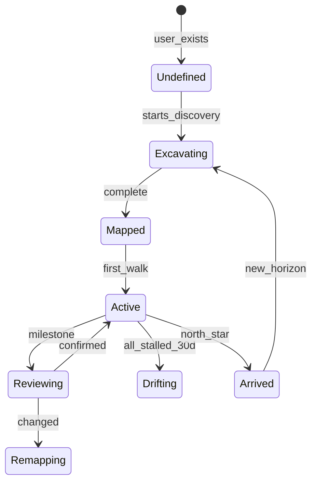

# The Horizon - Canonical Reference

**System:** the-horizon
**Status:** Draft
**Last Updated:** 2026-01-15
**Lenses:** SKELETON ✓ BLOOD ✓ NERVES ✓ SKIN ✓ MIRROR ✓ TRIBE ○

---

## Summary

The Horizon is S.T.A.R.S.'s **strategic layer** — multi-Walk planning for 1-5-10 year trajectories.

**Core Insight:** The Walk gets you to the next star. The Horizon tells you which stars to walk toward.

---

## The Three Layers

| Layer | Scope | What It Does |
|-------|-------|--------------|
| **Star Map** | Present | Who you are now (constellation) |
| **The Walk** | 3-6 months | Journey toward near-term milestones |
| **The Horizon** | 1-10 years | Strategic trajectory; vision/anti-vision |

---

## States (7)



| State | Duration | Description |
|-------|----------|-------------|
| UNDEFINED | Until discovery | No Horizon set |
| EXCAVATING | 15-45 min | Vision/Anti-Vision construction |
| MAPPED | Brief | Trajectory defined, Walk not started |
| ACTIVE | Months-years | Walking toward Horizon |
| REVIEWING | One session | Milestone reached, checking validity |
| REMAPPING | 5-15 min | Adjusting Horizon |
| DRIFTING | Up to 365d | All Walks stalled |
| ARRIVED | Transitional | North Star reached |

---

## Slingshot Mechanics

When a Walk reaches a milestone:

```
exit_velocity = approach_velocity × (1 + slingshot_multiplier)

slingshot_multiplier = power × alignment × momentum_bonus
```

### Slingshot Power

| Timeframe | Power |
|-----------|-------|
| 3_month | 0.15 |
| 6_month | 0.25 |
| 1_year | 0.40 |
| 3_year | 0.60 |
| 5_year | 0.80 |
| 10_year | 1.00 |

### Key Formula

```python
# Accumulated slingshot from completed Walks
horizon.slingshot_velocity += slingshot_gain
horizon.slingshot_velocity = min(horizon.slingshot_velocity, 2.0)

# Decays at 1%/day between milestones
```

---

## Dark Star Drift

When all Walks stall (velocity < 0.1 for 30+ days):

```
drift_pull = DARK_GRAVITY / distance_to_dark²

# User drifts toward anti-vision
distance_to_dark -= drift_pull × (1 - velocity)
```

### Constants

| Constant | Value |
|----------|-------|
| DRIFT_THRESHOLD | 0.10 |
| DRIFT_DAYS | 30 |
| DARK_GRAVITY | 0.05 |
| MAX_DRIFT_PULL | 0.30 |

---

## Vision / Anti-Vision

### Inference-Based Discovery (Post-Mirror)

**Phase 1: Trajectory Presentation** (TARS infers from 7-day Mirror)
- TARS: "Based on your constellation, here's where your current path leads..."
- Shows projected trajectory: patterns, tendencies, likely outcomes
- User sees: "This is your birth chart's trajectory"

**Phase 2: User Reflection** (TARS invites noticing, not interrogation)
- "What do you notice when you look at this path?"
- "Sit with that for a moment. What comes up?"
- "This pattern here — does it feel like you? Or like something you've been carrying?"
- → Anti-vision emerges from discomfort, resistance, fear
- → Vision emerges from resonance, longing, energy

**Phase 3: Decomposition**
- 10-year → 5-year → 3-year → 1-year → First Walk

**Key insight:** Anti-vision is not explicitly excavated — it's revealed through the user's reaction to their projected trajectory.

---

## Phase Gating

> [!IMPORTANT]
> Horizon excavation is gated by constellation phase. Scattered users shouldn't set 10-year visions.

| Phase | Horizon Scope | Rationale |
|-------|---------------|-----------|
| SCATTERED | No Horizon (Walk only) | User still discovering themselves |
| CONNECTING | 1-year Horizon | Patterns emerging, near-term vision |
| EMERGING | 1-5 year Horizon | Shape visible, can see further |
| LUMINOUS | Full 10-year Horizon | Ready for North Star |

### Implementation

```pseudocode
function can_excavate_horizon(user, horizon_type):
    phase = user.constellation.phase

    if horizon_type == '10_year':
        return phase == LUMINOUS
    if horizon_type == '5_year':
        return phase in [EMERGING, LUMINOUS]
    if horizon_type == '1_year':
        return phase in [CONNECTING, EMERGING, LUMINOUS]

    return false  // SCATTERED users can't set Horizons yet
```

### Constants

| Constant | Value | Description |
|----------|-------|-------------|
| PHASE_GATE_10_YEAR | LUMINOUS | Required phase for 10-year Horizon |
| PHASE_GATE_5_YEAR | EMERGING | Required phase for 5-year Horizon |
| PHASE_GATE_1_YEAR | CONNECTING | Required phase for 1-year Horizon |

---

## AI Inference Quality (Anti-Vision)

> [!WARNING]
> TARS inferring wrong anti-vision = user feels misunderstood = trust erodes.

### Confidence Scoring

Every anti-vision inference includes:

```typescript
interface AntiVisionInference {
  content: string;           // The inferred anti-vision
  confidence: number;        // 0.0-1.0
  evidence: string[];        // Quotes from Mirror that support it
  needsValidation: boolean;  // true if confidence < 0.7
}
```

### Fallback Prompts (confidence < 0.7)

If TARS isn't confident in the inference:

> "Based on what you've shared, I have a sense of what you're trying to avoid... but I'm not certain.
>
> Can you tell me in your own words: What's the life you're terrified of living?"

### User Correction Path

After presenting anti-vision:

> "Does this feel right?"
> **[Yes]** / **[Partially]** / **[Not really]**

If "Not really":

> "Help me understand. What did I get wrong? What's actually pulling you away from who you want to be?"

Update inference with user correction. Log for model improvement.

### Constants

| Constant | Value | Description |
|----------|-------|-------------|
| CONFIDENCE_THRESHOLD | 0.7 | Below this, use fallback prompt |
| MIN_EVIDENCE_COUNT | 3 | Minimum quotes to support inference |

---

## Entity Model

```
Horizon
├── vision: VisionDocument
├── anti_vision: AntiVisionDocument
├── north_star: DestinationStar (10-year)
├── milestones: DestinationStar[] (1yr, 3yr, 5yr)
├── dark_star: ConstellationStar (anti-vision projection)
├── walks: Walk[]
├── slingshot_velocity: float
└── state: HorizonState
```

---

## Integration

### Depends On

| System | Usage |
|--------|-------|
| the-walk | Walk mechanics, velocity, momentum |
| constellation-states | Profile stars, dark stars |

### Provides To

| System | What We Provide |
|--------|-----------------|
| the-walk | Slingshot velocity boost, trajectory alignment |
| experiment-selection | Horizon context for prioritization |

---

## Constants Reference

| Constant | Value | Unit |
|----------|-------|------|
| SLINGSHOT_1_YEAR | 0.40 | - |
| SLINGSHOT_10_YEAR | 1.00 | - |
| MOMENTUM_AMPLIFIER | 0.20 | - |
| MAX_ACCUMULATED_VELOCITY | 2.00 | - |
| DRIFT_THRESHOLD | 0.10 | - |
| DRIFT_DAYS | 30 | days |
| DARK_GRAVITY | 0.05 | - |
| HORIZON_MOMENTUM_DECAY | 0.02 | /day |
| POST_ARRIVAL_PRESERVATION | 0.50 | - |
| HORIZON_DECAY_PERIOD | 365 | days |

---

## Quick Reference

```
THREE LAYERS:        Star Map (present) → Walk (tactical) → Horizon (strategic)

HORIZON STATES:      Undefined → Excavating → Mapped → Active → Arrived

SLINGSHOT:           exit_velocity = approach × (1 + power × alignment × momentum)

DRIFT:               velocity < 0.1 for 30d → drifting toward dark star

ARRIVAL:             North Star reached → celebration → new Horizon (50% velocity preserved)

REVIEW:              At milestones, check if Horizon still valid
```

---

## Changelog

| Date | Change |
|------|--------|
| 2026-01-15 | Initial Horizon design |
| 2026-01-15 | SKELETON: 7 states, slingshot concept |
| 2026-01-15 | BLOOD: Formulas for slingshot, drift, momentum |
| 2026-01-15 | NERVES: Research citations |
| 2026-01-15 | SKIN: Edge cases |
| 2026-01-15 | MIRROR: Simulation validated |

---

*"The star map shows who you are. The walk shows who you're becoming. The horizon shows who you'll be."*
