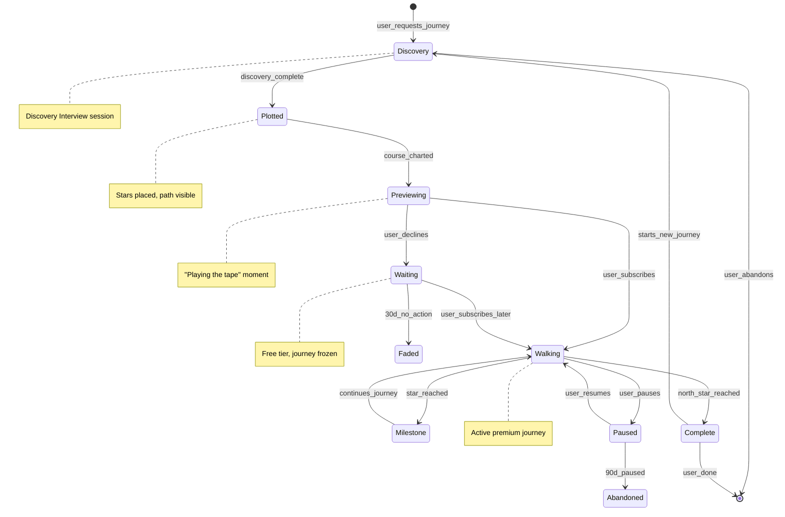

# The Walk - SKELETON

**System:** the-walk
**Lens:** SKELETON (1/7)
**Created:** 2026-01-15
**Status:** Draft
**Depends on:** constellation-states, experiment-selection

---

## Overview

The Walk is the **journey system** — how users move through state space toward self-defined goals. Stars become destinations (milestones), users have trajectory vectors, and momentum accumulates with each step.

**Key insight:** The star map (profile) is free. The journey (Walk) is premium.

---

## Core Concepts

### Journey vs. Profile

| Concept | Free (Star Map) | Premium (Walk) |
|---------|-----------------|----------------|
| What it is | Snapshot of who you are NOW | Path to who you're BECOMING |
| Stars are | Traits, patterns, attributes | Destinations, milestones |
| Changes by | TARS observation | User action |
| Time dimension | Present | Future trajectory |

### Physics Metaphor

```
USER POSITION:     State vector s_t = [P, M, E, C, G]
TRAJECTORY:        Direction + Velocity in state space
DESTINATION STAR:  Target position to reach (milestone)
THRUST:            Force applied by completing milestones
MOMENTUM:          Accumulated velocity from sustained action
```

---

## State Machine: Journey Lifecycle



---

## States (8)

### 1. DISCOVERY
**Meaning:** Active discovery interview to chart the journey
**Visibility:** Conversation UI, no star map yet
**Duration:** 15-30 minutes typically

**Entry conditions:**
- User explicitly requests: "I want to start a journey"
- OR user completes Star Map and prompts for direction

**Exit conditions:**
- → PLOTTED: Discovery interview completes (all phases done)
- → [abandoned]: User exits mid-interview

---

### 2. PLOTTED
**Meaning:** Stars placed on map, path visible, but not yet "played"
**Visibility:** Star map shows destination stars (dim, distant)
**Duration:** Moments (automatic transition)

**Entry conditions:**
- Discovery interview produces DiscoveryOutput

**Exit conditions:**
- → PREVIEWING: System begins "play the tape" sequence

---

### 3. PREVIEWING
**Meaning:** TARS narrates the journey, showing each milestone
**Visibility:** Three.js animation, camera flying through path
**Duration:** 2-5 minutes

**Entry conditions:**
- Journey has been plotted

**Exit conditions:**
- → WALKING: User subscribes ("Start Walking")
- → WAITING: User declines ("Not yet")

**Special properties:**
- AI-generated narratives for each milestone
- Emotional conversion moment
- No action possible during preview

---

### 4. WAITING
**Meaning:** Journey exists but user hasn't started walking
**Visibility:** Star map shows path (grayed/frozen)
**Duration:** Up to 30 days

**Entry conditions:**
- User clicked "Not yet" after preview

**Exit conditions:**
- → WALKING: User subscribes later
- → FADED: 30 days pass without action

**Special properties:**
- Gentle whispers every few days
- Path remains visible
- Context preserved

---

### 5. WALKING
**Meaning:** Active journey, user receiving experiments
**Visibility:** Star map with trajectory arrow, active experiments
**Duration:** Weeks to years

**Entry conditions:**
- User subscribes (payment)
- OR user resumes from PAUSED

**Exit conditions:**
- → MILESTONE: User reaches a destination star
- → PAUSED: User explicitly pauses
- → COMPLETE: North Star reached

**Special properties:**
- Daily experiments generated toward nearest star
- Velocity and momentum tracking
- Full TARS engagement

---

### 6. MILESTONE
**Meaning:** Transitional state when user reaches a destination star
**Visibility:** Celebration moment, star lights up fully
**Duration:** Moments (event, not duration)

**Entry conditions:**
- Milestone success criteria met

**Exit conditions:**
- → WALKING: Continues to next star

**Special properties:**
- Thrust applied (velocity boost)
- Identity update (Bayesian prior shift)
- TARS acknowledgment

---

### 7. PAUSED
**Meaning:** User explicitly paused their journey
**Visibility:** Star map frozen, "sabbatical mode"
**Duration:** Up to 90 days

**Entry conditions:**
- User requests pause
- OR subscription lapses

**Exit conditions:**
- → WALKING: User resumes
- → ABANDONED: 90 days pass

**Special properties:**
- Context fully preserved
- Weekly whisper at most
- Can resume instantly

---

### 8. COMPLETE
**Meaning:** North Star reached, journey finished
**Visibility:** Full constellation celebration
**Duration:** Permanent (archived)

**Entry conditions:**
- North Star success criteria met

**Exit conditions:**
- → DISCOVERY: User starts new journey
- → [archived]: User chooses not to continue

**Special properties:**
- Journey archived in user's history
- Context carries forward to new journeys
- Major celebration moment

---

## Entity Relationships

```
┌─────────────────────────────────────────────────────────────────┐
│                           USER                                   │
│                                                                  │
│    ┌────────────────────────────────────────────────────────┐   │
│    │                     CONSTELLATION                       │   │
│    │    (Star Map - FREE)                                    │   │
│    │    ┌──────┐ ┌──────┐ ┌──────┐                          │   │
│    │    │ STAR │ │ STAR │ │ STAR │  ← Profile stars         │   │
│    │    └──────┘ └──────┘ └──────┘                          │   │
│    └────────────────────────────────────────────────────────┘   │
│                              │                                   │
│                              │ user has 0-3 active               │
│                              ▼                                   │
│    ┌────────────────────────────────────────────────────────┐   │
│    │                    JOURNEY(S)                           │   │
│    │    (The Walk - PREMIUM)                                 │   │
│    │                                                         │   │
│    │    ┌───────────────────────────────────────────────┐   │   │
│    │    │              JOURNEY                           │   │   │
│    │    │                                                │   │   │
│    │    │  north_star: DestinationStar                   │   │   │
│    │    │  milestones: DestinationStar[]                 │   │   │
│    │    │  current_position: StateVector                 │   │   │
│    │    │  trajectory: TrajectoryVector                  │   │   │
│    │    │  state: JourneyState                           │   │   │
│    │    │                                                │   │   │
│    │    └───────────────────────────────────────────────┘   │   │
│    │                                                         │   │
│    └────────────────────────────────────────────────────────┘   │
│                                                                  │
└─────────────────────────────────────────────────────────────────┘

DestinationStar
├── id: string
├── description: string (from discovery)
├── successCriteria: string[]
├── position: StateVector
├── timeframe: '1_month' | '3_month' | '6_month' | '1_year' | '2_year' | '5_year'
├── status: 'distant' | 'approaching' | 'reached' | 'passed'
├── distance: float (from current position)
└── gravitationalPull: float (increases as you approach)

TrajectoryVector
├── direction: number[] (unit vector in state space)
├── velocity: float [0, 1]
├── acceleration: float
└── momentum: float (accumulated, decays)

Journey
├── id: string
├── user_id: string
├── domain: 'career' | 'health' | 'relationships' | 'purpose' | 'wealth'
├── state: JourneyState
├── northStar: DestinationStar
├── milestones: DestinationStar[]
├── currentPosition: StateVector
├── trajectory: TrajectoryVector
├── discoveryOutput: DiscoveryOutput
├── created_at: datetime
├── started_at: datetime | null
├── completed_at: datetime | null
└── experiments: Experiment[]
```

---

## Multi-Journey Rules

Users can have multiple active journeys (capacity-managed):

| Active Journeys | Experiments/Day | Rationale |
|-----------------|-----------------|-----------|
| 1 | 3 | Full focus |
| 2 | 2 + 1 | Split focus |
| 3 | 1 + 1 + 1 | Spread thin (max) |

**Cross-journey load balancing:**
- Total experiments never exceed user capacity
- Journeys compete for experiment slots
- Priority to stalled journeys (prevent asymmetric decay)

---

## Integration with Other Systems

### Depends On

| System | What We Use |
|--------|-------------|
| constellation-states | Profile stars inform discovery |
| experiment-selection | Algorithm for daily experiments |
| brightness-decay | Completion affects star brightness |

### Provides To

| System | What We Provide |
|--------|-----------------|
| experiment-selection | Journey context (target star, momentum) |
| constellation-states | Profile enrichment from journey insights |

---

## Discovery Interview Integration

The Discovery phase uses the discovery-interview skill pattern:

```
PHASE 1: Initial Orientation
├── "What are you trying to become?"
├── "What happens if you stay on current trajectory?"
└── "What does success look like?"

PHASE 2: Deep Dive
├── Problem & Goals
├── Constraints (time, resources)
├── Conflicts (competing priorities)
└── Skills to build

PHASE 3: Research Loops
└── Agent researches when user is uncertain

PHASE 4: Milestone Discovery
└── Work backwards from North Star

PHASE 5: Completeness Check
└── All milestones have success criteria

OUTPUT: DiscoveryOutput
├── northStar
├── milestones[]
├── conflicts[]
└── researchFindings[]
```

---

## Preview ("Play the Tape")

The conversion moment:

1. Camera flies through star map
2. TARS narrates each milestone (AI-generated, personal)
3. Shows vivid scenarios at each star
4. Pauses before North Star
5. Paywall: "Do you want to walk?"

```
Star 1 → "It's March. You've validated your idea..."
Star 2 → "Three months now. $500 in revenue..."
Star 3 → "You handed in your notice..."
...
North Star → [camera stops, star remains distant]
TARS: "I can only walk it with you. When you're ready."
```

---

## Edge Cases

| Case | Question | Resolution |
|------|----------|------------|
| User abandons discovery | What happens to partial data? | Saved as draft, can resume |
| User has 3 journeys, wants 4th | Hard limit or soft? | Soft - warn, suggest completing one |
| North Star changes mid-journey | How to handle? | New discovery session, path re-plots |
| User reaches star early | What if ahead of timeframe? | Celebrate, adjust timeline |
| User far behind schedule | What if 6mo milestone at 12mo? | TARS suggests adjustment, no shame |
| Journey conflicts with profile | Career journey contradicts soul star | Surface conflict, user decides |
| Subscription lapses | Mid-journey, payment fails | Grace period, then PAUSED |
| Multiple journeys in same domain | Career A vs Career B? | Allowed, but warn about dilution |

---

## Open Questions for BLOOD

- [ ] What is the exact velocity/momentum formula?
- [ ] How does gravitational pull affect experiment selection?
- [ ] What's the thrust magnitude from reaching a milestone?
- [ ] How does journey velocity affect experiment difficulty?
- [ ] What's the decay rate for momentum when inactive?
- [ ] How do multiple journeys share capacity pool?

---

*SKELETON complete. Proceed to BLOOD for formulas.*
