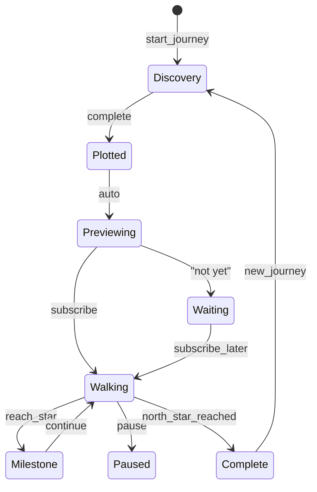

# The Walk - Canonical Reference

**System:** the-walk
**Status:** Draft
**Last Updated:** 2026-01-15
**Lenses:** SKELETON ✓ BLOOD ✓ NERVES ✓ SKIN ✓ MIRROR ✓ TRIBE ○

---

## Summary

The Walk is S.T.A.R.S.'s **journey system** — transforming static profiles into dynamic paths through state space.

**Core Insight:** The Star Map (profile) is free. The Journey (Walk) is premium.

---

## The Freemium Split

| FREE | PREMIUM |
|------|---------|
| 7-day Mirror (excavation) | Active Journey |
| Star Map (constellation snapshot) | Daily experiments |
| Discovery Interview | Velocity/momentum tracking |
| Preview ("play the tape") | TARS guidance |
| Frozen path (visible, not walkable) | Milestone celebrations |

---

## Journey States



| State | Duration | Description |
|-------|----------|-------------|
| Discovery | 15-30 min | Discovery interview in progress |
| Plotted | Instant | Stars placed, path visible |
| Previewing | 2-5 min | "Play the tape" — AI narratives |
| Waiting | ≤30 days | Free tier, journey frozen |
| Walking | Weeks-years | Active premium journey |
| Milestone | Instant | Star reached, celebration |
| Paused | ≤90 days | User-initiated sabbatical |
| Complete | Permanent | North Star reached |

---

## Physics Model

### Position

```
s_t = [P, M, E, C, G]   (5-dimensional state vector)
```

### Velocity

```
v_t = v_{t-1} + acceleration - decay
```

### Momentum

```
momentum_t = momentum_{t-1} × 0.95 + velocity_gain
```

### Thrust (from milestones)

```
thrust = 0.10 × difficulty_multiplier × (1 + milestone_index × 0.1)
```

### Gravitational Pull

```
pull = 0.01 × star_mass / distance²    (capped at 0.5)
```

---

## Key Formulas

### Distance to Star

```
distance = ||star.position - user.position||₂
```

### Direction to Star

```
direction = normalize(star.position - user.position)
```

### Milestone Reached

```
reached = distance < 0.15 AND all(success_criteria.met)
```

### Stall Detection

```
stalled = velocity < 0.05 AND days_since_progress > 14
```

---

## Constants

| Constant | Value | Unit |
|----------|-------|------|
| MOMENTUM_DECAY | 0.05 | /day |
| MOMENTUM_BOOST_FACTOR | 0.30 | - |
| BASE_THRUST | 0.10 | - |
| MILESTONE_ACCEL_BONUS | 0.05 | - |
| GRAVITY_CONSTANT | 0.01 | - |
| MAX_PULL | 0.50 | - |
| BASE_DECAY | 0.02 | /day |
| DECAY_ACCELERATION | 0.01 | /day² |
| STALL_THRESHOLD | 0.05 | - |
| STALL_DAYS | 14 | days |
| REACH_THRESHOLD | 0.15 | - |
| MAX_DAILY_EXPERIMENTS | 3 | - |
| MAX_ACTIVE_JOURNEYS | 3 | - |
| WAITING_EXPIRE_DAYS | 30 | days |
| PAUSED_EXPIRE_DAYS | 90 | days |

---

## Multi-Journey Rules

| Active | Experiments/Day | Allocation |
|--------|-----------------|------------|
| 1 | 3 | Full focus |
| 2 | 2 + 1 | Split by urgency |
| 3 | 1 + 1 + 1 | Even spread |

**Urgency factors:** Stall (40%), Proximity (30%), Age (30%)

---

## Discovery Interview

```
Phase 1: "What are you trying to become?"
Phase 2: Deep dive (constraints, conflicts, skills)
Phase 3: Research loops (when uncertain)
Phase 4: Backward milestone discovery
Phase 5: Completeness check
OUTPUT:  DiscoveryOutput (northStar, milestones[], conflicts[])
```

---

## Preview ("Play the Tape")

**Conversion moment:**
1. Camera flies through star map
2. TARS narrates each milestone (AI-generated, personal)
3. Shows vivid scenarios
4. Pauses before North Star
5. Paywall: "Do you want to walk?"

---

## Integration

### Depends On

| System | Usage |
|--------|-------|
| constellation-states | Profile informs discovery |
| experiment-selection | Daily experiments |
| brightness-decay | Milestone effects |

### Provides To

| System | Data |
|--------|------|
| experiment-selection | Journey context, momentum |
| constellation-states | Journey insights |

---

## TRIBE (Multi-User) — STUB

> [!NOTE]
> This section is a placeholder for multi-user Walk mechanics. To be developed before multi-user launch.

### Open Questions

- How do shared experiments work? (Both do same experiment? Complementary experiments?)
- How does one user's momentum affect partner's Walk?
- How do milestones synchronize? (Both must reach? Either triggers?)
- How are celebrations shareable?

### Integration Points (Preserve These)

| Component | Single-User | Multi-User Consideration |
|-----------|-------------|--------------------------|
| Walk velocity | Per-user | Keep per-user, don't aggregate |
| Experiment allocation | Individual capacity | Consider relationship context |
| Celebrations | Private | May be shareable |
| Stall detection | Individual | May trigger partner notification |

### Compatibility Layer Reference

See [compatibility/06-scripture.md](../compatibility/06-scripture.md) for constellation-level multi-user mechanics.

---

## Quick Reference

```
FREEMIUM SPLIT:     Star Map = FREE | Journey = PREMIUM

JOURNEY STATES:     Discovery → Plotted → Previewing → Walking → Complete

PHYSICS:            Position (s_t) + Velocity (v) + Momentum (m)

VELOCITY:           v_t = v_{t-1} + acceleration - decay

MOMENTUM:           Decays 5%/day, boosts velocity gain by 30% at max

MILESTONE THRUST:   +10% velocity × difficulty multiplier

STALL:              v < 0.05 AND 14+ days → TARS intervention

MULTI-JOURNEY:      Max 3 active, capacity pool shared
```

---

## Changelog

| Date | Change |
|------|--------|
| 2026-01-15 | Initial Journey-Agnostic design |
| 2026-01-15 | SKELETON: 8 journey states |
| 2026-01-15 | BLOOD: Velocity, momentum, thrust formulas |
| 2026-01-15 | NERVES: Research citations |
| 2026-01-15 | SKIN: Edge cases |

---

*"The star map shows who you are. The journey shows who you're becoming."*
