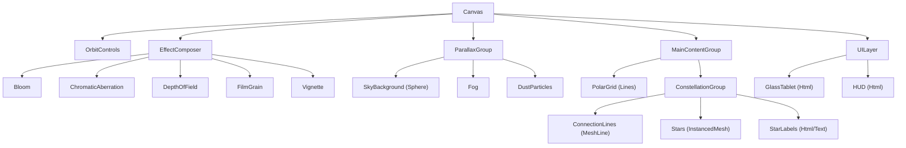

# Three.js Architecture

**Technical implementation specification for the WebGL layer**

> *Source: Refactored from [threejs-spec.md](../../threejs-spec.md)*

---

## Technology Stack

| Layer | Technology |
|-------|------------|
| **Framework** | React 19, Vite |
| **3D Core** | Three.js, React Three Fiber (R3F) |
| **Utilities** | Drei, Maath |
| **Animation** | Framer Motion (DOM), Spring physics (3D) |
| **Lines** | MeshLine |
| **Post-processing** | @react-three/postprocessing |

---

## Scene Architecture

### Coordinate System

The app uses a **Polar Coordinate System** ($r, \theta$) mapped to 3D Cartesian ($x, y, z$).

$$
x = r \cdot \cos(\theta)
$$
$$
y = r \cdot \sin(\theta)
$$
$$
z = 0 \quad (\text{Primary Plane})
$$

- **$r$ (Radius):** Time. Center ($r=0$) is "Now". Outer edge is Future/Projection.
- **$θ$ (Angle):** Life Domains:
  - $0°$: **Soul**
  - $72°$: **Purpose**
  - $144°$: **Career**
  - $216°$: **Relationships**
  - $288°$: **Health**

*Visual aesthetic may add slight $z$-variance for parallax, but interaction remains on $xy$ plane.*

---

### Scene Graph



---

## Component Design

### Star System (`<StarSystem />`)

**Challenge:** Efficient rendering of 50-200 stars with unique properties.

**Solution:** `InstancedMesh` with custom `ShaderMaterial`.

#### Shader Uniforms

| Uniform | Type | Description |
|---------|------|-------------|
| `uTime` | float | Global time for pulse/flicker |
| `uColor` | vec3 | Base color from Star Type |
| `uType` | int | 0=Bright, 1=Dim, 2=Flickering, 3=Dark |
| `uIntensity` | float | Brightness [0.05 - 1.0] |
| `uResonance` | float | Interaction feedback |
| `uLastActive` | float | Days since last interaction |
| `uDustLevel` | float | Entropy accumulation |

#### Star Archetype Shader Logic

```glsl
// Bright: steady pulse
if (uType == 0) {
  emission = uColor * (0.8 + 0.2 * sin(uTime * 0.5));
}

// Dim: low emission, no pulse
if (uType == 1) {
  emission = uColor * 0.2;
}

// Flickering: noise-modulated
if (uType == 2) {
  float noise = snoise(vec3(uTime * 2.0, 0.0, 0.0));
  emission = uColor * (0.5 + 0.5 * noise);
}

// Dark: negative emission effect
if (uType == 3) {
  emission = vec3(0.0);
  // Apply gravitational lensing in post
}
```

---

### Connection System (`<SynapseWeaver />`)

**Goal:** Organic "mycelium" growth, not vector graphics.

#### Geometry

```javascript
import { MeshLine, MeshLineMaterial } from 'meshline';

// Create curved path
const curve = new THREE.CubicBezierCurve3(
  starA.position,
  controlPoint1,
  controlPoint2,
  starB.position
);

const points = curve.getPoints(50);
const line = new MeshLine();
line.setPoints(points.flat());
```

#### Custom Shader Uniforms

| Uniform | Type | Description |
|---------|------|-------------|
| `uGrowth` | float | 0.0-1.0, controls draw progress |
| `uNoiseTexture` | sampler2D | Perlin noise for width modulation |
| `uPulse` | float | Time-based signal transmission |
| `uStrength` | float | Connection strength |
| `uStartColor` | vec3 | Source star color |
| `uEndColor` | vec3 | Destination star color |

#### Shader Logic

```glsl
// Vertex: Width jitter
vWidth = baseWidth * (1.0 + texture2D(uNoiseTexture, vUv).r * 0.5);

// Vertex: Taper at ends
float taper = smoothstep(0.0, 0.1, vProgress) * smoothstep(1.0, 0.9, vProgress);
vWidth *= taper;

// Fragment: Growing tip is bright
float tipGlow = smoothstep(uGrowth - 0.1, uGrowth, vProgress);
vec3 color = mix(uStartColor, uEndColor, vProgress);
color += tipGlow * 0.5;
```

---

### Sky Background (`<DeepSpace />`)

**Geometry:** Large inverted `SphereGeometry(500, 64, 64)`

**Shader:**
```glsl
// Vertical gradient
vec3 zenith = vec3(0.04, 0.04, 0.04);    // #0A0A0A
vec3 horizon = vec3(0.07, 0.09, 0.13);   // #121822
float gradient = smoothstep(-1.0, 1.0, normalize(vPosition).y);
vec3 skyColor = mix(horizon, zenith, gradient);

// Add subtle noise texture for grain
float grain = texture2D(uGrainTexture, vUv * 2.0).r;
skyColor += grain * 0.02;
```

---

## Post-Processing Stack

Apply in order:

```javascript
<EffectComposer>
  <ChromaticAberration offset={[0.002, 0.001]} />
  <DepthOfField
    focusDistance={focusDistance}
    focalLength={0.02}
    bokehScale={2.8}
  />
  <Bloom
    intensity={0.4}
    luminanceThreshold={0.85}
    luminanceSmoothing={0.9}
  />
  <Noise opacity={0.25} />
  <Vignette offset={0.15} darkness={0.45} />
</EffectComposer>
```

---

## Interaction Model

### Camera Controls

```javascript
<OrbitControls
  enableRotate={true}
  enableZoom={true}
  enablePan={false}
  minPolarAngle={Math.PI / 4}   // Constrain to top-down-ish
  maxPolarAngle={Math.PI / 2.5}
  minDistance={5}
  maxDistance={50}
  dampingFactor={0.05}          // Heavy, smooth feel
/>
```

### Raycasting

- Hit-test on Stars only
- Expanded hit radius: 40px equivalent invisible sphere
- Debounce hover events

### Event Handlers

```javascript
const handleStarHover = (star) => {
  // Scale animation
  gsap.to(star.scale, { x: 1.2, y: 1.2, z: 1.2, duration: 0.15 });

  // Brighten connections
  star.connections.forEach(conn => conn.brighten());

  // Show tooltip
  setHoveredStar(star);
};

const handleStarClick = (star) => {
  // Smooth camera pan
  gsap.to(camera.position, {
    x: star.position.x,
    y: star.position.y + 5,
    z: star.position.z + 10,
    duration: 0.8
  });

  // Open detail view
  setSelectedStar(star);
};
```

---

## Hybrid HTML/WebGL

### 2D → 3D Coordinate Projection

```javascript
// Get DOM element position
const rect = inputRef.getBoundingClientRect();

// Convert to normalized device coordinates
const x = (rect.left / window.innerWidth) * 2 - 1;
const y = -(rect.top / window.innerHeight) * 2 + 1;

// Project to 3D world
const vector = new THREE.Vector3(x, y, 0.5);
vector.unproject(camera);
```

### Glass Tablet Integration

```javascript
import { Html } from '@react-three/drei';

<Html
  transform
  position={[0, 0, 5]}
  style={{
    backdropFilter: 'blur(40px)',
    background: 'rgba(25, 25, 25, 0.6)',
    border: '1px solid rgba(255, 255, 255, 0.1)',
    borderRadius: '24px',
  }}
>
  <GlassTablet />
</Html>
```

---

## Performance Targets

| Metric | Target | Acceptable |
|--------|--------|------------|
| FPS | 60 | 30 (mobile) |
| Draw calls | < 50 | < 100 |
| Stars | 200 | 100 (low-end) |
| Particles | 2000 | 500 (low-end) |

### Optimization Strategies

1. `InstancedMesh` for stars
2. Geometry LOD (reduce sphere segments on mobile)
3. Disable post-processing selectively on low-end
4. Clamp DPR to 2
5. Use `useMemo` for expensive calculations
6. Frustum culling for off-screen stars

---

## Resources & References

| Topic | Resource |
|-------|----------|
| Star shaders | `sugaith/react-three-fiber-shader-galaxy` |
| Organic lines | `threejs-meshline` library |
| Polar grid | `THREE.PolarGridHelper` |
| Volumetric effects | Raymarching tutorials, `three-nebula` |

---

*"The technology should be invisible—users see stars, not shaders."*
